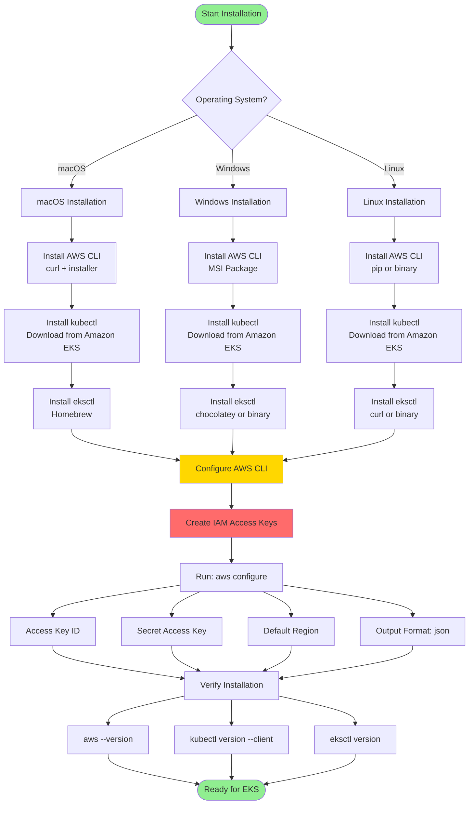

# Install AWS, kubectl & eksctl CLI's

## Architecture Diagram



### Diagram Explanation

- **Operating System Choice**: Installation steps vary by OS - **macOS** uses Homebrew, **Windows** uses MSI installers, **Linux** uses package managers or binaries
- **AWS CLI Installation**: Essential for **AWS API calls**, manages credentials, and enables **programmatic access** to all AWS services
- **kubectl Installation**: The **Kubernetes command-line tool** that communicates with the cluster **API server** to manage workloads and resources
- **eksctl Installation**: Simplifies **EKS cluster creation** and management, automatically handles **VPC**, **IAM roles**, and **CloudFormation** stacks
- **Amazon EKS-vended kubectl**: Always use **AWS-provided kubectl binary** to ensure **version compatibility** with your specific EKS cluster version
- **IAM Access Keys**: Create keys from **IAM user** (never root user) with appropriate **permissions** for EKS, EC2, and VPC operations
- **AWS Configuration**: Stores credentials in **~/.aws/credentials** and config in **~/.aws/config** for automated authentication
- **Default Region**: Choose region closest to your location for **lower latency** and ensure **service availability** (e.g., us-east-1)
- **Verification Tests**: Running version commands confirms **successful installation** and **PATH configuration** for all three tools
- **Security Best Practice**: Never commit AWS credentials to code repositories; use **environment variables** or **AWS credential files** only

## Step-00: Introduction
- Install AWS CLI
- Install kubectl CLI
- Install eksctl CLI

## Step-01: Install AWS CLI
- Reference-1: https://docs.aws.amazon.com/cli/latest/userguide/cli-chap-install.html
- Reference-2: https://docs.aws.amazon.com/cli/latest/userguide/install-cliv2.html
### Step-01-01: MAC - Install and configure AWS CLI
- Download the binary and install via command line using below two commands. 
```
# Download Binary
curl "https://awscli.amazonaws.com/AWSCLIV2.pkg" -o "AWSCLIV2.pkg"

# Install the binary
sudo installer -pkg ./AWSCLIV2.pkg -target /
```
- Verify the installation 
```
aws --version
aws-cli/2.0.7 Python/3.7.4 Darwin/19.4.0 botocore/2.0.0dev11

which aws
```
- Reference: https://docs.aws.amazon.com/cli/latest/userguide/install-cliv2-mac.html

### Step-01-02: Windows 10 - Install and configure AWS CLI
- The AWS CLI version 2 is supported on Windows XP or later.
- The AWS CLI version 2 supports only 64-bit versions of Windows.
- Download Binary: https://awscli.amazonaws.com/AWSCLIV2.msi
- Install the downloaded binary (standard windows install)
```
aws --version
aws-cli/2.0.8 Python/3.7.5 Windows/10 botocore/2.0.0dev12
```
- Reference: https://docs.aws.amazon.com/cli/latest/userguide/install-cliv2-windows.html

### Step-01-03: Configure AWS Command Line using Security Credentials
- Go to AWS Management Console --> Services --> IAM
- Select the IAM User: kalyan 
- **Important Note:** Use only IAM user to generate **Security Credentials**. Never ever use Root User. (Highly not recommended)
- Click on **Security credentials** tab
- Click on **Create access key**
- Copy Access ID and Secret access key
- Go to command line and provide the required details
```
aws configure
AWS Access Key ID [None]: ABCDEFGHIAZBERTUCNGG  (Replace your creds when prompted)
AWS Secret Access Key [None]: uMe7fumK1IdDB094q2sGFhM5Bqt3HQRw3IHZzBDTm  (Replace your creds when prompted)
Default region name [None]: us-east-1
Default output format [None]: json
```
- Test if AWS CLI is working after configuring the above
```
aws ec2 describe-vpcs
```

## Step-02: Install kubectl CLI
- **IMPORTANT NOTE:** Kubectl binaries for EKS please prefer to use from Amazon (**Amazon EKS-vended kubectl binary**)
- This will help us to get the exact Kubectl client version based on our EKS Cluster version. You can use the below documentation link to download the binary.
- Reference: https://docs.aws.amazon.com/eks/latest/userguide/install-kubectl.html

### Step-02-01: MAC - Install and configure kubectl
- Kubectl version we are using here is 1.16.8 (It may vary based on Cluster version you are planning use in AWS EKS)

```
# Download the Package
mkdir kubectlbinary
cd kubectlbinary
curl -o kubectl https://amazon-eks.s3.us-west-2.amazonaws.com/1.16.8/2020-04-16/bin/darwin/amd64/kubectl

# Provide execute permissions
chmod +x ./kubectl

# Set the Path by copying to user Home Directory
mkdir -p $HOME/bin && cp ./kubectl $HOME/bin/kubectl && export PATH=$PATH:$HOME/bin
echo 'export PATH=$PATH:$HOME/bin' >> ~/.bash_profile

# Verify the kubectl version
kubectl version --short --client
Output: Client Version: v1.16.8-eks-e16311
```


### Step-02-02: Windows 10 - Install and configure kubectl
- Install kubectl on Windows 10 
```
mkdir kubectlbinary
cd kubectlbinary
curl -o kubectl.exe https://amazon-eks.s3.us-west-2.amazonaws.com/1.16.8/2020-04-16/bin/windows/amd64/kubectl.exe
```
- Update the system **Path** environment variable 
```
C:\Users\KALYAN\Documents\kubectlbinary
```
- Verify the kubectl client version
```
kubectl version --short --client
kubectl version --client
```

## Step-03: Install eksctl CLI
### Step-03-01: eksctl on Mac
```
# Install Homebrew on MacOs
/bin/bash -c "$(curl -fsSL https://raw.githubusercontent.com/Homebrew/install/master/install.sh)"

# Install the Weaveworks Homebrew tap.
brew tap weaveworks/tap

# Install the Weaveworks Homebrew tap.
brew install weaveworks/tap/eksctl

# Verify eksctl version
eksctl version
```

### Step-03-02: eksctl on windows or linux
- For windows and linux OS, you can refer below documentation link. 
- **Reference:** https://docs.aws.amazon.com/eks/latest/userguide/eksctl.html#installing-eksctl


## References:
- https://docs.aws.amazon.com/eks/latest/userguide/getting-started-eksctl.html