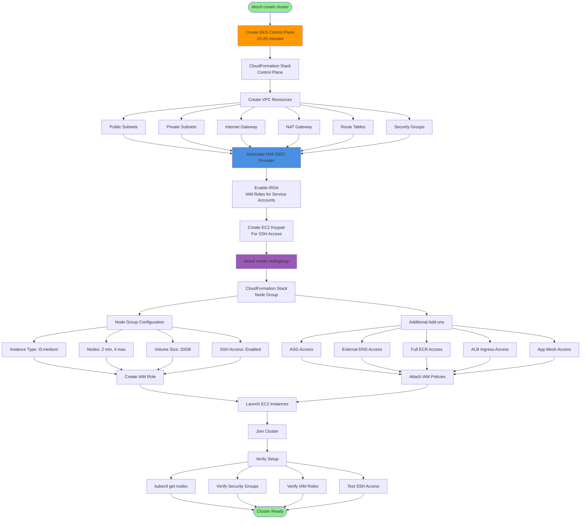

# Create EKS Cluster & Node Groups

## Architecture Diagram



### Diagram Explanation

- **Control Plane Creation**: Takes **15-20 minutes**, AWS manages **etcd**, **API server**, **scheduler**, and **controller manager** across **multiple AZs**
- **CloudFormation Automation**: eksctl uses **CloudFormation stacks** to create and track all resources, enabling **easy rollback** and **cleanup**
- **VPC Architecture**: Automatically provisions **public subnets** (for load balancers), **private subnets** (for nodes), **NAT gateways**, and **routing tables**
- **Security Groups**: Creates **control plane security group** and **node security group** with proper **ingress/egress rules** for cluster communication
- **IAM OIDC Provider**: Essential for **IRSA** (IAM Roles for Service Accounts), allows pods to assume **IAM roles** without node-level credentials
- **Service Account Integration**: OIDC enables **fine-grained IAM permissions** for individual pods using **Kubernetes service accounts** mapped to **IAM roles**
- **EC2 Keypair**: Required for **SSH access** to worker nodes for **debugging**, **troubleshooting**, and **log inspection**
- **Managed Node Group**: AWS handles **AMI updates**, **graceful termination**, and **ASG integration** for worker node lifecycle management
- **Add-on Policies**: Pre-configured **IAM policies** for common use cases - **ALB Ingress**, **External DNS**, **ECR pulls**, **Cluster Autoscaler**
- **Node Configuration**: Specifies **instance type**, **scaling limits**, **EBS volume size**, and enables **managed scaling** through Auto Scaling Groups

## Step-00: Introduction
- Understand about EKS Core Objects
  - Control Plane
  - Worker Nodes & Node Groups
  - Fargate Profiles
  - VPC
- Create EKS Cluster
- Associate EKS Cluster to IAM OIDC Provider
- Create EKS Node Groups
- Verify Cluster, Node Groups, EC2 Instances, IAM Policies and Node Groups


## Step-01: Create EKS Cluster using eksctl
- It will take 15 to 20 minutes to create the Cluster Control Plane 
```
# Create Cluster
eksctl create cluster --name=eksdemo1 \
                      --region=us-east-1 \
                      --zones=us-east-1a,us-east-1b \
                      --without-nodegroup 

# Get List of clusters
eksctl get cluster                  
```


## Step-02: Create & Associate IAM OIDC Provider for our EKS Cluster
- To enable and use AWS IAM roles for Kubernetes service accounts on our EKS cluster, we must create &  associate OIDC identity provider.
- To do so using `eksctl` we can use the  below command. 
- Use latest eksctl version (as on today the latest version is `0.21.0`)
```                   
# Template
eksctl utils associate-iam-oidc-provider \
    --region region-code \
    --cluster <cluter-name> \
    --approve

# Replace with region & cluster name
eksctl utils associate-iam-oidc-provider \
    --region us-east-1 \
    --cluster eksdemo1 \
    --approve
```


## Step-03: Create EC2 Keypair
- Create a new EC2 Keypair with name as `kube-demo`
- This keypair we will use it when creating the EKS NodeGroup.
- This will help us to login to the EKS Worker Nodes using Terminal.

## Step-04: Create Node Group with additional Add-Ons in Public Subnets
- These add-ons will create the respective IAM policies for us automatically within our Node Group role.
 ```
# Create Public Node Group   
eksctl create nodegroup --cluster=eksdemo1 \
                        --region=us-east-1 \
                        --name=eksdemo1-ng-public1 \
                        --node-type=t3.medium \
                        --nodes=2 \
                        --nodes-min=2 \
                        --nodes-max=4 \
                        --node-volume-size=20 \
                        --ssh-access \
                        --ssh-public-key=kube-demo \
                        --managed \
                        --asg-access \
                        --external-dns-access \
                        --full-ecr-access \
                        --appmesh-access \
                        --alb-ingress-access 
```

## Step-05: Verify Cluster & Nodes

### Verify NodeGroup subnets to confirm EC2 Instances are in Public Subnet
- Verify the node group subnet to ensure it created in public subnets
  - Go to Services -> EKS -> eksdemo -> eksdemo1-ng1-public
  - Click on Associated subnet in **Details** tab
  - Click on **Route Table** Tab.
  - We should see that internet route via Internet Gateway (0.0.0.0/0 -> igw-xxxxxxxx)

### Verify Cluster, NodeGroup in EKS Management Console
- Go to Services -> Elastic Kubernetes Service -> eksdemo1

### List Worker Nodes
```
# List EKS clusters
eksctl get cluster

# List NodeGroups in a cluster
eksctl get nodegroup --cluster=<clusterName>

# List Nodes in current kubernetes cluster
kubectl get nodes -o wide

# Our kubectl context should be automatically changed to new cluster
kubectl config view --minify
```

### Verify Worker Node IAM Role and list of Policies
- Go to Services -> EC2 -> Worker Nodes
- Click on **IAM Role associated to EC2 Worker Nodes**

### Verify Security Group Associated to Worker Nodes
- Go to Services -> EC2 -> Worker Nodes
- Click on **Security Group** associated to EC2 Instance which contains `remote` in the name.

### Verify CloudFormation Stacks
- Verify Control Plane Stack & Events
- Verify NodeGroup Stack & Events

### Login to Worker Node using Keypai kube-demo
- Login to worker node
```
# For MAC or Linux or Windows10
ssh -i kube-demo.pem ec2-user@<Public-IP-of-Worker-Node>

# For Windows 7
Use putty
```

## Step-06: Update Worker Nodes Security Group to allow all traffic
- We need to allow `All Traffic` on worker node security group

## Additional References
- https://docs.aws.amazon.com/eks/latest/userguide/enable-iam-roles-for-service-accounts.html
- https://docs.aws.amazon.com/eks/latest/userguide/create-service-account-iam-policy-and-role.html
