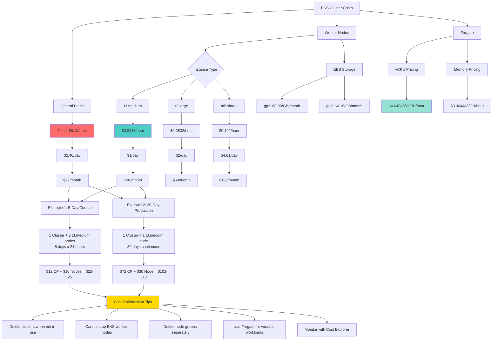

# EKS Cluster Pricing

## Pricing Diagram

### Diagram Explanation

- **Control Plane Cost**: Fixed **$0.10 per hour** ($72/month) regardless of cluster size, workload, or traffic volume - **no free tier available**
- **Worker Node Pricing**: Based on **EC2 instance type** and **running hours** - a single **t3.medium** costs approximately **$30/month** if running continuously
- **Multiple Node Cost**: With 2 t3.medium nodes, monthly cost is **$60 for compute** plus **$72 for control plane** = **$132 total minimum**
- **EBS Storage Costs**: Each node requires **root volume** (typically 20GB), charged at **$0.08-0.10/GB/month** for gp3/gp2 volumes
- **Fargate Pricing Model**: Pay for **actual vCPU and memory** consumed per second with **1-minute minimum**, ideal for **variable workloads**
- **Course Duration Cost**: For a **5-day learning period** with 2 worker nodes, expect approximately **$22-25** in total AWS charges
- **Cannot Stop Nodes**: Unlike regular EC2 instances, you **cannot stop** EKS worker nodes - must **delete the node group** to avoid charges
- **Cost Optimization Strategy**: **Delete entire cluster** when not actively learning, **recreate as needed** using eksctl for hands-on practice
- **Regional Pricing Variance**: Prices shown are for **us-east-1** (N. Virginia) - other regions may have **5-15% higher** instance costs
- **Hidden Costs**: Don't forget **data transfer**, **load balancer hours**, **EBS snapshots**, and **NAT gateway charges** in total calculation

## Steo-01: Very Important EKS Pricing Note
- EKS is not free (Unlike other AWS Services)
- In short, no free-tier for EKS.
### EKS Cluster Pricing
    - We pay $0.10 per hour for each Amazon EKS cluster
    - Per Day: $2.4
    - For 30 days: $72
### EKS Worker Nodes Pricing - EC2
    - You pay for AWS resources (e.g. EC2 instances or EBS volumes) 
    - T3 Medium Server in N.Virginia
        - $0.0416 per Hour
        - Per Day: $0.9984 - Approximately $1
        - Per Month: $30 per 1 t3.medium server
    - Reference: https://aws.amazon.com/ec2/pricing/on-demand/
    - In short, if we run 1 EKS Cluster and 1 t3.medium worker node **continuously** for 1 month, our bill is going to be around $102 to $110
    - If we take 5 days to complete this course, and if we run 1 EKS Cluster and 2 t3.medium Worker nodes continuosly for 5 days it will cost us approximately around $25. 
### EKS Fargate Profile
    - AWS Fargate pricing is calculated based on the **vCPU and memory** resources used from the time you start to download your container image until the EKS Pod terminates.
    - **Reference:** https://aws.amazon.com/fargate/pricing/    
    - Amazon EKS support for AWS Fargate is available in us-east-1, us-east-2, eu-west-1, and ap-northeast-1.

### Important Notes    
- **Important Note-1:** If you are using your personal AWS Account, then ensure you delete and recreate cluster and worker nodes as and when needed. 
- **Important Note-2:** We cant stop our EC2 Instances which are in Kubernetes cluster unlike regular EC2 Instances. So we need to delete the worker nodes (Node Group) if we are not using it during our learning process.
 