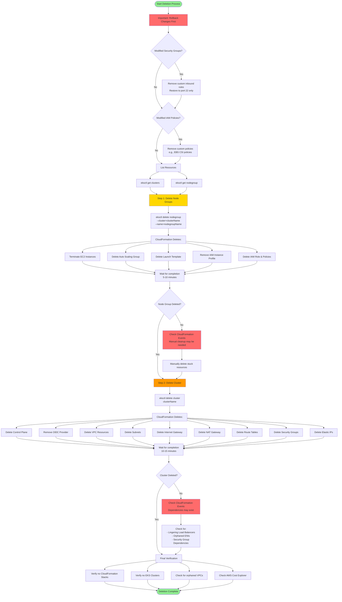

# Delete EKS Cluster & Node Groups

## Deletion Workflow Diagram



### Diagram Explanation

- **Pre-Deletion Rollback**: Critical to **revert security group changes** and **IAM policy modifications** before deletion to avoid **stuck resources**
- **Order Matters**: Always delete **node groups first**, then **cluster** - reversing this order causes **CloudFormation errors** and **orphaned resources**
- **CloudFormation Orchestration**: eksctl uses **CloudFormation stacks** to track resources - deletion happens in **reverse dependency order**
- **Node Group Deletion**: Terminates **EC2 instances** gracefully, deletes **Auto Scaling Group**, **Launch Template**, and associated **IAM roles**
- **Deletion Timing**: Node groups take **5-10 minutes**, cluster deletion takes **10-15 minutes** - be patient and monitor **CloudFormation events**
- **Security Group Dependencies**: Custom rules added for **NodePort services** or **load balancers** can block deletion - **must be removed first**
- **IAM Policy Cleanup**: Custom policies like **EBS CSI Driver** or **ALB Controller** policies attached to node role **prevent clean deletion**
- **VPC Resource Cleanup**: Cluster deletion removes **subnets**, **route tables**, **NAT gateways**, **internet gateways**, and **security groups** automatically
- **Common Failure Causes**: Orphaned **ENIs** (Elastic Network Interfaces), **load balancers**, or **security group dependencies** can block VPC deletion
- **Cost Verification**: After deletion, check **AWS Cost Explorer** and **CloudFormation console** to ensure **no lingering resources** causing charges

## Step-01: Delete Node Group
- We can delete a nodegroup separately using below `eksctl delete nodegroup`
```
# List EKS Clusters
eksctl get clusters

# Capture Node Group name
eksctl get nodegroup --cluster=<clusterName>
eksctl get nodegroup --cluster=eksdemo1

# Delete Node Group
eksctl delete nodegroup --cluster=<clusterName> --name=<nodegroupName>
eksctl delete nodegroup --cluster=eksdemo1 --name=eksdemo1-ng-public1
```

## Step-02: Delete Cluster  
- We can delete cluster using `eksctl delete cluster`
```
# Delete Cluster
eksctl delete cluster <clusterName>
eksctl delete cluster eksdemo1
```

## Important Notes

### Note-1: Rollback any Security Group Changes
- When we create a EKS cluster using `eksctl` it creates the worker node security group with only port 22 access.
- When we progress through the course, we will be creating many **NodePort Services** to access and test our applications via browser. 
- During this process, we need to add an additional rule to this automatically created security group, allowing access to our applications we have deployed. 
- So the point we need to understand here is when we are deleting the cluster using `eksctl`, its core components should be in same state which means roll back the change we have done to security group before deleting the cluster.
- In this way, cluster will get deleted without any issues, else we might have issues and we need to refer cloudformation events and manually delete few things. In short, we need to go to many places for deletions. 

### Note-2: Rollback any EC2 Worker Node Instance Role - Policy changes
- When we are doing `EBS Storage Section with EBS CSI Driver` we will add a custom policy to worker node IAM role.
- When you are deleting the cluster, first roll back that change and delete it. 
- This way we don't face any issues during cluster deletion.
