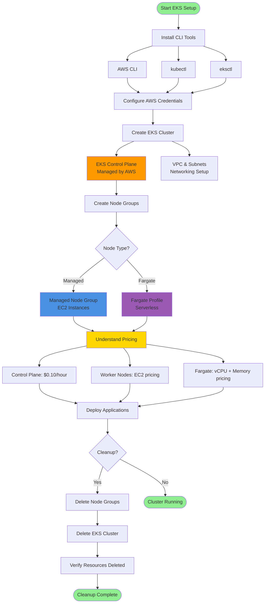

# EKS - Create Cluster

## Architecture Diagram

### Diagram Explanation

- **CLI Installation**: Three essential tools required - **AWS CLI** for AWS operations, **kubectl** for Kubernetes management, and **eksctl** for EKS cluster automation
- **AWS Configuration**: Set up **IAM credentials** and **default region** to authenticate and authorize all AWS API calls
- **EKS Control Plane**: Fully managed by AWS, provides **high availability** across multiple AZs, handles **API server** and **etcd** database
- **VPC Networking**: Automatically creates **VPC**, **subnets**, **security groups**, and **routing tables** for cluster communication
- **Node Group Options**: Choose between **Managed Node Groups** (EC2 instances with auto-scaling) or **Fargate Profiles** (serverless, no node management)
- **Control Plane Pricing**: Fixed cost of **$0.10 per hour** regardless of cluster size or workload volume
- **Worker Node Costs**: **EC2-based pricing** for managed node groups based on instance type, plus **EBS storage** costs
- **Fargate Pricing**: Pay only for **vCPU and memory** resources used by pods, billed per second with 1-minute minimum
- **Resource Cleanup**: Important to delete **node groups first**, then **cluster**, then verify **VPC and security groups** are removed
- **Cost Optimization**: Proper cleanup prevents unnecessary charges; use **eksctl delete cluster** command for complete removal

## List of Topics 
- Install CLIs
  - AWS CLI
  - kubectl
  - eksctl
- Create EKS Cluster
- Create EKS Node Groups
- Understand EKS Cluster Pricing
  - EKS Control Plane
  - EKS Worker Nodes
  - EKS Fargate Profile
- Delete EKS Clusters 

