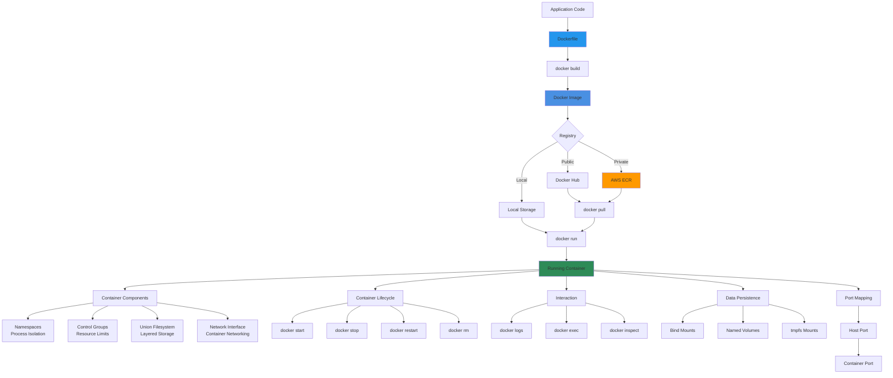

# Docker Fundamentals

## Architecture Diagram

### Diagram Explanation

- **Docker Image**: Immutable **template** containing application code, **dependencies**, **runtime**, and **system libraries** - built from Dockerfile instructions
- **Dockerfile**: Text file with **step-by-step instructions** (FROM, COPY, RUN, CMD) that defines how to **build** a container image
- **Container Registry**: Central repository for storing and distributing images - **Docker Hub** (public), **AWS ECR** (private), or **local** registry
- **Running Container**: Isolated process with its own **filesystem**, **network**, and **resources** created from a Docker image
- **Namespaces**: Linux kernel feature providing **process isolation** - separate PID, network, mount, and user namespaces per container
- **Control Groups (cgroups)**: Limit and monitor **resource usage** (CPU, memory, disk I/O) to prevent containers from consuming excessive resources
- **Union Filesystem**: **Layered** approach where each Dockerfile instruction creates a layer, enabling **image reusability** and **efficient storage**
- **Container Networking**: Each container gets virtual **network interface**, can communicate via **bridge network**, **host network**, or **overlay network**
- **Volume Management**: Persist data beyond container lifecycle using **named volumes** (managed by Docker) or **bind mounts** (host directories)
- **Port Mapping**: Expose container services to host by mapping **container ports** to **host ports** (e.g., 8080:80 maps host 8080 to container 80)

## External Resource
- For Docker Fundamentals github repository, please click on below link
- https://github.com/stacksimplify/docker-fundamentals

