# Kubernetes Fundamentals

## Architecture Diagram

```mermaid
graph TB
    subgraph "Control Plane"
        API[API Server<br/>kubectl entry point]
        ETCD[etcd<br/>Cluster state database]
        SCHED[Scheduler<br/>Pod placement]
        CM[Controller Manager<br/>Desired state]
        CCM[Cloud Controller Manager<br/>Cloud integration]
    end
    
    subgraph "Worker Node 1"
        KUBELET1[kubelet<br/>Node agent]
        KPROXY1[kube-proxy<br/>Network rules]
        RUNTIME1[Container Runtime<br/>Docker/containerd]
        
        subgraph "Pods"
            POD1[Pod 1<br/>App Container]
            POD2[Pod 2<br/>App Container]
        end
    end
    
    subgraph "Worker Node 2"
        KUBELET2[kubelet]
        KPROXY2[kube-proxy]
        RUNTIME2[Container Runtime]
        
        subgraph "Pods2"
            POD3[Pod 3]
            POD4[Pod 4]
        end
    end
    
    USER[kubectl/API Client] --> API
    API <--> ETCD
    API --> SCHED
    API --> CM
    API --> CCM
    
    SCHED --> API
    CM --> API
    
    API <--> KUBELET1
    API <--> KUBELET2
    
    KUBELET1 --> RUNTIME1
    RUNTIME1 --> POD1
    RUNTIME1 --> POD2
    
    KUBELET2 --> RUNTIME2
    RUNTIME2 --> POD3
    RUNTIME2 --> POD4
    
    KPROXY1 -.-> POD1
    KPROXY1 -.-> POD2
    KPROXY2 -.-> POD3
    KPROXY2 -.-> POD4
    
    subgraph "Kubernetes Objects"
        DEP[Deployment<br/>Manages ReplicaSets]
        RS[ReplicaSet<br/>Maintains Pod replicas]
        SVC[Service<br/>Load balancing & discovery]
        ING[Ingress<br/>HTTP routing]
        CM2[ConfigMap<br/>Configuration data]
        SEC[Secret<br/>Sensitive data]
        PV[PersistentVolume<br/>Storage]
        PVC[PersistentVolumeClaim<br/>Storage request]
        NS[Namespace<br/>Virtual clusters]
    end
    
    DEP --> RS
    RS --> POD1
    RS --> POD2
    SVC --> POD1
    SVC --> POD3
    ING --> SVC
    
    style API fill:#326CE5
    style ETCD fill:#FF6B6B
    style POD1 fill:#2E8B57
    style POD2 fill:#2E8B57
    style DEP fill:#4A90E2
    style SVC fill:#9B59B6
```

### Diagram Explanation

- **Control Plane**: Brain of Kubernetes cluster - manages **cluster state**, **scheduling decisions**, and **controller operations** across all nodes
- **API Server**: Central hub for all cluster communication - **kubectl** commands, **internal components**, and **external APIs** interact through it
- **etcd**: Distributed **key-value store** holding entire cluster state - **critical for recovery**, requires **regular backups** for production
- **Scheduler**: Watches for **unscheduled pods** and assigns them to nodes based on **resource requirements**, **constraints**, and **policies**
- **kubelet**: Node agent running on each worker node - ensures **containers are running**, reports **node health**, and manages **pod lifecycle**
- **kube-proxy**: Maintains **network rules** on nodes, enables **service abstraction** by routing traffic to appropriate pods via **iptables** or **IPVS**
- **Pod**: Smallest deployable unit - contains one or more **tightly coupled containers** sharing **network namespace** and **storage volumes**
- **Deployment**: Declares **desired state** for pods - handles **rolling updates**, **rollbacks**, and maintains specified number of **replicas**
- **Service**: Provides **stable networking** for pods - offers **ClusterIP** (internal), **NodePort** (external), or **LoadBalancer** (cloud) types
- **Ingress**: **HTTP/HTTPS routing** to services based on **hostnames** and **URL paths** - requires **Ingress Controller** like NGINX or ALB

## External Resource
- For Kubernetes Fundamentals github repository, please click on below link
- https://github.com/stacksimplify/kubernetes-fundamentals
