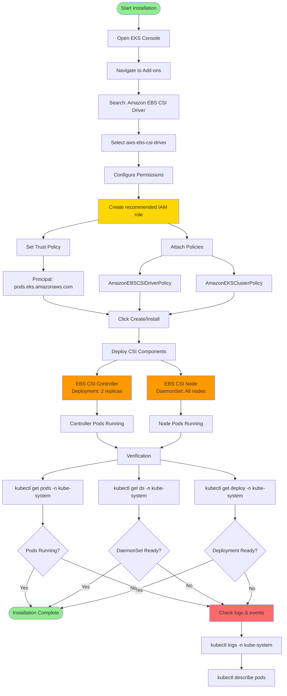

# Amazon EBS CSI Driver on EKS (with Pod Identity)

## Installation Flow Diagram



### Diagram Explanation

- **EKS Add-on Installation**: Simplified **one-click deployment** via EKS console, automatically handles **IAM** and **pod configurations**
- **Recommended IAM Role**: EKS creates **IAM role** with trust policy for **pods.eks.amazonaws.com** and attaches required **EBS policies**
- **AmazonEBSCSIDriverPolicy**: Managed policy granting permissions for **CreateVolume**, **AttachVolume**, **DeleteVolume**, **DescribeVolumes** operations
- **CSI Controller Deployment**: Runs **2 replicas** (for high availability) handling **volume lifecycle** operations via AWS EBS API
- **CSI Node DaemonSet**: Runs on **every worker node**, manages **device mounting**, **filesystem formatting**, and **volume attachment** to pods
- **Pod Identity Integration**: CSI driver pods automatically receive **temporary IAM credentials** via Pod Identity Agent, no manual configuration needed
- **Multi-Container Pods**: Controller pods run **6 containers** (provisioner, attacher, snapshotter, resizer, liveness probe, node driver registrar)
- **Node Driver Registrar**: Registers **CSI driver** with kubelet on each node, enabling volume mount/unmount operations
- **Verification Commands**: Check pod status in **kube-system namespace** to confirm **controller** and **node pods** are running successfully
- **Troubleshooting**: If pods fail, check **logs** and **describe events** to identify issues with IAM permissions or cluster configuration

## Step-00: What we'll do

1. Install the **Amazon EBS CSI Driver** add-on (with IAM role via "Create recommended role")
2. Verify installation using `kubectl`

---

## Step-01: Install Amazon EBS CSI Driver

1. Still on **Add-ons** → **Get more add-ons**
2. Search for **Amazon EBS CSI driver (`aws-ebs-csi-driver`)**
3. On the **Permissions** step, choose **Create recommended role**

   * Console will create an IAM role with the managed policy:
     **`AmazonEBSCSIDriverPolicy`**, and **`AmazonEKSClusterPolicy`**
   * Trust is automatically set to **`pods.eks.amazonaws.com`**

```json
{
    "Version": "2012-10-17",
    "Statement": [
        {
            "Effect": "Allow",
            "Principal": {
                "Service": "pods.eks.amazonaws.com"
            },
            "Action": [
                "sts:AssumeRole",
                "sts:TagSession"
            ]
        }
    ]
}
```

4. Click **Create**

> This deploys the **EBS CSI controller** Deployment and the **EBS CSI node DaemonSet**.

---

## Step-02: Verify installation

```bash
# List pods in kube-system
kubectl get pods -n kube-system
```

**Expected output (sample):**

```bash
NAME                                  READY   STATUS    RESTARTS   AGE
aws-node-np6bt                        2/2     Running   0          2h
coredns-6b9575c64c-bvlxh              1/1     Running   0          2h45m
ebs-csi-controller-6c794c785d-27mcc   6/6     Running   0          15m
ebs-csi-node-bf4nq                    3/3     Running   0          15m
eks-pod-identity-agent-mkxmw          1/1     Running   0          42m
kube-proxy-6svwq                      1/1     Running   0          2h
metrics-server-75c7985757-c2cbf       1/1     Running   0          2h45m
```

```bash
# DaemonSets
kubectl get ds -n kube-system
```

**Expected output (sample):**

```bash
NAME                     DESIRED   CURRENT   READY   UP-TO-DATE   AVAILABLE   NODE SELECTOR              AGE
aws-node                 2         2         2       2            2           <none>                     2h45m
ebs-csi-node             2         2         2       2            2           kubernetes.io/os=linux     15m
eks-pod-identity-agent   2         2         2       2            2           <none>                     42m
kube-proxy               2         2         2       2            2           <none>                     2h45m
```

```bash
# Deployments
kubectl get deploy -n kube-system
```

**Expected output (sample):**

```bash
NAME                 READY   UP-TO-DATE   AVAILABLE   AGE
coredns              2/2     2            2           2h45m
ebs-csi-controller   2/2     2            2           16m
metrics-server       2/2     2            2           2h45m
```

---

## Summary

* Installed **Amazon EBS CSI Driver** add-on (with recommended IAM role)
* Verified that the **EBS CSI controller pods** and **EBS CSI node DaemonSet** are running successfully in the cluster

---
