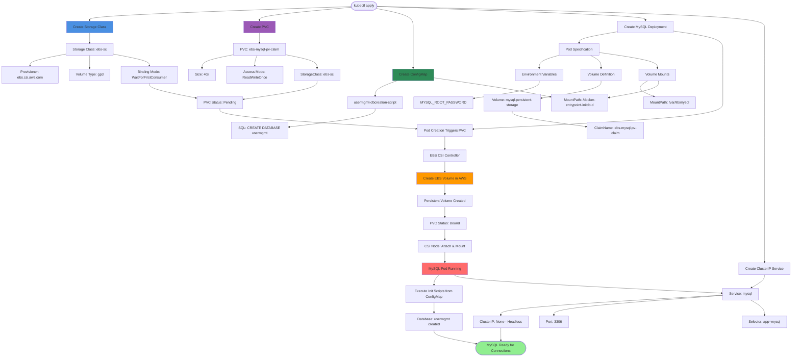

# EKS Storage -  Storage Classes, Persistent Volume Claims

## MySQL Deployment Architecture



### Diagram Explanation

- **Storage Class**: Defines **EBS CSI provisioner** with **gp3 volume type** and **WaitForFirstConsumer** binding mode for optimized AZ placement
- **WaitForFirstConsumer**: Delays **volume creation** until pod is scheduled, ensuring EBS volume is created in **same AZ** as the node
- **Persistent Volume Claim**: Requests **4Gi storage** with **ReadWriteOnce** access (single node mount), references the ebs-sc storage class
- **Dynamic Provisioning**: When pod is created, **CSI controller** automatically provisions **EBS volume** and creates **PersistentVolume** object
- **ConfigMap for Initialization**: Contains **SQL script** to create **usermgmt database** schema, mounted at **/docker-entrypoint-initdb.d** for MySQL auto-execution
- **Volume Mounts**: Pod mounts **mysql-persistent-storage** at **/var/lib/mysql** (data directory) and **configmap** at **/docker-entrypoint-initdb.d** (init scripts)
- **Environment Variables**: MYSQL_ROOT_PASSWORD set from manifest, used by MySQL container for **initial root user** setup
- **Headless Service**: ClusterIP None creates **DNS entry** pointing directly to **pod IP**, ideal for single-instance stateful applications
- **Service Discovery**: Other pods connect to MySQL using **mysql.default.svc.cluster.local** hostname on **port 3306**
- **Data Persistence**: Even if MySQL pod is deleted and recreated, data persists in **EBS volume** and **reattaches** to new pod automatically

## Step-01: Introduction
- We are going to create a MySQL Database with persistence storage using AWS EBS Volumes

| Kubernetes Object  | YAML File |
| ------------- | ------------- |
| Storage Class  | 01-storage-class.yml |
| Persistent Volume Claim | 02-persistent-volume-claim.yml   |
| Config Map  | 03-UserManagement-ConfigMap.yml  |
| Deployment, Environment Variables, Volumes, VolumeMounts  | 04-mysql-deployment.yml  |
| ClusterIP Service  | 05-mysql-clusterip-service.yml  |

## Step-02: Create following Kubernetes manifests
### Create Storage Class manifest
- https://kubernetes.io/docs/concepts/storage/storage-classes/#volume-binding-mode
- **Important Note:** `WaitForFirstConsumer` mode will delay the volume binding and provisioning  of a PersistentVolume until a Pod using the PersistentVolumeClaim is created. 

### Create Persistent Volume Claims manifest
```
# Create Storage Class & PVC
kubectl apply -f kube-manifests/

# List Storage Classes
kubectl get sc

# List PVC
kubectl get pvc 

# List PV
kubectl get pv
```
### Create ConfigMap manifest
- We are going to create a `usermgmt` database schema during the mysql pod creation time which we will leverage when we deploy User Management Microservice. 

### Create MySQL Deployment manifest
- Environment Variables
- Volumes
- Volume Mounts

### Create MySQL ClusterIP Service manifest
- At any point of time we are going to have only one mysql pod in this design so `ClusterIP: None` will use the `Pod IP Address` instead of creating or allocating a separate IP for `MySQL Cluster IP service`.   

## Step-03: Create MySQL Database with all above manifests
```
# Create MySQL Database
kubectl apply -f kube-manifests/

# List Storage Classes
kubectl get sc

# List PVC
kubectl get pvc 

# List PV
kubectl get pv

# List pods
kubectl get pods 

# List pods based on  label name
kubectl get pods -l app=mysql
```

## Step-04: Connect to MySQL Database
```
# Connect to MYSQL Database
kubectl run -it --rm --image=mysql:5.6 --restart=Never mysql-client -- mysql -h mysql -pdbpassword11

[or]

# Use mysql client latest tag
kubectl run -it --rm --image=mysql:latest --restart=Never mysql-client -- mysql -h mysql -pdbpassword11

# Verify usermgmt schema got created which we provided in ConfigMap
mysql> show schemas;
```

## Step-05: References
- We need to discuss references exclusively here. 
- These will help you in writing effective templates based on need in your environments. 
- Few features are still in alpha stage as on today (Example:Resizing), but once they reach beta you can start leveraging those templates and make your trials. 
- **EBS CSI Driver:** https://github.com/kubernetes-sigs/aws-ebs-csi-driver
- **EBS CSI Driver Dynamic Provisioning:**  https://github.com/kubernetes-sigs/aws-ebs-csi-driver/tree/master/examples/kubernetes/dynamic-provisioning
- **EBS CSI Driver - Other Examples like Resizing, Snapshot etc:** https://github.com/kubernetes-sigs/aws-ebs-csi-driver/tree/master/examples/kubernetes
- **k8s API Reference Doc:** https://kubernetes.io/docs/reference/generated/kubernetes-api/v1.18/#storageclass-v1-storage-k8s-io


