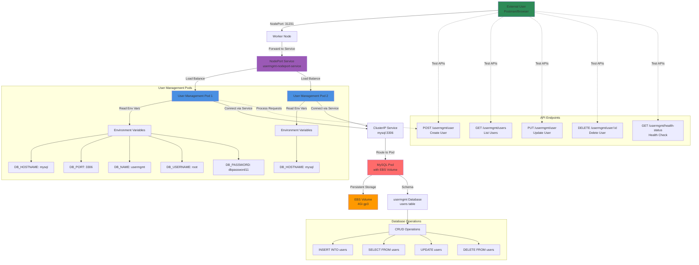

# Deploy UserManagement Service with MySQL Database

## Application Architecture Diagram



### Diagram Explanation

- **User Management Microservice**: **Spring Boot** application providing RESTful APIs for **user CRUD operations** with MySQL backend
- **NodePort Service**: Exposes application on **port 31231** on all worker nodes, allowing **external access** without load balancer
- **Environment Variables**: Pod configuration includes **DB connection parameters** (hostname, port, database name, credentials) injected at runtime
- **Service Discovery**: Application connects to MySQL using **service name** (mysql) which resolves to **ClusterIP**, no hardcoded IPs
- **Connection Pooling**: Spring Boot manages **database connection pool** for efficient **concurrent request handling** and **resource management**
- **Pod Replication**: Multiple pods provide **high availability** and **horizontal scaling**, service distributes traffic across all healthy pods
- **RESTful API Design**: Follows **REST principles** with proper **HTTP methods** (GET, POST, PUT, DELETE) and **JSON payloads**
- **Health Status Endpoint**: Provides **liveness** and **readiness** checks for Kubernetes health monitoring and **automatic pod recovery**
- **Data Persistence**: All user data stored in **MySQL database** backed by **EBS volume**, survives pod restarts and redeployments
- **Testing with Postman**: Import collection to test all APIs with **environment variables** for easy endpoint management and **request templates**

## Step-01: Introduction
- We are going to deploy a **User Management Microservice** which will connect to MySQL Database schema **usermgmt** during startup.
- Then we can test the following APIs
  - Create Users
  - List Users
  - Delete User
  - Health Status 

| Kubernetes Object  | YAML File |
| ------------- | ------------- |
| Deployment, Environment Variables  | 06-UserManagementMicroservice-Deployment.yml  |
| NodePort Service  | 07-UserManagement-Service.yml  |

## Step-02: Create following Kubernetes manifests

### Create User Management Microservice Deployment manifest
- **Environment Variables**

| Key Name  | Value |
| ------------- | ------------- |
| DB_HOSTNAME  | mysql |
| DB_PORT  | 3306  |
| DB_NAME  | usermgmt  |
| DB_USERNAME  | root  |
| DB_PASSWORD | dbpassword11  |  

### Create User Management Microservice NodePort Service manifest
- NodePort Service

## Step-03: Create UserManagement Service Deployment & Service 
```
# Create Deployment & NodePort Service
kubectl apply -f kube-manifests/

# List Pods
kubectl get pods

# Verify logs of Usermgmt Microservice pod
kubectl logs -f <Pod-Name>

# Verify sc, pvc, pv
kubectl get sc,pvc,pv
```
- **Problem Observation:** 
  - If we deploy all manifests at a time, by the time mysql is ready our `User Management Microservice` pod will be restarting multiple times due to unavailability of Database. 
  - To avoid such situations, we can apply `initContainers` concept to our User management Microservice `Deployment manifest`.
  - We will see that in our next section but for now lets continue to test the application
- **Access Application**
```
# List Services
kubectl get svc

# Get Public IP
kubectl get nodes -o wide

# Access Health Status API for User Management Service
http://<EKS-WorkerNode-Public-IP>:31231/usermgmt/health-status
```

## Step-04: Test User Management Microservice using Postman
### Download Postman client 
- https://www.postman.com/downloads/ 
### Import Project to Postman
- Import the postman project `AWS-EKS-Masterclass-Microservices.postman_collection.json` present in folder `04-03-UserManagement-MicroService-with-MySQLDB`
### Create Environment in postman
- Go to Settings -> Click on Add
- **Environment Name:** UMS-NodePort
  - **Variable:** url
  - **Initial Value:** http://WorkerNode-Public-IP:31231
  - **Current Value:** http://WorkerNode-Public-IP:31231
  - Click on **Add**
### Test User Management Services
- Select the environment before calling any API
- **Health Status API**
  - URL: `{{url}}/usermgmt/health-status`
- **Create User Service**
  - URL: `{{url}}/usermgmt/user`
  - `url` variable will replaced from environment we selected
```json
    {
        "username": "admin1",
        "email": "dkalyanreddy@gmail.com",
        "role": "ROLE_ADMIN",
        "enabled": true,
        "firstname": "fname1",
        "lastname": "lname1",
        "password": "Pass@123"
    }
```
- **List User Service**
  - URL: `{{url}}/usermgmt/users`

- **Update User Service**
  - URL: `{{url}}/usermgmt/user`
```json
    {
        "username": "admin1",
        "email": "dkalyanreddy@gmail.com",
        "role": "ROLE_ADMIN",
        "enabled": true,
        "firstname": "fname2",
        "lastname": "lname2",
        "password": "Pass@123"
    }
```  
- **Delete User Service**
  - URL: `{{url}}/usermgmt/user/admin1`

## Step-05: Verify Users in MySQL Database
```
# Connect to MYSQL Database
kubectl run -it --rm --image=mysql:5.6 --restart=Never mysql-client -- mysql -h mysql -u root -pdbpassword11

# Verify usermgmt schema got created which we provided in ConfigMap
mysql> show schemas;
mysql> use usermgmt;
mysql> show tables;
mysql> select * from users;
```

## Step-06: Clean-Up
- Delete all k8s objects created as part of this section
```
# Delete All
kubectl delete -f kube-manifests/

# List Pods
kubectl get pods

# Verify sc, pvc, pv
kubectl get sc,pvc,pv
```


