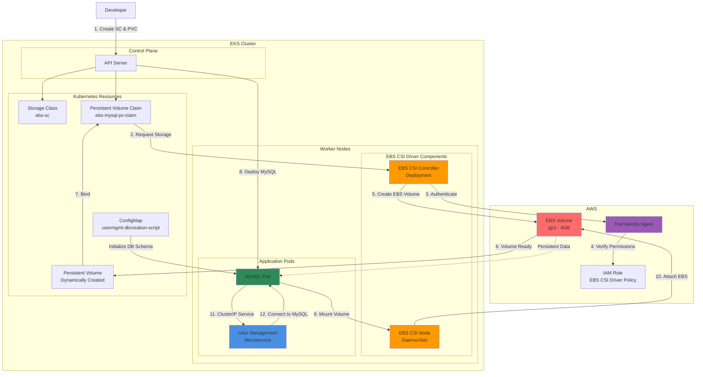

# AWS EKS Storage

## Architecture Diagram

### Diagram Explanation

- **EBS CSI Driver**: **Kubernetes controller** that enables dynamic provisioning of **AWS EBS volumes** as **PersistentVolumes** for pod storage
- **CSI Controller**: **Deployment** (runs on few nodes) handles **volume creation**, **attachment**, **deletion**, and communicates with **AWS EBS API**
- **CSI Node DaemonSet**: Runs on **every worker node**, responsible for **mounting volumes** into pods and managing **block device operations**
- **Storage Class**: Defines **EBS volume type** (gp3/gp2), **IOPS**, **throughput**, and **reclaim policy** for dynamic provisioning
- **Persistent Volume Claim (PVC)**: Kubernetes **storage request** by pods - specifies **size**, **access mode**, and references **StorageClass**
- **Dynamic Provisioning**: When PVC is created, CSI Controller **automatically creates** EBS volume and binds it as a **PersistentVolume**
- **Pod Identity Agent**: Provides **IAM credentials** to CSI driver pods using **EKS Pod Identity**, eliminating need for **node-level IAM policies**
- **Volume Attachment**: EBS CSI Node mounts the **attached EBS volume** to the node, then **bind-mounts** it into the pod's filesystem
- **Data Persistence**: MySQL data survives **pod restarts** and **rescheduling** as EBS volume persists independently of pod lifecycle
- **ConfigMap Integration**: Pre-loads MySQL with **database schema** (usermgmt) for application initialization during first startup

## AWS EBS CSI Driver
- We are going to use EBS CSI Driver and use EBS Volumes for persistence storage to MySQL Database

## Topics
1. Install EBS CSI Driver
2. Create MySQL Database Deployment & ClusterIP Service
3. Create User Management Microservice Deployment & NodePort Service

## Concepts
| Kubernetes Object  | YAML File |
| ------------- | ------------- |
| Storage Class  | 01-storage-class.yml |
| Persistent Volume Claim | 02-persistent-volume-claim.yml   |
| Config Map  | 03-UserManagement-ConfigMap.yml  |
| Deployment, Environment Variables, Volumes, VolumeMounts  | 04-mysql-deployment.yml  |
| ClusterIP Service  | 05-mysql-clusterip-service.yml  |
| Deployment, Environment Variables  | 06-UserManagementMicroservice-Deployment.yml  |
| NodePort Service  | 07-UserManagement-Service.yml  |

## References:
- **Dynamic Volume Provisioning:** https://kubernetes.io/docs/concepts/storage/dynamic-provisioning/
- https://github.com/kubernetes-sigs/aws-ebs-csi-driver/tree/master/deploy/kubernetes/overlays/stable
- https://docs.aws.amazon.com/eks/latest/userguide/ebs-csi.html
- https://github.com/kubernetes-sigs/aws-ebs-csi-driver
- https://github.com/kubernetes-sigs/aws-ebs-csi-driver/tree/master/examples/kubernetes/dynamic-provisioning
- https://github.com/kubernetes-sigs/aws-ebs-csi-driver/tree/master/deploy/kubernetes/overlays/stable
- https://github.com/kubernetes-sigs/aws-ebs-csi-driver
- **Legacy: Will be deprecated** 
  - https://kubernetes.io/docs/concepts/storage/storage-classes/#aws-ebs
  - https://docs.aws.amazon.com/eks/latest/userguide/storage-classes.html