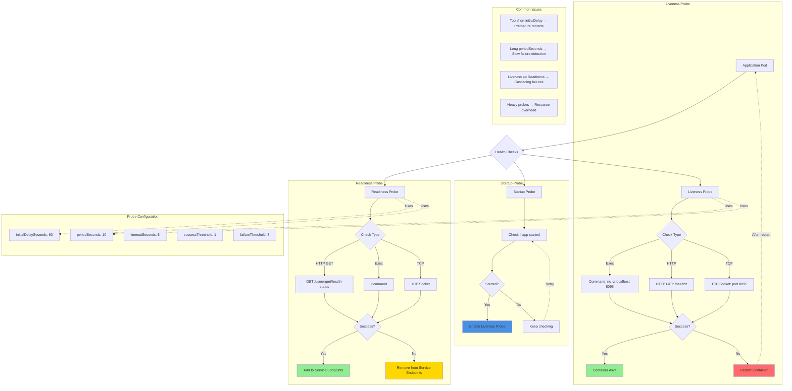

# Kubernetes - Liveness & Readiness Probes

## Probes Architecture Diagram



### Diagram Explanation

- **Liveness Probe**: Detects **deadlocked** or **unresponsive** containers, kubelet **restarts** container when probe fails repeatedly
- **Readiness Probe**: Determines if container can **serve traffic**, removes pod from **service endpoints** when not ready, preventing failed requests
- **Startup Probe**: For **slow-starting** applications, disables liveness checks until app is **fully initialized**, prevents premature kills
- **HTTP GET Probe**: Sends HTTP request to specified **path and port**, success if response code is **200-399**
- **Exec Command Probe**: Executes command inside container, success if exit code is **0** (e.g., nc -z checks port availability)
- **TCP Socket Probe**: Attempts TCP connection to **specified port**, success if connection established, useful for non-HTTP services
- **initialDelaySeconds**: Wait time before **first probe**, must be longer than application **startup time** to avoid false failures
- **periodSeconds**: How often to perform the probe, balance between **quick detection** (low value) and **resource usage** (high value)
- **failureThreshold**: Number of **consecutive failures** before taking action (restart for liveness, remove from service for readiness)
- **Best Practice**: Readiness should be **lighter weight** than liveness, use **different endpoints** to avoid cascading failures during high load

## Step-01: Introduction
- Refer `Probes` slide for additional details

## Step-02: Create Liveness Probe with Command
```yml
          livenessProbe:
            exec:
              command:
                - /bin/sh
                - -c
                - nc -z localhost 8095
            initialDelaySeconds: 60
            periodSeconds: 10
```

## Step-03: Create Readiness Probe with HTTP GET
```yml
          readinessProbe:
            httpGet:
              path: /usermgmt/health-status
              port: 8095
            initialDelaySeconds: 60
            periodSeconds: 10     
```


## Step-04: Create k8s objects & Test
```
# Create All Objects
kubectl apply -f kube-manifests/

# List Pods
kubectl get pods

# Watch List Pods screen
kubectl get pods -w

# Describe Pod & Discuss about init container
kubectl describe pod <usermgmt-microservice-xxxxxx>

# Access Application Health Status Page
http://<WorkerNode-Public-IP>:31231/usermgmt/health-status
```
- **Observation:** User Management Microservice pod witll not be in READY state to accept traffic until it completes the `initialDelaySeconds=60seconds`. 

## Step-05: Clean-Up
- Delete all k8s objects created as part of this section
```
# Delete All
kubectl delete -f kube-manifests/

# List Pods
kubectl get pods

# Verify sc, pvc, pv
kubectl get sc,pvc,pv
```


## References:
- https://kubernetes.io/docs/tasks/configure-pod-container/configure-liveness-readiness-startup-probes/
