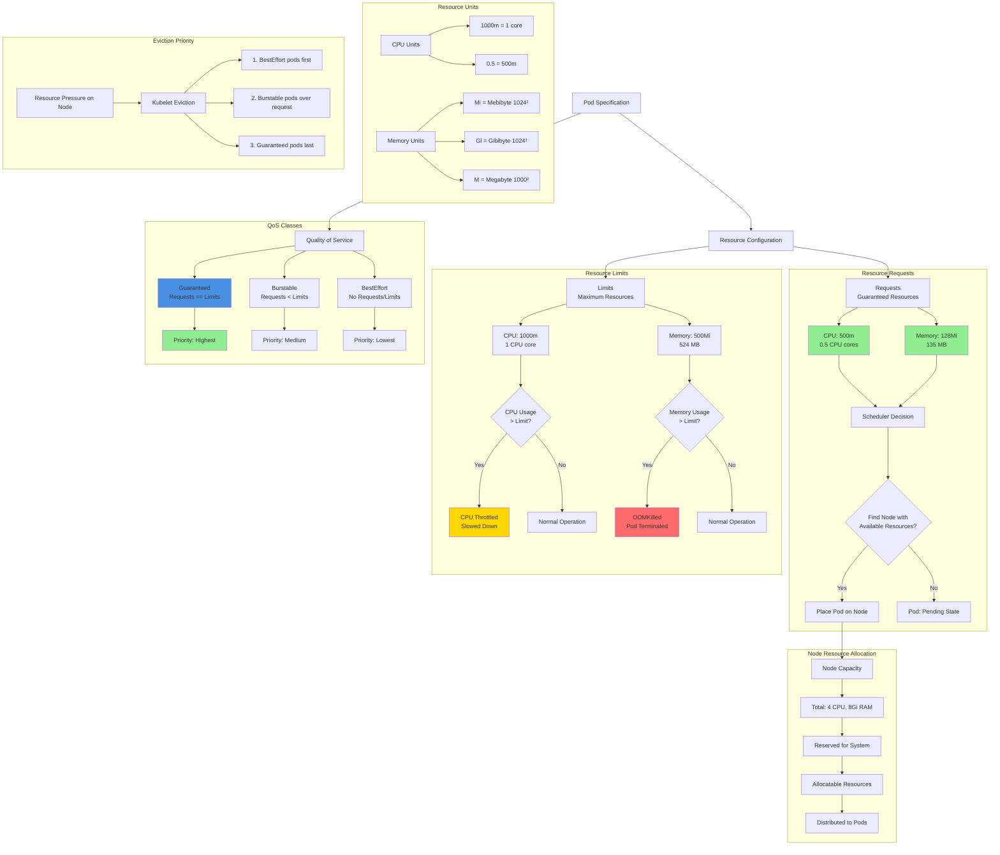

# Kubernetes - Requests and Limits

## Resource Management Diagram



### Diagram Explanation

- **CPU Requests**: **Guaranteed CPU time** for container, scheduler uses this to find nodes with **sufficient capacity**
- **Memory Requests**: **Guaranteed memory** allocation, kubelet reserves this amount on node for the container
- **CPU Limits**: **Maximum CPU** container can use, excess usage causes **CPU throttling** (slowdown), not termination
- **Memory Limits**: **Maximum memory** container can use, exceeding limit triggers **OOMKilled** (Out of Memory Kill), pod terminates
- **Scheduler Behavior**: Sums all pod **requests** (not limits) to determine if node has **enough allocatable resources**
- **QoS Guaranteed**: Requests equal limits for all resources, **highest priority**, last to be evicted during node pressure
- **QoS Burstable**: Requests less than limits, can use **extra resources** if available, evicted before Guaranteed pods
- **QoS BestEffort**: No requests or limits specified, uses **leftover resources**, first to be evicted under resource pressure
- **CPU Throttling**: When container exceeds CPU limit, kernel reduces its **CPU time slices**, causing **performance degradation**
- **milliCPU Units**: **1000m = 1 CPU core**, 500m = half core, allows **fine-grained** CPU allocation

## Step-01: Introduction
- We can specify how much each container a pod needs the resources like CPU & Memory. 
- When we provide this information in our pod, the scheduler uses this information to decide which node to place the Pod on. 
- When you specify a resource limit for a Container, the kubelet enforces those `limits` so that the running container is not allowed to use more of that resource than the limit you set. 
-  The kubelet also reserves at least the `request` amount of that system resource specifically for that container to use.

## Step-02: Add Requests & Limits
```yml
          resources:
            requests:
              memory: "128Mi" # 128 MebiByte is equal to 135 Megabyte (MB)
              cpu: "500m" # `m` means milliCPU
            limits:
              memory: "500Mi"
              cpu: "1000m"  # 1000m is equal to 1 VCPU core                                          
```

## Step-03: Create k8s objects & Test
```
# Create All Objects
kubectl apply -f kube-manifests/

# List Pods
kubectl get pods

# Watch List Pods screen
kubectl get pods -w

# Describe Pod & Discuss about init container
kubectl describe pod <usermgmt-microservice-xxxxxx>

# Access Application Health Status Page
http://<WorkerNode-Public-IP>:31231/usermgmt/health-status

# List Nodes & Describe Node
kubectl get nodes
kubectl describe node <Node-Name>
```
## Step-04: Clean-Up
- Delete all k8s objects created as part of this section
```
# Delete All
kubectl delete -f kube-manifests/

# List Pods
kubectl get pods

# Verify sc, pvc, pv
kubectl get sc,pvc,pv
```

## References:
- https://kubernetes.io/docs/concepts/configuration/manage-resources-containers/