# Namespaces

## Namespace Architecture Diagram

```mermaid
graph TB
    CLUSTER[Kubernetes Cluster] --> NS1[Namespace: default]
    CLUSTER --> NS2[Namespace: dev]
    CLUSTER --> NS3[Namespace: staging]
    CLUSTER --> NS4[Namespace: production]
    CLUSTER --> SYSTEM[Namespace: kube-system]
    
    subgraph "default namespace"
        NS1 --> D1[Pods]
        NS1 --> D2[Services]
        NS1 --> D3[ConfigMaps]
    end
    
    subgraph "dev namespace"
        NS2 --> QUOTA[ResourceQuota<br/>CPU: 4 cores<br/>Memory: 8Gi]
        NS2 --> LIMIT[LimitRange<br/>Default requests/limits]
        NS2 --> DEVPODS[Development Pods]
        QUOTA --> DEVPODS
        LIMIT --> DEVPODS
    end
    
    subgraph "staging namespace"
        NS3 --> STAGEQUOTA[ResourceQuota<br/>CPU: 8 cores<br/>Memory: 16Gi]
        NS3 --> STAGEPODS[Staging Pods]
    end
    
    subgraph "production namespace"
        NS4 --> PRODQUOTA[ResourceQuota<br/>CPU: 20 cores<br/>Memory: 40Gi]
        NS4 --> PRODPOLICY[Network Policies]
        NS4 --> PRODPODS[Production Pods]
        PRODQUOTA --> PRODPODS
        PRODPOLICY --> PRODPODS
    end
    
    subgraph "kube-system namespace"
        SYSTEM --> COREDNS[CoreDNS]
        SYSTEM --> KPROXY[kube-proxy]
        SYSTEM --> CNI[CNI Plugins]
    end
    
    subgraph "Namespace Features"
        F1[Logical Isolation]
        F2[Resource Quotas]
        F3[LimitRanges]
        F4[RBAC Boundaries]
        F5[Network Policies]
        F6[Service Discovery]
    end
    
    subgraph "ResourceQuota Limits"
        RQ[ResourceQuota]
        RQ --> RQCPU[CPU Limits]
        RQ --> RQMEM[Memory Limits]
        RQ --> RQPODS[Pod Count]
        RQ --> RQPVC[PVC Count]
        RQ --> RQSVC[Service Count]
    end
    
    subgraph "LimitRange Defaults"
        LR[LimitRange]
        LR --> LRDEF[Default Requests]
        LR --> LRLIM[Default Limits]
        LR --> LRMIN[Min Resources]
        LR --> LRMAX[Max Resources]
    end
    
    subgraph "Access Control"
        RBAC[Role-Based Access Control]
        RBAC --> ROLE[Role: namespace-scoped]
        RBAC --> ROLEBIND[RoleBinding]
        ROLE --> PERM[Permissions per namespace]
    end
    
    subgraph "Service Discovery"
        SVC[Service DNS]
        SVC --> SAME[Same NS: service-name]
        SVC --> CROSS[Cross NS: service.namespace.svc.cluster.local]
    end
    
    NS2 --> F1
    NS2 --> F2
    NS2 --> RQ
    NS2 --> LR
    NS2 --> RBAC
    
    style NS2 fill:#4A90E2
    style NS4 fill:#FF6B6B
    style QUOTA fill:#FFD700
    style PRODQUOTA fill:#FFD700
    style RBAC fill:#9B59B6
```

### Diagram Explanation

- **Logical Isolation**: Namespaces provide **virtual clusters** within physical cluster, separate **teams**, **projects**, or **environments** (dev/staging/prod)
- **ResourceQuota**: Limits **total resources** (CPU, memory, storage, object counts) that can be consumed in a namespace
- **LimitRange**: Sets **default requests/limits** for containers and enforces **min/max** resource constraints within namespace
- **RBAC Boundaries**: **Roles** and **RoleBindings** are namespace-scoped, enabling **fine-grained access control** per namespace
- **Network Policies**: Namespace-based **network isolation**, control ingress/egress traffic between pods in different namespaces
- **Service DNS**: Services within namespace use **short name**, cross-namespace requires **FQDN** (service.namespace.svc.cluster.local)
- **Default Namespace**: Auto-created namespace for resources without explicit namespace, **not recommended** for production workloads
- **kube-system Namespace**: Contains **cluster infrastructure** pods (CoreDNS, kube-proxy, CNI), **critical for cluster operation**
- **Resource Quota Enforcement**: Prevents **resource exhaustion** by limiting total usage, requires pods to specify **requests/limits**
- **Multi-Tenancy**: Namespaces enable **soft multi-tenancy**, multiple teams share cluster while maintaining **isolation** and **resource governance**

## Namespace Topics

1. Namespaces - Imperative using kubectl
2. Namespaces -  Declarative using YAML & LimitRange
3. Namespaces -  Declarative using YAML & ResourceQuota
