# Kubernetes Important Concepts for Application Deployments

## Concepts Overview Diagram

```mermaid
graph TB
    APP[Application Deployment] --> CONCEPTS[Critical K8s Concepts]
    
    CONCEPTS --> SEC[1. Secrets]
    CONCEPTS --> INIT[2. Init Containers]
    CONCEPTS --> PROBES[3. Probes]
    CONCEPTS --> RES[4. Resources]
    CONCEPTS --> NS[5. Namespaces]
    
    SEC --> SEC1[Secure Sensitive Data]
    SEC --> SEC2[Base64 Encoded]
    SEC --> SEC3[Environment Variables]
    SEC --> SEC4[Volume Mounts]
    
    INIT --> INIT1[Pre-start Tasks]
    INIT --> INIT2[Sequential Execution]
    INIT --> INIT3[Dependency Checks]
    INIT --> INIT4[Database Initialization]
    
    PROBES --> LIVE[Liveness Probe]
    PROBES --> READY[Readiness Probe]
    PROBES --> START[Startup Probe]
    
    LIVE --> LIVE1[Restart if Failed]
    READY --> READY1[Remove from Service]
    START --> START1[Delay Liveness Check]
    
    RES --> REQ[Requests]
    RES --> LIM[Limits]
    
    REQ --> REQ1[Minimum Resources<br/>CPU & Memory]
    LIM --> LIM1[Maximum Resources<br/>Prevent Overuse]
    
    NS --> NS1[Virtual Clusters]
    NS --> NS2[Resource Isolation]
    NS --> NS3[RBAC Boundaries]
    NS --> NS4[Resource Quotas]
    
    style SEC fill:#FF6B6B
    style INIT fill:#4A90E2
    style PROBES fill:#2E8B57
    style RES fill:#FF9900
    style NS fill:#9B59B6
```

### Diagram Explanation

- **Secrets**: Store **sensitive data** like passwords, API keys, and certificates in **base64-encoded** format, keeping them separate from application code
- **Environment Variables from Secrets**: Inject secrets as **environment variables** or mount as **files in volumes** for secure access by containers
- **Init Containers**: Run **before** main containers start, used for **setup tasks**, **dependency checks**, or **data initialization** that must complete first
- **Sequential Init Execution**: Multiple init containers run **one at a time** in order, next one starts only when previous succeeds
- **Liveness Probe**: Kubernetes checks if container is **alive**, **restarts pod** automatically if probe fails, useful for detecting **deadlocks**
- **Readiness Probe**: Determines if container is **ready to serve traffic**, removes pod from **service endpoints** if not ready, prevents **failed requests**
- **Startup Probe**: Used for **slow-starting containers**, disables **liveness checks** until app is fully initialized, prevents premature restarts
- **Resource Requests**: **Guaranteed resources** (CPU, memory) for container, used by **scheduler** for pod placement decisions
- **Resource Limits**: **Maximum resources** container can use, prevents **resource starvation** of other pods, enforces **fair sharing**
- **Namespaces**: Provide **logical isolation** between teams/projects, enable **resource quotas**, **network policies**, and **RBAC** per namespace

| S.No  | k8s Concept Name |
| ------------- | ------------- |
| 1.  | Secrets  |
| 2.  | Init Containers  |
| 3.  | Liveness & Readiness Probes  |
| 4.  | Requests & Limits  |
| 5.  | Namespaces  |
