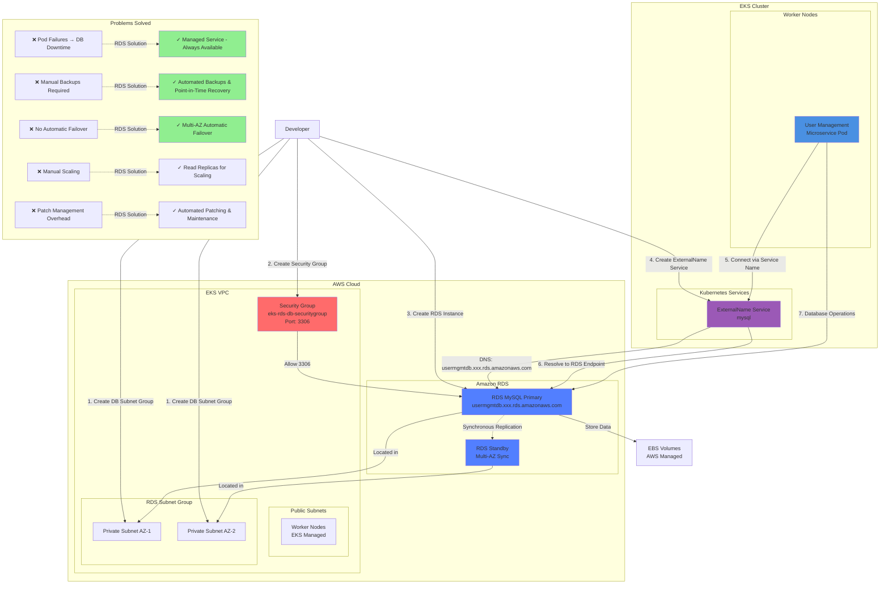

# Use RDS Database for Workloads running on AWS EKS Cluster

## RDS Integration Architecture



### Diagram Explanation

- **RDS Managed Service**: AWS handles **database administration**, **patching**, **backups**, and **high availability** automatically
- **ExternalName Service**: Kubernetes service type that creates **DNS CNAME** record pointing to **external RDS endpoint**, no proxy or load balancing
- **DB Subnet Group**: Defines **private subnets** across **multiple AZs** where RDS instances can be deployed for network isolation
- **Security Group**: Controls **inbound traffic** on port **3306**, allows connections from **EKS worker nodes** or specific CIDR ranges
- **Multi-AZ Deployment**: RDS maintains **synchronous standby replica** in different AZ, **automatic failover** in 60-120 seconds during outage
- **Automated Backups**: Daily **automated snapshots** retained for 7-35 days, **point-in-time recovery** to any second within retention period
- **No Pod Management**: Unlike MySQL pod, RDS eliminates concerns about **pod restarts**, **node failures**, and **storage attachment** issues
- **Read Replicas**: Create **asynchronous replicas** for **read scaling**, offload **SELECT queries** from primary to improve performance
- **Publicly Accessible Option**: For learning/troubleshooting, enable **public access** (not recommended for production) to connect from anywhere
- **Connection String Update**: Application connects to RDS endpoint (e.g., usermgmtdb.xxx.rds.amazonaws.com) via **ExternalName service** named "mysql"

## Step-01: Introduction
- What are the problems with MySQL Pod & EBS CSI? 
- How we are going to solve them using AWS RDS Database?

## Step-02: Create RDS Database

### Review VPC of our EKS Cluster
- Go to Services -> VPC
- **VPC Name:**  eksctl-eksdemo1-cluster/VPC

### Pre-requisite-1: Create DB Security Group
- Create security group to allow access for RDS Database on port 3306
- Security group name: eks_rds_db_sg
- Description: Allow access for RDS Database on Port 3306 
- VPC: eksctl-eksdemo1-cluster/VPC
- **Inbound Rules**
  - Type: MySQL/Aurora
  - Protocol: TPC
  - Port: 3306
  - Source: Anywhere (0.0.0.0/0)
  - Description: Allow access for RDS Database on Port 3306 
- **Outbound Rules**  
  - Leave to defaults

### Pre-requisite-2: Create DB Subnet Group in RDS 
- Go to RDS -> Subnet Groups
- Click on **Create DB Subnet Group**
  - **Name:** eks-rds-db-subnetgroup
  - **Description:** EKS RDS DB Subnet Group
  - **VPC:** eksctl-eksdemo1-cluster/VPC
  - **Availability Zones:** us-east-1a, us-east-1b
  - **Subnets:** 2 subnets in 2 AZs
  - Click on **Create**

### Create RDS Database 
- Go to  **Services -> RDS**
- Click on **Create Database**
  - **Choose a Database Creation Method:** Standard Create
  - **Engine Options:** MySQL  
  - **Edition**: MySQL Community
  - **Version**: 5.7.22  (default populated)
  - **Template Size:** Free Tier
  - **DB instance identifier:** usermgmtdb
  - **Master Username:** dbadmin
  - **Master Password:** dbpassword11
  - **Confirm Password:** dbpassword11
  - **DB Instance Size:** leave to defaults
  - **Storage:** leave to defaults
  - **Connectivity**
    - **VPC:** eksctl-eksdemo1-cluster/VPC
    - **Additional Connectivity Configuration**
      - **Subnet Group:** eks-rds-db-subnetgroup
      - **Publicyly accessible:** YES (for our learning and troubleshooting - if required)
    - **VPC Security Group:** Create New
      - **Name:** eks-rds-db-securitygroup    
    - **Availability Zone:** No Preference
    - **Database Port:** 3306 
  - Rest all leave to defaults                
- Click on Create Database

### Edit Database Security to Allow Access from 0.0.0.0/0
- Go to **EC2 -> Security Groups -> eks-rds-db-securitygroup** 
- **Edit Inboud Rules**
  - **Source:** Anywhere (0.0.0.0/0)  (Allow access from everywhere for now)


## Step-03: Create Kubernetes externalName service Manifest and Deploy
- Create mysql externalName Service
- **01-MySQL-externalName-Service.yml**
```yml
apiVersion: v1
kind: Service
metadata:
  name: mysql
spec:
  type: ExternalName
  externalName: usermgmtdb.c7hldelt9xfp.us-east-1.rds.amazonaws.com
```
 - **Deploy Manifest**
```
kubectl apply -f kube-manifests/01-MySQL-externalName-Service.yml
```
## Step-04:  Connect to RDS Database using kubectl and create usermgmt schema/db
```
kubectl run -it --rm --image=mysql:latest --restart=Never mysql-client -- mysql -h usermgmtdb.c7hldelt9xfp.us-east-1.rds.amazonaws.com -u dbadmin -pdbpassword11

mysql> show schemas;
mysql> create database usermgmt;
mysql> show schemas;
mysql> exit
```
## Step-05: In User Management Microservice deployment file change username from `root` to `dbadmin`
- **02-UserManagementMicroservice-Deployment-Service.yml**
```yml
# Change From
          - name: DB_USERNAME
            value: "root"

# Change To
          - name: DB_USERNAME
            value: "dbadmin"            
```

## Step-06: Deploy User Management Microservice and Test
```
# Deploy all Manifests
kubectl apply -f kube-manifests/

# List Pods
kubectl get pods

# Stream pod logs to verify DB Connection is successful from SpringBoot Application
kubectl logs -f <pod-name>
```
## Step-07: Access Application
```
# Capture Worker Node External IP or Public IP
kubectl get nodes -o wide

# Access Application
http://<Worker-Node-Public-Ip>:31231/usermgmt/health-status
```

## Step-08: Clean Up 
```
# Delete all Objects created
kubectl delete -f kube-manifests/

# Verify current Kubernetes Objects
kubectl get all
```
