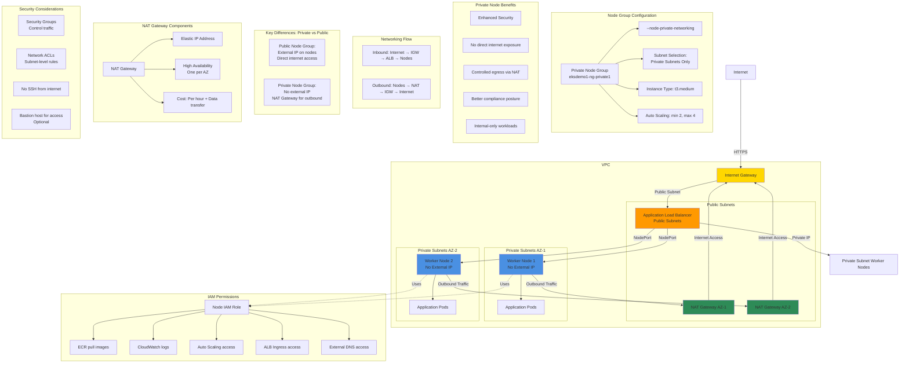

# EKS - Create EKS Node Group in Private Subnets

## Private Node Group Architecture Diagram



### Diagram Explanation

- **Private Node Group**: Worker nodes deployed in **private subnets** with no external IP addresses, enhanced security posture
- **--node-private-networking Flag**: eksctl option that places nodes in **private subnets** and configures NAT Gateway routing
- **NAT Gateway Outbound**: Nodes use **NAT Gateway** in public subnet for outbound internet access (pulling images, API calls)
- **Load Balancer Placement**: ALB/NLB created in **public subnets**, routes traffic to private nodes via NodePort or TargetGroup
- **High Availability**: NAT Gateway in **each AZ** ensures nodes in that AZ maintain internet access if other AZ fails
- **No Direct Internet Access**: Nodes cannot receive **inbound connections** from internet, only via load balancer
- **Security Groups**: Control **inbound traffic** to nodes, typically only from load balancer and internal services
- **Cost Considerations**: **NAT Gateway charges** per hour plus data transfer, but provides security and isolation
- **Bastion Host**: Optional **jump server** in public subnet for SSH access to private nodes for troubleshooting
- **Compliance Ready**: Private networking meets **compliance requirements** for sensitive workloads, reduces attack surface

## Step-01: Introduction
- We are going to create a node group in VPC Private Subnets
- We are going to deploy workloads on the private node group wherein workloads will be running private subnets and load balancer gets created in public subnet and accessible via internet.

## Step-02: Delete existing Public Node Group in EKS Cluster
```
# Get NodeGroups in a EKS Cluster
eksctl get nodegroup --cluster=<Cluster-Name>
eksctl get nodegroup --cluster=eksdemo1

# Delete Node Group - Replace nodegroup name and cluster name
eksctl delete nodegroup <NodeGroup-Name> --cluster <Cluster-Name>
eksctl delete nodegroup eksdemo1-ng-public1 --cluster eksdemo1
```

## Step-03: Create EKS Node Group in Private Subnets
- Create Private Node Group in a Cluster
- Key option for the command is `--node-private-networking`

```
eksctl create nodegroup --cluster=eksdemo1 \
                        --region=us-east-1 \
                        --name=eksdemo1-ng-private1 \
                        --node-type=t3.medium \
                        --nodes-min=2 \
                        --nodes-max=4 \
                        --node-volume-size=20 \
                        --ssh-access \
                        --ssh-public-key=kube-demo \
                        --managed \
                        --asg-access \
                        --external-dns-access \
                        --full-ecr-access \
                        --appmesh-access \
                        --alb-ingress-access \
                        --node-private-networking                       
```

## Step-04: Verify if Node Group created in Private Subnets

### Verify External IP Address for Worker Nodes
- External IP Address should be none if our Worker Nodes created in Private Subnets
```
kubectl get nodes -o wide
```
### Subnet Route Table Verification - Outbound Traffic goes via NAT Gateway
- Verify the node group subnet routes to ensure it created in private subnets
  - Go to Services -> EKS -> eksdemo -> eksdemo1-ng1-private
  - Click on Associated subnet in **Details** tab
  - Click on **Route Table** Tab.
  - We should see that internet route via NAT Gateway (0.0.0.0/0 -> nat-xxxxxxxx)
