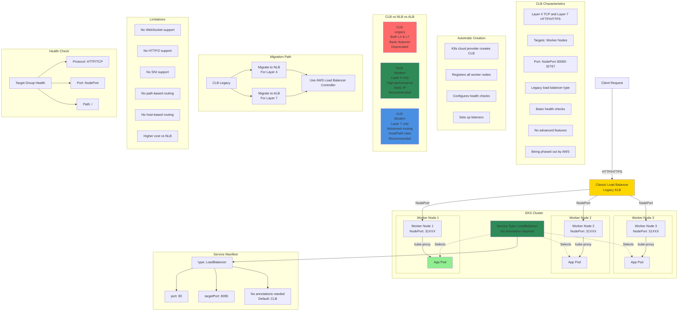

# AWS - Classic Load Balancer - CLB

## Classic Load Balancer Architecture Diagram



### Diagram Explanation

- **Classic Load Balancer**: **Legacy AWS load balancer** automatically created by Kubernetes cloud provider when Service type is LoadBalancer
- **No Annotations Needed**: CLB is **default behavior** when no `service.beta.kubernetes.io/aws-load-balancer-type` annotation specified
- **NodePort Targets**: CLB routes traffic to **worker node IPs** on NodePort, kube-proxy forwards to pods
- **Deprecated**: AWS recommends **migrating to NLB or ALB**, CLB lacks modern features and is being phased out
- **Basic Features Only**: Supports **basic Layer 4/7** load balancing, no advanced routing, WebSocket, HTTP/2, or SNI
- **Hybrid Layer Support**: Can handle **both TCP (L4) and HTTP/HTTPS (L7)** but without advanced Layer 7 features
- **Health Checks**: Performs **simple health checks** on NodePort, less sophisticated than NLB/ALB health checks
- **Migration to NLB**: For **Layer 4 traffic** (TCP/UDP), migrate to NLB with annotation `service.beta.kubernetes.io/aws-load-balancer-type: nlb`
- **Migration to ALB**: For **Layer 7 traffic** (HTTP/HTTPS), migrate to ALB using Ingress with AWS Load Balancer Controller
- **Cost**: CLB typically **more expensive** than NLB for same traffic volume, another reason to migrate

## Step-01: Create AWS Classic Load Balancer Kubernetes Manifest & Deploy
- **04-ClassicLoadBalancer.yml**
```yml
apiVersion: v1
kind: Service
metadata:
  name: clb-usermgmt-restapp
  labels:
    app: usermgmt-restapp
spec:
  type: LoadBalancer  # Regular k8s Service manifest with type as LoadBalancer
  selector:
    app: usermgmt-restapp     
  ports:
  - port: 80
    targetPort: 8095
```
- **Deploy all Manifest**
```
# Deploy all manifests
kubectl apply -f kube-manifests/

# List Services (Verify newly created CLB Service)
kubectl get svc

# Verify Pods
kubectl get pods
```

## Step-02: Verify the deployment
- Verify if new CLB got created 
  - Go to  Services -> EC2 -> Load Balancing -> Load Balancers 
    - CLB should be created
    - Copy DNS Name (Example: a85ae6e4030aa4513bd200f08f1eb9cc-7f13b3acc1bcaaa2.elb.us-east-1.amazonaws.com)
  - Go to  Services -> EC2 -> Load Balancing -> Target Groups
    - Verify the health status, we should see active. 
- **Access Application** 
```
# Access Application
http://<CLB-DNS-NAME>/usermgmt/health-status
```    

## Step-03: Clean Up 
```
# Delete all Objects created
kubectl delete -f kube-manifests/

# Verify current Kubernetes Objects
kubectl get all
```