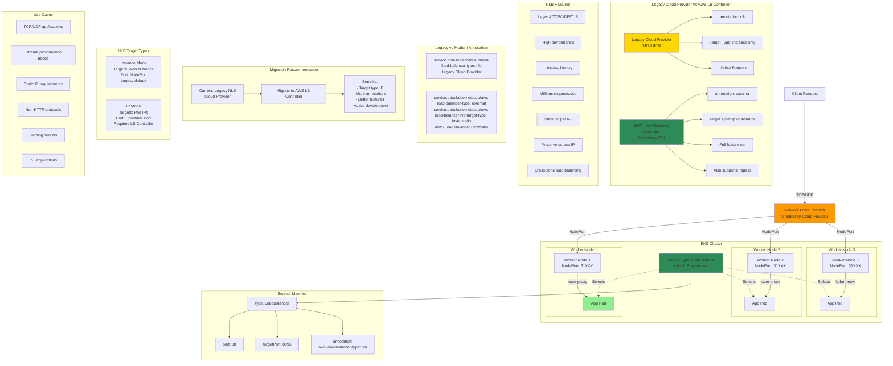

 # AWS - Network Load Balancer - NLB

## Network Load Balancer (Legacy) Diagram



### Diagram Explanation

- **Legacy Cloud Provider NLB**: Created by Kubernetes **in-tree cloud provider** with annotation `service.beta.kubernetes.io/aws-load-balancer-type: nlb`
- **Target Type Instance Only**: Legacy NLB supports **instance mode** only, routes to worker node IPs on NodePort
- **Modern Alternative**: **AWS Load Balancer Controller** (separate pod) provides more features including IP target type
- **NLB Annotation**: Single annotation `aws-load-balancer-type: nlb` creates NLB instead of default CLB
- **Layer 4 Only**: NLB operates at **TCP/UDP layer**, no HTTP-specific features, ideal for non-HTTP protocols
- **High Performance**: Handles **millions of requests per second** with ultra-low latency, better than CLB/ALB
- **Static IP per AZ**: Each AZ gets **static IP address**, useful for IP whitelisting and firewall rules
- **Source IP Preservation**: Maintains **client source IP** when routing to backends, useful for logging and security
- **Migration Path**: Recommend **migrating to AWS Load Balancer Controller** for target-type IP and advanced features
- **Limited Features**: Legacy cloud provider NLB has **fewer configuration options** compared to Load Balancer Controller version

## Step-01: Create AWS Network Load Balancer Kubernetes Manifest & Deploy
- **04-NetworkLoadBalancer.yml**
```yml
apiVersion: v1
kind: Service
metadata:
  name: nlb-usermgmt-restapp
  labels:
    app: usermgmt-restapp
  annotations:
    service.beta.kubernetes.io/aws-load-balancer-type: nlb    # To create Network Load Balancer
spec:
  type: LoadBalancer # Regular k8s Service manifest with type as LoadBalancer
  selector:
    app: usermgmt-restapp     
  ports:
  - port: 80
    targetPort: 8095
```
- **Deploy all Manifest**
```
# Deploy all manifests
kubectl apply -f kube-manifests/

# List Services (Verify newly created NLB Service)
kubectl get svc

# Verify Pods
kubectl get pods
```

## Step-02: Verify the deployment
- Verify if new CLB got created 
  - Go to  Services -> EC2 -> Load Balancing -> Load Balancers 
    - CLB should be created
    - Copy DNS Name (Example: a85ae6e4030aa4513bd200f08f1eb9cc-7f13b3acc1bcaaa2.elb.us-east-1.amazonaws.com)
  - Go to  Services -> EC2 -> Load Balancing -> Target Groups
    - Verify the health status, we should see active. 
- **Access Application** 
```
# Access Application
http://<NLB-DNS-NAME>/usermgmt/health-status
```    

## Step-03: Clean Up 
```
# Delete all Objects created
kubectl delete -f kube-manifests/

# Verify current Kubernetes Objects
kubectl get all
```


