# AWS Elastic Load Balancers

## Load Balancer Types Diagram

```mermaid
graph TB
    USER[Internet Users] --> LB{Load Balancer Types}
    
    LB -->|Layer 4/7| CLB[Classic Load Balancer<br/>CLB - Legacy]
    LB -->|Layer 4| NLB[Network Load Balancer<br/>NLB - High Performance]
    LB -->|Layer 7| ALB[Application Load Balancer<br/>ALB - HTTP/HTTPS]
    
    subgraph "Classic Load Balancer Features"
        CLB --> CLB1[Layer 4 & 7]
        CLB --> CLB2[Legacy - Not Recommended]
        CLB --> CLB3[Fixed hostname]
        CLB --> CLB4[Basic health checks]
        CLB --> CLB5[No advanced routing]
    end
    
    subgraph "Network Load Balancer Features"
        NLB --> NLB1[Layer 4 - TCP/UDP]
        NLB --> NLB2[Ultra-low latency]
        NLB --> NLB3[Millions of requests/sec]
        NLB --> NLB4[Static IP per AZ]
        NLB --> NLB5[Preserve source IP]
        NLB --> NLB6[TLS termination]
    end
    
    subgraph "Application Load Balancer Features"
        ALB --> ALB1[Layer 7 - HTTP/HTTPS]
        ALB --> ALB2[Path-based routing]
        ALB --> ALB3[Host-based routing]
        ALB --> ALB4[WebSocket support]
        ALB --> ALB5[HTTP/2 support]
        ALB --> ALB6[Target groups]
        ALB --> ALB7[SSL termination]
        ALB --> ALB8[WAF integration]
    end
    
    subgraph "Kubernetes Integration"
        K8SCLB[Service Type: LoadBalancer<br/>annotations for CLB]
        K8SNLB[Service Type: LoadBalancer<br/>annotations for NLB]
        K8SALB[Ingress Resource<br/>ALB Ingress Controller]
    end
    
    CLB -.->|Creates| K8SCLB
    NLB -.->|Creates| K8SNLB
    ALB -.->|Creates| K8SALB
    
    K8SCLB --> PODS1[EKS Pods]
    K8SNLB --> PODS2[EKS Pods]
    K8SALB --> PODS3[EKS Pods]
    
    subgraph "Use Cases"
        UC1[CLB: Legacy apps migration]
        UC2[NLB: Gaming, IoT, realtime]
        UC3[ALB: Microservices, containers]
    end
    
    subgraph "Pricing"
        P1[CLB: Per hour + GB processed]
        P2[NLB: Per hour + LCU]
        P3[ALB: Per hour + LCU]
    end
    
    style CLB fill:#FFD700
    style NLB fill:#4A90E2
    style ALB fill:#FF6B6B
    style K8SALB fill:#2E8B57
```

### Diagram Explanation

- **Classic Load Balancer**: **Legacy** load balancer supporting both Layer 4 (TCP) and Layer 7 (HTTP/HTTPS), **not recommended** for new applications
- **Network Load Balancer**: **Layer 4** (TCP/UDP/TLS) load balancer for **extreme performance**, handles millions of requests per second with **ultra-low latency**
- **Application Load Balancer**: **Layer 7** (HTTP/HTTPS) load balancer with **advanced routing** based on path, host, headers, and query strings
- **Static IP per AZ**: NLB provides **one static IP** per availability zone, ideal for **whitelisting** and **DNS** requirements
- **Source IP Preservation**: NLB preserves original **client IP address**, ALB adds **X-Forwarded-For** header, CLB can preserve with proxy protocol
- **Path-Based Routing**: ALB routes traffic to different **target groups** based on **URL paths** (e.g., /api → API service, /web → Web service)
- **Host-Based Routing**: ALB routes based on **host header**, enabling **multiple domains** on single load balancer (e.g., api.example.com, www.example.com)
- **Service Type LoadBalancer**: Kubernetes creates **CLB or NLB** automatically when service type is **LoadBalancer** with appropriate **annotations**
- **Ingress with ALB**: Requires **AWS Load Balancer Controller**, creates **ALB** from **Ingress resources**, supports advanced routing
- **Load Balancer Units (LCU)**: NLB and ALB pricing based on **LCU dimensions** - new connections, active connections, bandwidth, rule evaluations

## AWS Load Balancer Types
1. Classic Load Balancer
2. Network Load Balancer
3. Application Load Balancer  (k8s Ingress)