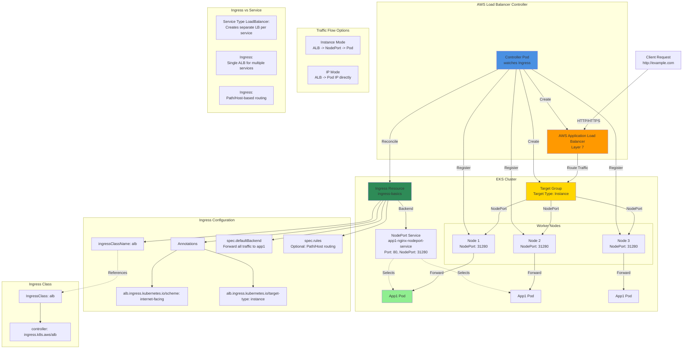

## ALB Ingress Basics Diagram



### Diagram Explanation

- **Ingress Resource**: Kubernetes **API object** that defines HTTP routing rules, managed by AWS Load Balancer Controller
- **IngressClassName**: Specifies which controller handles the Ingress, **alb** class tells AWS LB Controller to create ALB
- **Default Backend**: Simplest Ingress form, forwards **all traffic** to single service without path/host rules
- **Target Type Instance**: ALB routes traffic to **NodePort on worker nodes**, kube-proxy forwards to pod IPs
- **Target Type IP**: Alternative where ALB routes **directly to pod IPs**, more efficient but requires CNI support
- **AWS Load Balancer Controller**: Watches **Ingress resources**, creates/updates ALB, Target Groups, and registers targets automatically
- **NodePort Service**: Required for **instance mode**, exposes pods on static port across all nodes
- **Annotations**: AWS-specific **configuration** on Ingress (scheme, target-type, SSL certs, WAF, etc.)
- **Single ALB Multiple Services**: Key advantage over LoadBalancer Service - **one ALB** routes to many services via rules
- **IngressClass Resource**: Defines controller **implementation**, allows multiple ingress controllers in same cluster

## Step-01: Introduction
- Discuss about the Application Architecture which we are going to deploy
- Understand the following Ingress Concepts
  - [Annotations](https://kubernetes-sigs.github.io/aws-load-balancer-controller/latest/guide/ingress/annotations/)
  - [ingressClassName](https://kubernetes-sigs.github.io/aws-load-balancer-controller/latest/guide/ingress/ingress_class/)
  - defaultBackend
  - rules

## Step-02: Review App1 Deployment kube-manifest
- **File Location:** `01-kube-manifests-default-backend/01-Nginx-App1-Deployment-and-NodePortService.yml`
```yaml
apiVersion: apps/v1
kind: Deployment
metadata:
  name: app1-nginx-deployment
  labels:
    app: app1-nginx
spec:
  replicas: 1
  selector:
    matchLabels:
      app: app1-nginx
  template:
    metadata:
      labels:
        app: app1-nginx
    spec:
      containers:
        - name: app1-nginx
          image: stacksimplify/kube-nginxapp1:1.0.0
          ports:
            - containerPort: 80
```
## Step-03: Review App1 NodePort Service
- **File Location:** `01-kube-manifests-default-backend/01-Nginx-App1-Deployment-and-NodePortService.yml`
```yaml
apiVersion: v1
kind: Service
metadata:
  name: app1-nginx-nodeport-service
  labels:
    app: app1-nginx
  annotations:
#Important Note:  Need to add health check path annotations in service level if we are planning to use multiple targets in a load balancer    
#    alb.ingress.kubernetes.io/healthcheck-path: /app1/index.html
spec:
  type: NodePort
  selector:
    app: app1-nginx
  ports:
    - port: 80
      targetPort: 80  
```

## Step-04: Review Ingress kube-manifest with Default Backend Option
- [Annotations](https://kubernetes-sigs.github.io/aws-load-balancer-controller/latest/guide/ingress/annotations/)
- **File Location:** `01-kube-manifests-default-backend/02-ALB-Ingress-Basic.yml`
```yaml
# Annotations Reference: https://kubernetes-sigs.github.io/aws-load-balancer-controller/latest/guide/ingress/annotations/
apiVersion: networking.k8s.io/v1
kind: Ingress
metadata:
  name: ingress-nginxapp1
  labels:
    app: app1-nginx
  annotations:
    #kubernetes.io/ingress.class: "alb" (OLD INGRESS CLASS NOTATION - STILL WORKS BUT RECOMMENDED TO USE IngressClass Resource)
    # Ingress Core Settings
    alb.ingress.kubernetes.io/scheme: internet-facing
    # Health Check Settings
    alb.ingress.kubernetes.io/healthcheck-protocol: HTTP 
    alb.ingress.kubernetes.io/healthcheck-port: traffic-port
    alb.ingress.kubernetes.io/healthcheck-path: /app1/index.html    
    alb.ingress.kubernetes.io/healthcheck-interval-seconds: '15'
    alb.ingress.kubernetes.io/healthcheck-timeout-seconds: '5'
    alb.ingress.kubernetes.io/success-codes: '200'
    alb.ingress.kubernetes.io/healthy-threshold-count: '2'
    alb.ingress.kubernetes.io/unhealthy-threshold-count: '2'
spec:
  ingressClassName: ic-external-lb # Ingress Class
  defaultBackend:
    service:
      name: app1-nginx-nodeport-service
      port:
        number: 80                    
```

## Step-05: Deploy kube-manifests and Verify
```t
# Change Directory
cd 08-02-ALB-Ingress-Basics

# Deploy kube-manifests
kubectl apply -f 01-kube-manifests-default-backend/

# Verify k8s Deployment and Pods
kubectl get deploy
kubectl get pods

# Verify Ingress (Make a note of Address field)
kubectl get ingress
Obsevation: 
1. Verify the ADDRESS value, we should see something like "app1ingress-1334515506.us-east-1.elb.amazonaws.com"

# Describe Ingress Controller
kubectl describe ingress ingress-nginxapp1
Observation:
1. Review Default Backend and Rules

# List Services
kubectl get svc

# Verify Application Load Balancer using 
Goto AWS Mgmt Console -> Services -> EC2 -> Load Balancers
1. Verify Listeners and Rules inside a listener
2. Verify Target Groups

# Access App using Browser
kubectl get ingress
http://<ALB-DNS-URL>
http://<ALB-DNS-URL>/app1/index.html
or
http://<INGRESS-ADDRESS-FIELD>
http://<INGRESS-ADDRESS-FIELD>/app1/index.html

# Sample from my environment (for reference only)
http://app1ingress-154912460.us-east-1.elb.amazonaws.com
http://app1ingress-154912460.us-east-1.elb.amazonaws.com/app1/index.html

# Verify AWS Load Balancer Controller logs
kubectl get po -n kube-system 
## POD1 Logs: 
kubectl -n kube-system logs -f <POD1-NAME>
kubectl -n kube-system logs -f aws-load-balancer-controller-65b4f64d6c-h2vh4
##POD2 Logs: 
kubectl -n kube-system logs -f <POD2-NAME>
kubectl -n kube-system logs -f aws-load-balancer-controller-65b4f64d6c-t7qqb
```

## Step-06: Clean Up
```t
# Delete Kubernetes Resources
kubectl delete -f 01-kube-manifests-default-backend/
```

## Step-07: Review Ingress kube-manifest with Ingress Rules
- Discuss about [Ingress Path Types](https://kubernetes.io/docs/concepts/services-networking/ingress/#path-types)
- [Better Path Matching With Path Types](https://kubernetes.io/blog/2020/04/02/improvements-to-the-ingress-api-in-kubernetes-1.18/#better-path-matching-with-path-types)
- [Sample Ingress Rule](https://kubernetes.io/docs/concepts/services-networking/ingress/#the-ingress-resource)
- **ImplementationSpecific (default):** With this path type, matching is up to the controller implementing the IngressClass. Implementations can treat this as a separate pathType or treat it identically to the Prefix or Exact path types.
- **Exact:** Matches the URL path exactly and with case sensitivity.
- **Prefix:** Matches based on a URL path prefix split by /. Matching is case sensitive and done on a path element by element basis.

- **File Location:** `02-kube-manifests-rules\02-ALB-Ingress-Basic.yml`
```yaml
# Annotations Reference: https://kubernetes-sigs.github.io/aws-load-balancer-controller/latest/guide/ingress/annotations/
apiVersion: networking.k8s.io/v1
kind: Ingress
metadata:
  name: ingress-nginxapp1
  labels:
    app: app1-nginx
  annotations:
    # Load Balancer Name
    alb.ingress.kubernetes.io/load-balancer-name: app1ingressrules
    #kubernetes.io/ingress.class: "alb" (OLD INGRESS CLASS NOTATION - STILL WORKS BUT RECOMMENDED TO USE IngressClass Resource)
    # Ingress Core Settings
    alb.ingress.kubernetes.io/scheme: internet-facing
    # Health Check Settings
    alb.ingress.kubernetes.io/healthcheck-protocol: HTTP 
    alb.ingress.kubernetes.io/healthcheck-port: traffic-port
    alb.ingress.kubernetes.io/healthcheck-path: /app1/index.html    
    alb.ingress.kubernetes.io/healthcheck-interval-seconds: '15'
    alb.ingress.kubernetes.io/healthcheck-timeout-seconds: '5'
    alb.ingress.kubernetes.io/success-codes: '200'
    alb.ingress.kubernetes.io/healthy-threshold-count: '2'
    alb.ingress.kubernetes.io/unhealthy-threshold-count: '2'
spec:
  ingressClassName: ic-external-lb # Ingress Class
  rules:
    - http:
        paths:
          - path: /
            pathType: Prefix
            backend:
              service:
                name: app1-nginx-nodeport-service
                port: 
                  number: 80
      

# 1. If  "spec.ingressClassName: ic-external-lb" not specified, will reference default ingress class on this kubernetes cluster
# 2. Default Ingress class is nothing but for which ingress class we have the annotation `ingressclass.kubernetes.io/is-default-class: "true"`
```

## Step-08: Deploy kube-manifests and Verify
```t
# Change Directory
cd 08-02-ALB-Ingress-Basics

# Deploy kube-manifests
kubectl apply -f 02-kube-manifests-rules/

# Verify k8s Deployment and Pods
kubectl get deploy
kubectl get pods

# Verify Ingress (Make a note of Address field)
kubectl get ingress
Obsevation: 
1. Verify the ADDRESS value, we should see something like "app1ingressrules-154912460.us-east-1.elb.amazonaws.com"

# Describe Ingress Controller
kubectl describe ingress ingress-nginxapp1
Observation:
1. Review Default Backend and Rules

# List Services
kubectl get svc

# Verify Application Load Balancer using 
Goto AWS Mgmt Console -> Services -> EC2 -> Load Balancers
1. Verify Listeners and Rules inside a listener
2. Verify Target Groups

# Access App using Browser
kubectl get ingress
http://<ALB-DNS-URL>
http://<ALB-DNS-URL>/app1/index.html
or
http://<INGRESS-ADDRESS-FIELD>
http://<INGRESS-ADDRESS-FIELD>/app1/index.html

# Sample from my environment (for reference only)
http://app1ingressrules-154912460.us-east-1.elb.amazonaws.com
http://app1ingressrules-154912460.us-east-1.elb.amazonaws.com/app1/index.html

# Verify AWS Load Balancer Controller logs
kubectl get po -n kube-system 
kubectl logs -f aws-load-balancer-controller-794b7844dd-8hk7n -n kube-system
```

## Step-09: Clean Up
```t
# Delete Kubernetes Resources
kubectl delete -f 02-kube-manifests-rules/

# Verify if Ingress Deleted successfully 
kubectl get ingress
Important Note: It is going to cost us heavily if we leave ALB load balancer idle without deleting it properly

# Verify Application Load Balancer DELETED 
Goto AWS Mgmt Console -> Services -> EC2 -> Load Balancers
```


