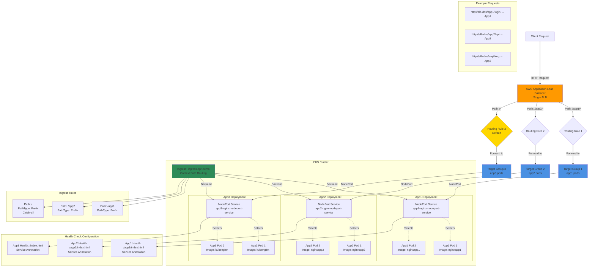

## Context Path Based Routing Diagram



### Diagram Explanation

- **Single ALB Multiple Apps**: One ALB handles **multiple applications** using path-based routing, cost-effective vs separate load balancers
- **Ingress Rules**: Define **path patterns** (/app1, /app2, /*) that map to different backend services
- **Path Matching Priority**: More specific paths evaluated **before generic paths**, /* catches all unmatched requests
- **Target Groups**: ALB creates **separate Target Group** per backend service for independent health checks and routing
- **Health Check Paths**: Each service has **custom health check** annotation, ALB verifies correct endpoint per application
- **PathType Prefix**: Matches request if path **starts with** specified prefix, /app1 matches /app1/login, /app1/api, etc.
- **Service-Level Annotations**: Health check paths moved to **Service annotations** instead of Ingress for multi-target scenarios
- **Traffic Distribution**: Each Target Group load balances across **multiple pod replicas** of that application
- **Catch-All Route**: Path `/*` serves as **default backend** for any requests not matching specific paths
- **Cost Efficiency**: Single ALB with rules is **cheaper** than 3 separate ALBs, shared infrastructure for multiple services

## Step-01: Introduction
- Discuss about the Architecture we are going to build as part of this Section
- We are going to deploy all these 3 apps in kubernetes with context path based routing enabled in Ingress Controller
  - /app1/* - should go to app1-nginx-nodeport-service
  - /app2/* - should go to app1-nginx-nodeport-service
  - /*    - should go to  app3-nginx-nodeport-service
- As part of this process, this respective annotation `alb.ingress.kubernetes.io/healthcheck-path:` will be moved to respective application NodePort Service. 
- Only generic settings will be present in Ingress manifest annotations area `04-ALB-Ingress-ContextPath-Based-Routing.yml`  


## Step-02: Review Nginx App1, App2 & App3 Deployment & Service
- Differences for all 3 apps will be only two fields from kubernetes manifests perspective and their naming conventions
  - **Kubernetes Deployment:** Container Image name
  - **Kubernetes Node Port Service:** Health check URL path 
- **App1 Nginx: 01-Nginx-App1-Deployment-and-NodePortService.yml**
  - **image:** stacksimplify/kube-nginxapp1:1.0.0
  - **Annotation:** alb.ingress.kubernetes.io/healthcheck-path: /app1/index.html
- **App2 Nginx: 02-Nginx-App2-Deployment-and-NodePortService.yml**
  - **image:** stacksimplify/kube-nginxapp2:1.0.0
  - **Annotation:** alb.ingress.kubernetes.io/healthcheck-path: /app2/index.html
- **App3 Nginx: 03-Nginx-App3-Deployment-and-NodePortService.yml**
  - **image:** stacksimplify/kubenginx:1.0.0
  - **Annotation:** alb.ingress.kubernetes.io/healthcheck-path: /index.html


## Step-03: Create ALB Ingress Context path based Routing Kubernetes manifest
- **04-ALB-Ingress-ContextPath-Based-Routing.yml**
```yaml
# Annotations Reference: https://kubernetes-sigs.github.io/aws-load-balancer-controller/latest/guide/ingress/annotations/
apiVersion: networking.k8s.io/v1
kind: Ingress
metadata:
  name: ingress-cpr-demo
  annotations:
    # Load Balancer Name
    alb.ingress.kubernetes.io/load-balancer-name: cpr-ingress
    # Ingress Core Settings
    #kubernetes.io/ingress.class: "alb" (OLD INGRESS CLASS NOTATION - STILL WORKS BUT RECOMMENDED TO USE IngressClass Resource)
    alb.ingress.kubernetes.io/scheme: internet-facing
    # Health Check Settings
    alb.ingress.kubernetes.io/healthcheck-protocol: HTTP 
    alb.ingress.kubernetes.io/healthcheck-port: traffic-port
    #Important Note:  Need to add health check path annotations in service level if we are planning to use multiple targets in a load balancer    
    alb.ingress.kubernetes.io/healthcheck-interval-seconds: '15'
    alb.ingress.kubernetes.io/healthcheck-timeout-seconds: '5'
    alb.ingress.kubernetes.io/success-codes: '200'
    alb.ingress.kubernetes.io/healthy-threshold-count: '2'
    alb.ingress.kubernetes.io/unhealthy-threshold-count: '2'   
spec:
  ingressClassName: my-aws-ingress-class   # Ingress Class                  
  rules:
    - http:
        paths:      
          - path: /app1
            pathType: Prefix
            backend:
              service:
                name: app1-nginx-nodeport-service
                port: 
                  number: 80
          - path: /app2
            pathType: Prefix
            backend:
              service:
                name: app2-nginx-nodeport-service
                port: 
                  number: 80
          - path: /
            pathType: Prefix
            backend:
              service:
                name: app3-nginx-nodeport-service
                port: 
                  number: 80              

# Important Note-1: In path based routing order is very important, if we are going to use  "/*", try to use it at the end of all rules.                                        
                        
# 1. If  "spec.ingressClassName: my-aws-ingress-class" not specified, will reference default ingress class on this kubernetes cluster
# 2. Default Ingress class is nothing but for which ingress class we have the annotation `ingressclass.kubernetes.io/is-default-class: "true"`                      
```

## Step-04: Deploy all manifests and test
```t
# Deploy Kubernetes manifests
kubectl apply -f kube-manifests/

# List Pods
kubectl get pods

# List Services
kubectl get svc

# List Ingress Load Balancers
kubectl get ingress

# Describe Ingress and view Rules
kubectl describe ingress ingress-cpr-demo

# Verify AWS Load Balancer Controller logs
kubectl -n kube-system  get pods 
kubectl -n kube-system logs -f aws-load-balancer-controller-794b7844dd-8hk7n 
```

## Step-05: Verify Application Load Balancer on AWS Management Console**
- Verify Load Balancer
    - In Listeners Tab, click on **View/Edit Rules** under Rules
- Verify Target Groups
    - GroupD Details
    - Targets: Ensure they are healthy
    - Verify Health check path
    - Verify all 3 targets are healthy)
```t
# Access Application
http://<ALB-DNS-URL>/app1/index.html
http://<ALB-DNS-URL>/app2/index.html
http://<ALB-DNS-URL>/
```

## Step-06: Test Order in Context path based routing
### Step-0-01: Move Root Context Path to top
- **File:** 04-ALB-Ingress-ContextPath-Based-Routing.yml
```yaml
  ingressClassName: my-aws-ingress-class   # Ingress Class                  
  rules:
    - http:
        paths:      
          - path: /
            pathType: Prefix
            backend:
              service:
                name: app3-nginx-nodeport-service
                port: 
                  number: 80           
          - path: /app1
            pathType: Prefix
            backend:
              service:
                name: app1-nginx-nodeport-service
                port: 
                  number: 80
          - path: /app2
            pathType: Prefix
            backend:
              service:
                name: app2-nginx-nodeport-service
                port: 
                  number: 80
```
### Step-06-02: Deploy Changes and Verify
```t
# Deploy Changes
kubectl apply -f kube-manifests/

# Access Application (Open in new incognito window)
http://<ALB-DNS-URL>/app1/index.html  -- SHOULD FAIL
http://<ALB-DNS-URL>/app2/index.html  -- SHOULD FAIL
http://<ALB-DNS-URL>/  - SHOULD PASS
```

## Step-07: Roll back changes in 04-ALB-Ingress-ContextPath-Based-Routing.yml
```yaml
spec:
  ingressClassName: my-aws-ingress-class   # Ingress Class                  
  rules:
    - http:
        paths:      
          - path: /app1
            pathType: Prefix
            backend:
              service:
                name: app1-nginx-nodeport-service
                port: 
                  number: 80
          - path: /app2
            pathType: Prefix
            backend:
              service:
                name: app2-nginx-nodeport-service
                port: 
                  number: 80
          - path: /
            pathType: Prefix
            backend:
              service:
                name: app3-nginx-nodeport-service
                port: 
                  number: 80              
```

## Step-08: Clean Up
```t
# Clean-Up
kubectl delete -f kube-manifests/
```
