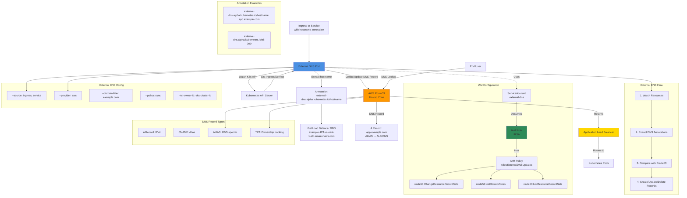

## External DNS Architecture Diagram



### Diagram Explanation

- **External DNS Pod**: Watches **Ingress and Service resources** with hostname annotations, automatically creates DNS records in Route53
- **IRSA (IAM Roles for Service Accounts)**: External DNS uses **ServiceAccount** with IAM role to authenticate with AWS Route53
- **Hostname Annotation**: `external-dns.alpha.kubernetes.io/hostname` specifies **desired DNS name** for the resource
- **Route53 Integration**: External DNS calls **Route53 API** to create/update/delete A, CNAME, or ALIAS records
- **TXT Record Ownership**: Creates **TXT records** to track which records it manages, prevents conflicts with other DNS controllers
- **Sync Policy**: With **--policy sync**, External DNS manages full lifecycle (create, update, delete) of DNS records
- **Domain Filter**: `--domain-filter` restricts External DNS to **specific hosted zones**, prevents unintended changes
- **ALIAS Records**: For AWS ALB/NLB, uses **ALIAS records** instead of CNAME for better performance and AWS integration
- **Automatic Cleanup**: When Ingress/Service is **deleted**, External DNS automatically removes corresponding DNS records
- **TTL Configuration**: Optional **TTL annotation** controls how long DNS resolvers cache the record (default 300 seconds)

## Step-01: Introduction
- **External DNS:** Used for Updating Route53 RecordSets from Kubernetes 
- We need to create IAM Policy, k8s Service Account & IAM Role and associate them together for external-dns pod to add or remove entries in AWS Route53 Hosted Zones. 
- Update External-DNS default manifest to support our needs
- Deploy & Verify logs

## Step-02: Create IAM Policy
- This IAM policy will allow external-dns pod to add, remove DNS entries (Record Sets in a Hosted Zone) in AWS Route53 service
- Go to Services -> IAM -> Policies -> Create Policy
  - Click on **JSON** Tab and copy paste below JSON
  - Click on **Visual editor** tab to validate
  - Click on **Review Policy**
  - **Name:** AllowExternalDNSUpdates 
  - **Description:** Allow access to Route53 Resources for ExternalDNS
  - Click on **Create Policy**  

```json
{
  "Version": "2012-10-17",
  "Statement": [
    {
      "Effect": "Allow",
      "Action": [
        "route53:ChangeResourceRecordSets"
      ],
      "Resource": [
        "arn:aws:route53:::hostedzone/*"
      ]
    },
    {
      "Effect": "Allow",
      "Action": [
        "route53:ListHostedZones",
        "route53:ListResourceRecordSets"
      ],
      "Resource": [
        "*"
      ]
    }
  ]
}
```
- Make a note of Policy ARN which we will use in next step
```t
# Policy ARN
arn:aws:iam::180789647333:policy/AllowExternalDNSUpdates
```  


## Step-03: Create IAM Role, k8s Service Account & Associate IAM Policy
- As part of this step, we are going to create a k8s Service Account named `external-dns` and also a AWS IAM role and associate them by annotating role ARN in Service Account.
- In addition, we are also going to associate the AWS IAM Policy `AllowExternalDNSUpdates` to the newly created AWS IAM Role.
### Step-03-01: Create IAM Role, k8s Service Account & Associate IAM Policy
```t
# Template
eksctl create iamserviceaccount \
    --name service_account_name \
    --namespace service_account_namespace \
    --cluster cluster_name \
    --attach-policy-arn IAM_policy_ARN \
    --approve \
    --override-existing-serviceaccounts

# Replaced name, namespace, cluster, IAM Policy arn 
eksctl create iamserviceaccount \
    --name external-dns \
    --namespace default \
    --cluster eksdemo1 \
    --attach-policy-arn arn:aws:iam::180789647333:policy/AllowExternalDNSUpdates \
    --approve \
    --override-existing-serviceaccounts
```
### Step-03-02: Verify the Service Account
- Verify external-dns service account, primarily verify annotation related to IAM Role
```t
# List Service Account
kubectl get sa external-dns

# Describe Service Account
kubectl describe sa external-dns
Observation: 
1. Verify the Annotations and you should see the IAM Role is present on the Service Account
```
### Step-03-03: Verify CloudFormation Stack
- Go to Services -> CloudFormation
- Verify the latest CFN Stack created.
- Click on **Resources** tab
- Click on link  in **Physical ID** field which will take us to **IAM Role** directly

### Step-03-04: Verify IAM Role & IAM Policy
- With above step in CFN, we will be landed in IAM Role created for external-dns. 
- Verify in **Permissions** tab we have a policy named **AllowExternalDNSUpdates**
- Now make a note of that Role ARN, this we need to update in External-DNS k8s manifest
```t
# Make a note of Role ARN
arn:aws:iam::180789647333:role/eksctl-eksdemo1-addon-iamserviceaccount-defa-Role1-JTO29BVZMA2N
```

### Step-03-05: Verify IAM Service Accounts using eksctl
- You can also make a note of External DNS Role ARN from here too. 
```t
# List IAM Service Accounts using eksctl
eksctl get iamserviceaccount --cluster eksdemo1

# Sample Output
Kalyans-Mac-mini:08-06-ALB-Ingress-ExternalDNS kalyanreddy$ eksctl get iamserviceaccount --cluster eksdemo1
2022-02-11 09:34:39 [ℹ]  eksctl version 0.71.0
2022-02-11 09:34:39 [ℹ]  using region us-east-1
NAMESPACE	NAME				ROLE ARN
default		external-dns			arn:aws:iam::180789647333:role/eksctl-eksdemo1-addon-iamserviceaccount-defa-Role1-JTO29BVZMA2N
kube-system	aws-load-balancer-controller	arn:aws:iam::180789647333:role/eksctl-eksdemo1-addon-iamserviceaccount-kube-Role1-EFQB4C26EALH
Kalyans-Mac-mini:08-06-ALB-Ingress-ExternalDNS kalyanreddy$ 
```


## Step-04: Update External DNS Kubernetes manifest
- **Original Template** you can find in https://github.com/kubernetes-sigs/external-dns/blob/master/docs/tutorials/aws.md
- **File Location:** kube-manifests/01-Deploy-ExternalDNS.yml
### Change-1: Line number 9: IAM Role update
  - Copy the role-arn you have made a note at the end of step-03 and replace at line no 9.
```yaml
    eks.amazonaws.com/role-arn: arn:aws:iam::180789647333:role/eksctl-eksdemo1-addon-iamserviceaccount-defa-Role1-JTO29BVZMA2N
```
### Chnage-2: Line 55, 56: Commented them
- We used eksctl to create IAM role and attached the `AllowExternalDNSUpdates` policy
- We didnt use KIAM or Kube2IAM so we don't need these two lines, so commented
```yaml
      #annotations:  
        #iam.amazonaws.com/role: arn:aws:iam::ACCOUNT-ID:role/IAM-SERVICE-ROLE-NAME    
```
### Change-3: Line 65, 67: Commented them
```yaml
        # - --domain-filter=external-dns-test.my-org.com # will make ExternalDNS see only the hosted zones matching provided domain, omit to process all available hosted zones
       # - --policy=upsert-only # would prevent ExternalDNS from deleting any records, omit to enable full synchronization
```

### Change-4: Line 61: Get latest Docker Image name
- [Get latest external dns image name](https://github.com/kubernetes-sigs/external-dns/releases/tag/v0.10.2)
```yaml
    spec:
      serviceAccountName: external-dns
      containers:
      - name: external-dns
        image: k8s.gcr.io/external-dns/external-dns:v0.10.2
```

## Step-05: Deploy ExternalDNS
- Deploy the manifest
```t
# Change Directory
cd 08-06-Deploy-ExternalDNS-on-EKS

# Deploy external DNS
kubectl apply -f kube-manifests/

# List All resources from default Namespace
kubectl get all

# List pods (external-dns pod should be in running state)
kubectl get pods

# Verify Deployment by checking logs
kubectl logs -f $(kubectl get po | egrep -o 'external-dns[A-Za-z0-9-]+')
```

## References
- https://github.com/kubernetes-sigs/external-dns/blob/master/docs/tutorials/alb-ingress.md
- https://github.com/kubernetes-sigs/external-dns/blob/master/docs/tutorials/aws.md


