## Ingress Groups Architecture Diagram

```mermaid
graph TB
    USER[Client Requests] -->|HTTP/HTTPS| ALB[Single Application Load Balancer<br/>Shared ALB]
    
    ALB -->|Merged Rules| RULES{Routing Rules}
    
    RULES -->|Path: /app1/*| TG1[Target Group 1<br/>App1 Pods]
    RULES -->|Path: /app2/*| TG2[Target Group 2<br/>App2 Pods]
    RULES -->|Path: /app3/*| TG3[Target Group 3<br/>App3 Pods]
    
    subgraph "EKS Cluster"
        subgraph "App1 Namespace/Deployment"
            ING1[Ingress: app1-ingress]
            ING1 --> GROUP1[group.name: myapps.web<br/>group.order: 10]
            ING1 --> RULE1[spec.rules: /app1/*]
            SVC1[Service: app1-service]
            POD1[App1 Pods]
            SVC1 -.->|Selects| POD1
        end
        
        subgraph "App2 Namespace/Deployment"
            ING2[Ingress: app2-ingress]
            ING2 --> GROUP2[group.name: myapps.web<br/>group.order: 20]
            ING2 --> RULE2[spec.rules: /app2/*]
            SVC2[Service: app2-service]
            POD2[App2 Pods]
            SVC2 -.->|Selects| POD2
        end
        
        subgraph "App3 Namespace/Deployment"
            ING3[Ingress: app3-ingress]
            ING3 --> GROUP3[group.name: myapps.web<br/>group.order: 30]
            ING3 --> RULE3[spec.rules: /app3/*]
            SVC3[Service: app3-service]
            POD3[App3 Pods]
            SVC3 -.->|Selects| POD3
        end
        
        LBC[AWS Load Balancer Controller]
        LBC -->|Watches| ING1
        LBC -->|Watches| ING2
        LBC -->|Watches| ING3
        LBC -->|Detects Same Group| MERGE[Merge Ingress Rules]
        MERGE -->|Create Single ALB| ALB
    end
    
    TG1 -->|NodePort| SVC1
    TG2 -->|NodePort| SVC2
    TG3 -->|NodePort| SVC3
    
    subgraph "Ingress Group Annotations"
        ANNO1[alb.ingress.kubernetes.io/group.name<br/>Groups Ingresses together]
        ANNO2[alb.ingress.kubernetes.io/group.order<br/>Priority for rule merging]
    end
    
    subgraph "Merging Logic"
        M1[1. Controller finds all Ingresses<br/>with same group.name]
        M2[2. Sorts by group.order<br/>Lower number = Higher priority]
        M3[3. Merges rules into single ALB]
        M4[4. Annotations from each Ingress<br/>apply only to its paths]
        
        M1 --> M2 --> M3 --> M4
    end
    
    subgraph "Benefits of Ingress Groups"
        B1[Single ALB for multiple apps]
        B2[Cost reduction vs separate ALBs]
        B3[Centralized management]
        B4[Consistent DNS endpoint]
        B5[Simplified certificate management]
        B6[Team/namespace isolation maintained]
    end
    
    subgraph "Use Cases"
        UC1[Multi-tenant applications]
        UC2[Microservices with separate Ingresses]
        UC3[Different teams managing own apps]
        UC4[Cost optimization]
        UC5[Namespace-based app deployment]
    end
    
    subgraph "Important Notes"
        NOTE1[All Ingresses must use same<br/>ingressClassName]
        NOTE2[Only annotations applying to<br/>specific paths take effect]
        NOTE3[Conflicting rules use group.order<br/>for priority]
        NOTE4[ALB shared but Target Groups separate]
    end
    
    style ALB fill:#FF9900
    style LBC fill:#4A90E2
    style ING1 fill:#2E8B57
    style ING2 fill:#2E8B57
    style ING3 fill:#2E8B57
    style MERGE fill:#FFD700
```



### Diagram Explanation

- **Ingress Groups**: Multiple **separate Ingress resources** with same `group.name` annotation share single ALB
- **Group Name Annotation**: `alb.ingress.kubernetes.io/group.name` identifies which Ingresses **merge together** into one ALB
- **Group Order**: `alb.ingress.kubernetes.io/group.order` determines **rule priority** when merging, lower numbers evaluated first
- **Rule Merging**: Controller **automatically combines** all routing rules from grouped Ingresses into single ALB configuration
- **Annotation Scope**: Most annotations (like health checks) apply **only to paths** defined in that specific Ingress
- **Cost Optimization**: **One ALB** serves multiple applications, significantly cheaper than separate load balancers per app
- **Team Isolation**: Different teams can **manage separate Ingresses** in their namespaces, while sharing infrastructure
- **Separate Target Groups**: Each service gets **own Target Group**, independent health checks and scaling
- **Conflict Resolution**: When rules conflict, **group.order** determines precedence, lower order wins
- **Consistency Requirements**: All Ingresses in group must use **same IngressClassName** for controller compatibility

## Step-01: Introduction
- IngressGroup feature enables you to group multiple Ingress resources together. 
- The controller will automatically merge Ingress rules for all Ingresses within IngressGroup and support them with a single ALB. 
- In addition, most annotations defined on a Ingress only applies to the paths defined by that Ingress.
- Demonstrate Ingress Groups concept with two Applications. 

## Step-02: Review App1 Ingress Manifest - Key Lines
- **File Name:** `kube-manifests/app1/02-App1-Ingress.yml`
```yaml
    # Ingress Groups
    alb.ingress.kubernetes.io/group.name: myapps.web
    alb.ingress.kubernetes.io/group.order: '10'
```

## Step-03: Review App2 Ingress Manifest - Key Lines
- **File Name:** `kube-manifests/app2/02-App2-Ingress.yml`
```yaml
    # Ingress Groups
    alb.ingress.kubernetes.io/group.name: myapps.web
    alb.ingress.kubernetes.io/group.order: '20'
```

## Step-04: Review App3 Ingress Manifest - Key Lines
```yaml
    # Ingress Groups
    alb.ingress.kubernetes.io/group.name: myapps.web
    alb.ingress.kubernetes.io/group.order: '30'
```

## Step-05: Deploy Apps with two Ingress Resources
```t
# Deploy both Apps
kubectl apply -R -f kube-manifests

# Verify Pods
kubectl get pods

# Verify Ingress
kubectl  get ingress
Observation:
1. Three Ingress resources will be created with same ADDRESS value
2. Three Ingress Resources are merged to a single Application Load Balancer as those belong to same Ingress group "myapps.web"
```

## Step-06: Verify on AWS Mgmt Console
- Go to Services -> EC2 -> Load Balancers 
- Verify Routing Rules for `/app1` and `/app2` and `default backend`

## Step-07: Verify by accessing in browser
```t
# Web URLs
http://ingress-groups-demo601.stacksimplify.com/app1/index.html
http://ingress-groups-demo601.stacksimplify.com/app2/index.html
http://ingress-groups-demo601.stacksimplify.com
```

## Step-08: Clean-Up
```t
# Delete Apps from k8s cluster
kubectl delete -R -f kube-manifests/

## Verify Route53 Record Set to ensure our DNS records got deleted
- Go to Route53 -> Hosted Zones -> Records 
- The below records should be deleted automatically
  - ingress-groups-demo601.stacksimplify.com
```
