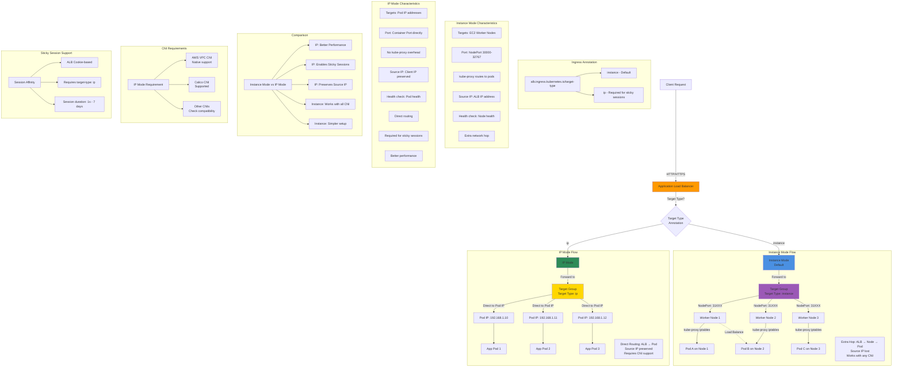

## Target Type IP vs Instance Diagram



### Diagram Explanation

- **Target Type Instance**: ALB routes to **EC2 worker nodes** on NodePort, kube-proxy forwards to pod IPs (extra hop)
- **Target Type IP**: ALB routes **directly to pod IPs**, bypassing NodePort, more efficient networking
- **NodePort Overhead**: Instance mode requires **kube-proxy iptables** rules to route from NodePort to pod, adds latency
- **Direct Pod Routing**: IP mode eliminates NodePort layer, traffic goes **straight from ALB to pod**, lower latency
- **Source IP Preservation**: IP mode maintains **original client IP**, useful for logging, security, and geolocation
- **Sticky Sessions**: Only **IP mode supports** ALB cookie-based sticky sessions for stateful applications
- **Health Checks**: Instance mode checks **node health**, IP mode checks **individual pod health**, more granular
- **CNI Compatibility**: IP mode requires **AWS VPC CNI** or compatible CNI that exposes pod IPs to AWS APIs
- **Performance**: IP mode offers **better performance** due to fewer network hops and reduced iptables overhead
- **Use Cases**: Use **IP mode** for sticky sessions, better performance, and source IP; use **instance mode** for simplicity

## Step-01: Introduction
- `alb.ingress.kubernetes.io/target-type` specifies how to route traffic to pods. 
- You can choose between `instance` and `ip`
- **Instance Mode:** `instance mode` will route traffic to all ec2 instances within cluster on NodePort opened for your service.
- **IP Mode:** `ip mode` is required for sticky sessions to work with Application Load Balancers.


## Step-02: Ingress Manifest - Add target-type
- **File Name:** 04-ALB-Ingress-target-type-ip.yml
```yaml
    # Target Type: IP
    alb.ingress.kubernetes.io/target-type: ip   
```

## Step-03: Deploy all Application Kubernetes Manifests and Verify
```t
# Deploy kube-manifests
kubectl apply -f kube-manifests/

# Verify Ingress Resource
kubectl get ingress

# Verify Apps
kubectl get deploy
kubectl get pods

# Verify NodePort Services
kubectl get svc
```
### Verify Load Balancer & Target Groups
- Load Balancer -  Listeneres (Verify both 80 & 443) 
- Load Balancer - Rules (Verify both 80 & 443 listeners) 
- Target Groups - Group Details (Verify Health check path)
- Target Groups - Targets (Verify all 3 targets are healthy)
- **PRIMARILY VERIFY - TARGET GROUPS which contain thePOD IPs instead of WORKER NODE IP with NODE PORTS**
```t
# List Pods and their IPs
kubectl get pods -o wide
```

### Verify External DNS Log
```t
# Verify External DNS logs
kubectl logs -f $(kubectl get po | egrep -o 'external-dns[A-Za-z0-9-]+')
```
### Verify Route53
- Go to Services -> Route53
- You should see **Record Sets** added for 
  - target-type-ip-501.stacksimplify.com 


## Step-04: Access Application using newly registered DNS Name
### Perform nslookup tests before accessing Application
- Test if our new DNS entries registered and resolving to an IP Address
```t
# nslookup commands
nslookup target-type-ip-501.stacksimplify.com 
```
### Access Application using DNS domain
```t
# Access App1
http://target-type-ip-501.stacksimplify.com /app1/index.html

# Access App2
http://target-type-ip-501.stacksimplify.com /app2/index.html

# Access Default App (App3)
http://target-type-ip-501.stacksimplify.com 
```

## Step-05: Clean Up
```t
# Delete Manifests
kubectl delete -f kube-manifests/

## Verify Route53 Record Set to ensure our DNS records got deleted
- Go to Route53 -> Hosted Zones -> Records 
- The below records should be deleted automatically
  - target-type-ip-501.stacksimplify.com 
```