# AWS EKS - Fargate Profiles

## Fargate Architecture Diagram

```mermaid
graph TB
    USER[User/Application] --> ALB[Application Load Balancer]
    ALB --> PODS{Pod Deployment}
    
    PODS -->|Traditional| EC2[EC2 Node Group]
    PODS -->|Serverless| FG[Fargate Profile]
    
    subgraph "EC2 Node Group"
        EC2 --> N1[Worker Node 1]
        EC2 --> N2[Worker Node 2]
        N1 --> P1[Pods]
        N2 --> P2[Pods]
    end
    
    subgraph "Fargate Serverless"
        FG --> SEL[Namespace + Label Selectors]
        SEL --> FP1[Fargate Pod 1<br/>Isolated VM]
        SEL --> FP2[Fargate Pod 2<br/>Isolated VM]
        SEL --> FP3[Fargate Pod 3<br/>Isolated VM]
    end
    
    subgraph "Fargate Features"
        F1[No node management]
        F2[Isolated compute per pod]
        F3[Pay per pod vCPU/memory]
        F4[Automatic scaling]
        F5[No SSH access]
        F6[2GB-120GB memory]
        F7[0.25-4 vCPU]
    end
    
    subgraph "Fargate Profile Config"
        PROF[Profile Selector]
        PROF --> NSP[Namespace: fargate]
        PROF --> LABELS[Labels: app=frontend]
        PROF --> SUB[Subnets: Private only]
        PROF --> POD_ROLE[Pod Execution Role]
    end
    
    subgraph "Fargate vs EC2"
        VS1[EC2: Shared nodes, manual scaling]
        VS2[Fargate: Isolated pods, auto-scale]
        VS3[EC2: Node overhead]
        VS4[Fargate: Pod-level billing]
    end
    
    FG --> PROF
    FP1 -.->|Uses| POD_ROLE
    
    style FG fill:#9B59B6
    style FP1 fill:#E8F4F8
    style FP2 fill:#E8F4F8
    style FP3 fill:#E8F4F8
    style EC2 fill:#4A90E2
```

### Diagram Explanation

- **Fargate Profile**: Defines which pods run on Fargate using **namespace** and **label selectors**, matching pods scheduled to Fargate compute
- **Isolated Compute**: Each Fargate pod runs in its own **micro-VM** with dedicated **kernel**, **CPU**, and **memory** - no pod cohabitation
- **No Node Management**: AWS manages **underlying infrastructure**, no need to provision, configure, or scale **EC2 instances**
- **Pay Per Pod**: Billed for **vCPU and memory** resources pod requests, charged per second with **1-minute minimum**, no node overhead
- **Pod Execution Role**: IAM role for Fargate agent to pull images from **ECR**, send logs to **CloudWatch**, requires **AmazonEKSFargatePodExecutionRolePolicy**
- **Namespace Selector**: Fargate profile targets entire **namespace**, all pods in namespace run on Fargate automatically
- **Label Selector**: **Optional** additional filtering using pod labels for fine-grained control over which pods use Fargate
- **Private Subnets Only**: Fargate pods must run in **private subnets**, communicate via **NAT Gateway** for internet access
- **Resource Limits**: Fargate supports **0.25 to 4 vCPU** and **2GB to 120GB memory** per pod with specific combinations
- **Use Cases**: Ideal for **batch jobs**, **sporadic workloads**, **CI/CD**, and **isolating untrusted code**

## Topics

1. Fargate Profiles - Basic
2. Fargate Profiles - Advanced using YAML

## References
- https://eksctl.io/usage/fargate-support/
- https://docs.aws.amazon.com/eks/latest/userguide/fargate.html
- https://kubernetes-sigs.github.io/aws-alb-ingress-controller/guide/ingress/annotation/#target-type