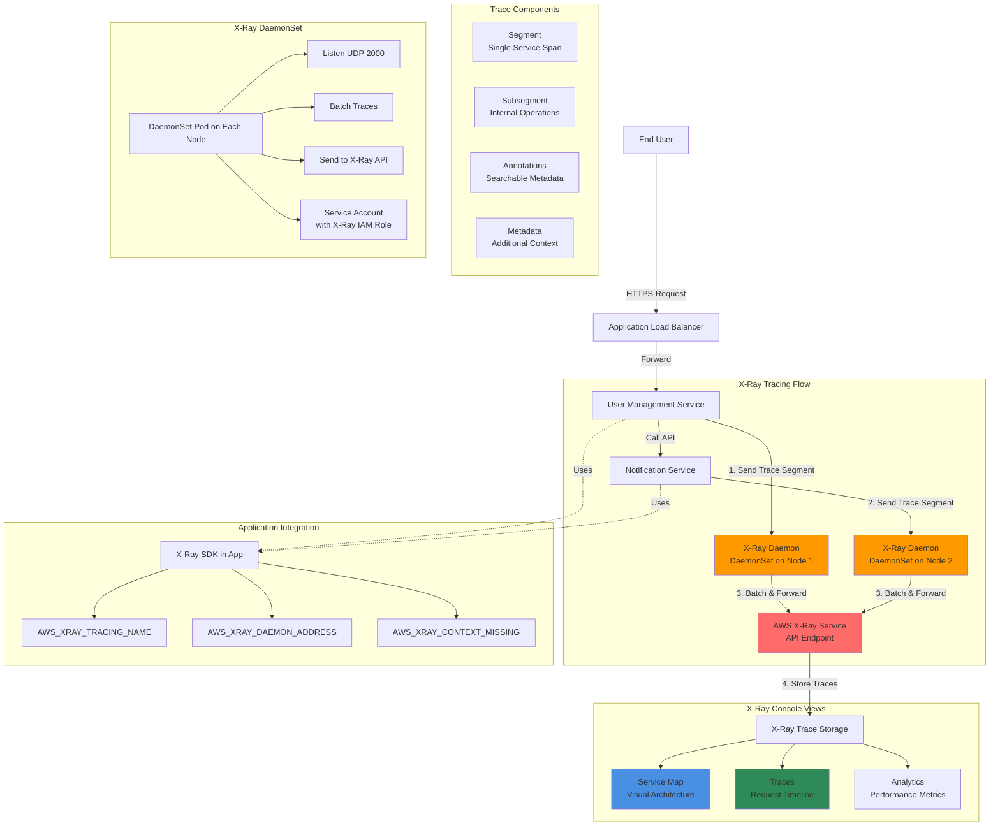

# Microservices Distributed Tracing with X-Ray on AWS EKS

## X-Ray Distributed Tracing Diagram



### Diagram Explanation

- **X-Ray Daemon DaemonSet**: Runs on **every node** as a DaemonSet, listens on **UDP port 2000** for trace segments from applications
- **Trace Segments**: Each microservice sends **segment data** to local X-Ray daemon, representing that service's portion of the request
- **Subsegments**: Breakdown of operations **within a segment** (database calls, HTTP requests, custom code blocks) for detailed analysis
- **Service Map**: **Visual representation** of microservices architecture showing service dependencies, traffic flow, and health status
- **Distributed Context**: **Trace ID** propagated across services via HTTP headers, correlates all segments belonging to single user request
- **Annotations**: **Key-value pairs** that are indexed and searchable in X-Ray console, useful for filtering traces by business logic
- **Metadata**: Additional **non-indexed information** attached to segments for context, includes request/response details
- **IAM Service Account**: X-Ray daemon uses **IRSA** (IAM Roles for Service Accounts) with **AWSXRayDaemonWriteAccess** policy
- **Batching & Buffering**: Daemon batches traces before sending to **X-Ray API**, reduces API calls and improves performance
- **Sampling Rules**: Control **percentage of requests** traced to manage costs, default is 1 request/second + 5% of additional requests

## Step-01: Introduction
### Introduction to AWS XRay & k8s DaemonSets 
- Understand about AWS X-Ray Services
- Understand Kubernetes DaemonSets
- Understand the AWS X-Ray and Microservices network design on EKS Cluster
- Understand about Service Map, Traces and Segments in AWS X-Ray

### Usecase Description
- User Management **getNotificationAppInfo**  will call Notification service **notification-xray** which will evetually send traces to AWS X-Ray service
- We are going to depict one Microservice calling other Microservice

### List of Docker Images used in this section
| Application Name                 | Docker Image Name                          |
| ------------------------------- | --------------------------------------------- |
| User Management Microservice | stacksimplify/kube-usermanagement-microservice:3.0.0-AWS-XRay-MySQLDB |
| Notifications Microservice V1 | stacksimplify/kube-notifications-microservice:3.0.0-AWS-XRay |

## Step-02: Pre-requisite: AWS RDS Database, ALB Ingress Controller & External DNS

### AWS RDS Database
- We have created AWS RDS Database as part of section [06-EKS-Storage-with-RDS-Database](/06-EKS-Storage-with-RDS-Database/README.md)
- We even created a `externalName service: 01-MySQL-externalName-Service.yml` in our Kubernetes manifests to point to that RDS Database. 

### ALB Ingress Controller & External DNS
- We are going to deploy a application which will also have a `ALB Ingress Service` and also will register its DNS name in Route53 using `External DNS`
- Which means we should have both related pods running in our EKS cluster. 
- We have installed **ALB Ingress Controller** as part of section [08-01-ALB-Ingress-Install](/08-ELB-Application-LoadBalancers/08-01-ALB-Ingress-Install/README.md)
- We have installed **External DNS** as part of section [08-06-01-Deploy-ExternalDNS-on-EKS](/08-ELB-Application-LoadBalancers/08-06-ALB-Ingress-ExternalDNS/08-06-01-Deploy-ExternalDNS-on-EKS/README.md)
```
# Verify alb-ingress-controller pod running in namespace kube-system
kubectl get pods -n kube-system

# Verify external-dns pod running in default namespace
kubectl get pods
```

## Step-03: Create IAM permissions for AWS X-Ray daemon
```
# Template
eksctl create iamserviceaccount \
    --name service_account_name \
    --namespace service_account_namespace \
    --cluster cluster_name \
    --attach-policy-arn arn:aws:iam::aws:policy/AWSXRayDaemonWriteAccess \
    --approve \
    --override-existing-serviceaccounts

# Replace Name, Namespace, Cluster Info (if any changes)
eksctl create iamserviceaccount \
    --name xray-daemon \
    --namespace default \
    --cluster eksdemo1 \
    --attach-policy-arn arn:aws:iam::aws:policy/AWSXRayDaemonWriteAccess \
    --approve \
    --override-existing-serviceaccounts
```

### Verify Service Account and AWS IAM Role
```
# List k8s Service Accounts
kubectl get sa

# Describe Service Account (Verify IAM Role annotated)
kubectl describe sa xray-daemon

# List IAM Roles on eksdemo1 Cluster created with eksctl
eksctl  get iamserviceaccount --cluster eksdemo1
```

## Step-04: Update IAM Role ARN in xray-k8s-daemonset.yml
### Get AWS IAM Role ARN for xray-daemon
```
# Get AWS IAM Role ARN
eksctl  get iamserviceaccount xray-daemon --cluster eksdemo1
```
### Update  xray-k8s-daemonset.yml
- File Name: kube-manifests/01-XRay-DaemonSet/xray-k8s-daemonset.yml
```yml
apiVersion: v1
kind: ServiceAccount
metadata:
  labels:
    app: xray-daemon
  name: xray-daemon
  namespace: default
  # Update IAM Role ARN created for X-Ray access
  annotations:
    eks.amazonaws.com/role-arn: arn:aws:iam::180789647333:role/eksctl-eksdemo1-addon-iamserviceaccount-defa-Role1-20F5AWU2J61F
```

### Deploy X-Ray DaemonSet on our EKS Cluster
```
# Deploy
kubectl apply -f kube-manifests/01-XRay-DaemonSet/xray-k8s-daemonset.yml

# Verify Deployment, Service & Pod
kubectl get deploy,svc,pod

# Verify X-Ray Logs
kubectl logs -f <X-Ray Pod Name>
kubectl logs -f xray-daemon-phszp  

# List & Describe DaemonSet
kubectl get daemonset
kubectl describe daemonset xray-daemon
```

## Step-05: Review Microservices Application Deployment Manifests
- **02-UserManagementMicroservice-Deployment.yml**
```yml
# Change-1: Image Tag is 3.0.0-AWS-XRay-MySQLDB
      containers:
        - name: usermgmt-restapp
          image: stacksimplify/kube-usermanagement-microservice:3.0.0-AWS-XRay-MySQLDB

# Change-2: New Environment Variables related to AWS X-Ray
            - name: AWS_XRAY_TRACING_NAME 
              value: "User-Management-Microservice"                
            - name: AWS_XRAY_DAEMON_ADDRESS
              value: "xray-service.default:2000"    
            - name: AWS_XRAY_CONTEXT_MISSING 
              value: "LOG_ERROR"  # Log an error and continue, Ideally RUNTIME_ERROR – Throw a runtime exception which is default option if not configured                                            
```
- **04-NotificationMicroservice-Deployment.yml**
```yml
# Change-1: Image Tag is 3.0.0-AWS-XRay
    spec:
      containers:
        - name: notification-service
          image: stacksimplify/kube-notifications-microservice:3.0.0-AWS-XRay

# Change-2: New Environment Variables related to AWS X-Ray
            - name: AWS_XRAY_TRACING_NAME 
              value: "V1-Notification-Microservice"              
            - name: AWS_XRAY_DAEMON_ADDRESS
              value: "xray-service.default:2000"      
            - name: AWS_XRAY_CONTEXT_MISSING 
              value: "LOG_ERROR"  # Log an error and continue, Ideally RUNTIME_ERROR – Throw a runtime exception which is default option if not configured                                            

```

## Step-06: Review Ingress Manifest
- **07-ALB-Ingress-SSL-Redirect-ExternalDNS.yml**
```yml
# Change-1-For-You: Update with your SSL Cert ARN when using template
    alb.ingress.kubernetes.io/certificate-arn: arn:aws:acm:us-east-1:180789647333:certificate/9f042b5d-86fd-4fad-96d0-c81c5abc71e1

# Change-2-For-You: Update with your "yourdomainname.com"
    # External DNS - For creating a Record Set in Route53
    external-dns.alpha.kubernetes.io/hostname: services-xray.kubeoncloud.com, xraydemo.kubeoncloud.com             
```

## Step-07: Deploy Manifests
```
# Deploy
kubectl apply -f kube-manifests/02-Applications

# Verify
kubectl get pods
```

## Step-08: Test
```
# Test
https://xraydemo.kubeoncloud.com/usermgmt/notification-xray
https://xraydemo.kubeoncloud.com/usermgmt/notification-xray

# Your Domain Name
https://<Replace-your-domain-name>/usermgmt/notification-xray
```

## Step-09: Clean-Up
- We are going to delete applications created as part of this section
- We are going to leave the xray daemon set running which we will leverage in our next section canary deployments in Kubernetes on EKS. 
```
# Delete Apps
kubectl delete -f kube-manifests/02-Applications
```

## References
- https://github.com/aws-samples/aws-xray-kubernetes/
- https://github.com/aws-samples/aws-xray-kubernetes/blob/master/xray-daemon/xray-k8s-daemonset.yaml
- https://aws.amazon.com/blogs/compute/application-tracing-on-kubernetes-with-aws-x-ray/
- https://docs.aws.amazon.com/xray/latest/devguide/xray-sdk-java-configuration.html
- https://docs.aws.amazon.com/xray/latest/devguide/xray-sdk-java-configuration.html#xray-sdk-java-configuration-plugins
- https://docs.aws.amazon.com/xray/latest/devguide/xray-sdk-java-httpclients.html
- https://docs.aws.amazon.com/xray/latest/devguide/xray-sdk-java-filters.html
- https://docs.aws.amazon.com/xray/latest/devguide/xray-sdk-java-sqlclients.html
