# Microservices Canary Deployments 

## Canary Deployment Architecture Diagram

```mermaid
graph TB
    USER[End User] -->|Request| ALB[Application Load Balancer]
    ALB -->|Route to| UMS[User Management Service<br/>Pod]
    
    UMS -->|API Call: getNotificationAppInfo| SVC[Notification Service<br/>ClusterIP Service]
    
    SVC -->|Load Balance| V1_PODS[Notification V1 Pods<br/>2 Replicas - 50%]
    SVC -->|Load Balance| V2_PODS[Notification V2 Pods<br/>2 Replicas - 50%]
    
    V1_PODS -->|Send Traces| XRAY1[X-Ray Daemon]
    V2_PODS -->|Send Traces| XRAY2[X-Ray Daemon]
    UMS -->|Send Traces| XRAY3[X-Ray Daemon]
    
    XRAY1 -->|Forward| XRAY_SVC[AWS X-Ray Service]
    XRAY2 -->|Forward| XRAY_SVC
    XRAY3 -->|Forward| XRAY_SVC
    
    XRAY_SVC -->|Visualize| SERVICEMAP[X-Ray Service Map<br/>Shows V1 & V2 calls]
    
    subgraph "Traffic Distribution Strategy"
        PHASE1[Phase 1: 100% V1<br/>4 V1, 0 V2]
        PHASE2[Phase 2: 75% V1, 25% V2<br/>3 V1, 1 V2]
        PHASE3[Phase 3: 50% V1, 50% V2<br/>2 V1, 2 V2]
        PHASE4[Phase 4: 25% V1, 75% V2<br/>1 V1, 3 V2]
        PHASE5[Phase 5: 100% V2<br/>0 V1, 4 V2]
        
        PHASE1 --> PHASE2 --> PHASE3 --> PHASE4 --> PHASE5
    end
    
    subgraph "Canary Deployment Benefits"
        B1[Gradual rollout]
        B2[Risk mitigation]
        B3[Easy rollback]
        B4[Real user testing]
        B5[Performance comparison]
        B6[Zero downtime]
    end
    
    subgraph "Version Differences"
        V1_INFO[V1: 3.0.0-AWS-XRay<br/>Stable baseline version]
        V2_INFO[V2: 4.0.0-AWS-XRay<br/>New features/fixes]
        COMPARE[Compare metrics:<br/>- Error rates<br/>- Latency<br/>- Resource usage]
    end
    
    subgraph "Kubernetes Load Balancing"
        SVC_LB[Service selects pods by labels]
        SVC_LB --> LABELS[Both V1 & V2 have same<br/>app: notification label]
        LABELS --> KUBE_PROXY[kube-proxy distributes<br/>evenly across endpoints]
        KUBE_PROXY --> RATIO[Traffic ratio = Replica ratio]
    end
    
    subgraph "Monitoring & Decision"
        MONITOR[Monitor V2 Performance]
        MONITOR --> METRICS[Check metrics in X-Ray]
        METRICS --> DECISION{V2 Healthy?}
        DECISION -->|Yes| INCREASE[Increase V2 replicas]
        DECISION -->|No| ROLLBACK[Scale down V2<br/>Investigate issues]
        INCREASE --> NEXT_PHASE[Move to next phase]
    end
    
    subgraph "X-Ray Visualization"
        TRACE1[Trace: User Mgmt → Notif V1]
        TRACE2[Trace: User Mgmt → Notif V2]
        TRACE3[Service Map shows both paths]
        TRACE4[Compare latency & errors]
    end
    
    subgraph "Deployment Commands"
        CMD1[kubectl scale deploy notif-v1 --replicas=2]
        CMD2[kubectl scale deploy notif-v2 --replicas=2]
        CMD3[kubectl get pods -l app=notification]
        CMD4[Verify traffic distribution in X-Ray]
    end
    
    style V1_PODS fill:#4A90E2
    style V2_PODS fill:#2E8B57
    style SVC fill:#FF9900
    style XRAY_SVC fill:#FF6B6B
    style PHASE3 fill:#FFD700
```



### Diagram Explanation

- **Canary Deployment**: **Gradual rollout** of new version (V2) alongside stable version (V1), controlled by replica count
- **Traffic Distribution**: Kubernetes Service **load balances** requests across all pods, ratio equals replica ratio (2:2 = 50:50)
- **Same Service Label**: Both V1 and V2 pods have **identical labels**, allowing single Service to route to both versions
- **Replica-Based Control**: **No complex routing rules** needed, simply adjust replica counts to change traffic split
- **X-Ray Tracing**: **AWS X-Ray** traces show which version handles each request, enabling performance comparison
- **Risk Mitigation**: Start with **small percentage** of V2 traffic (1 replica), increase gradually as confidence grows
- **Easy Rollback**: If issues detected, **scale down V2 replicas** to zero, immediate return to V1 only
- **Real User Testing**: **Production traffic** tests new version with real workloads, more realistic than staging
- **Zero Downtime**: During entire deployment process, **service remains available** with at least one version running
- **Service Map Visualization**: X-Ray Service Map shows **both V1 and V2 call paths**, compare latency and error rates side-by-side

## Step-01: Introduction
### Usecase Description
- User Management **getNotificationAppInfo**  will call Notification service V1 and V2 versions.
- We will distribute traffic between V1 and V2 versions of Notification service as per our choice based on Replicas

| NS V1 Replicas | NS V2 Replicas | Traffic Distribution | 
| -------------- | -------------- | -------------------- |
| 4 | 0 | 100% traffic to NS V1 Version |
| 3 | 1 | 25% traffic to NS V2 Version |
| 2 | 2 | 50% traffic to NS V2 Version |
| 1 | 3 | 75% traffic to NS V2 Version |
| 0 | 4 | 100% traffic to NS V2 Version |

- In our demo, we are going to distribute 50% traffic to each version (V1 and V2). 
- NS V1 - 2 replicas and NS V2 - 2 replicas
- We are going to depict one Microservice calling other Microservices with different versions in AWS X-Ray

### List of Docker Images used in this section
| Application Name                 | Docker Image Name                          |
| ------------------------------- | --------------------------------------------- |
| User Management Microservice | stacksimplify/kube-usermanagement-microservice:3.0.0-AWS-XRay-MySQLDB |
| Notifications Microservice V1 | stacksimplify/kube-notifications-microservice:3.0.0-AWS-XRay |
| Notifications Microservice V2 | stacksimplify/kube-notifications-microservice:4.0.0-AWS-XRay |

## Step-02: Pre-requisite: AWS RDS Database, ALB Ingress Controller, External DNS & X-Ray Daemon

### AWS RDS Database
- We have created AWS RDS Database as part of section [06-EKS-Storage-with-RDS-Database](/06-EKS-Storage-with-RDS-Database/README.md)
- We even created a `externalName service: 01-MySQL-externalName-Service.yml` in our Kubernetes manifests to point to that RDS Database. 

### ALB Ingress Controller & External DNS
- We are going to deploy a application which will also have a `ALB Ingress Service` and also will register its DNS name in Route53 using `External DNS`
- Which means we should have both related pods running in our EKS cluster. 
- We have installed **ALB Ingress Controller** as part of section [08-01-ALB-Ingress-Install](/08-ELB-Application-LoadBalancers/08-01-ALB-Ingress-Install/README.md)
- We have installed **External DNS** as part of section [08-06-01-Deploy-ExternalDNS-on-EKS](/08-ELB-Application-LoadBalancers/08-06-ALB-Ingress-ExternalDNS/08-06-01-Deploy-ExternalDNS-on-EKS/README.md)

### XRay Daemon
- We are going to view the application traces in AWS X-Ray.
- We need XRay Daemon running as Daemonset for that. 
```
# Verify alb-ingress-controller pod running in namespace kube-system
kubectl get pods -n kube-system

# Verify external-dns & xray-daemon pod running in default namespace
kubectl get pods
```

## Step-03: Review Deployment Manifest for V2 Notification Service
- We are going to distribute 50% traffic to each of the V1 and V2 version of application


| NS V1 Replicas | NS V2 Replicas | Traffic Distribution | 
| -------------- | -------------- | -------------------- |
| 2 | 2 | 50% traffic to NS V2 Version |

- **08-V2-NotificationMicroservice-Deployment.yml**
```yml
# Change-1: Image Tag is 4.0.0-AWS-XRay
    spec:
      containers:
        - name: notification-service
          image: stacksimplify/kube-notifications-microservice:4.0.0-AWS-XRay

# Change-2: New Environment Variables related to AWS X-Ray
            - name: AWS_XRAY_TRACING_NAME 
              value: "V2-Notification-Microservice"              
            - name: AWS_XRAY_DAEMON_ADDRESS
              value: "xray-service.default:2000"      
            - name: AWS_XRAY_CONTEXT_MISSING 
              value: "LOG_ERROR"  # Log an error and continue, Ideally RUNTIME_ERROR – Throw a runtime exception which is default option if not configured    
```


## Step-04: Review Ingress Manifest
- **07-ALB-Ingress-SSL-Redirect-ExternalDNS.yml**
```yml
# Change-1-For-You: Update with your SSL Cert ARN when using template
    alb.ingress.kubernetes.io/certificate-arn: arn:aws:acm:us-east-1:180789647333:certificate/9f042b5d-86fd-4fad-96d0-c81c5abc71e1

# Change-2-For-You: Update with your "yourdomainname.com"
    # External DNS - For creating a Record Set in Route53
    external-dns.alpha.kubernetes.io/hostname: canarydemo.kubeoncloud.com
```

## Step-05: Deploy Manifests
```
# Deploy
kubectl apply -f kube-manifests/

# Verify
kubectl get deploy,svc,pod
```
## Step-06: Test
```
# Test
https://canarydemo.kubeoncloud.com/usermgmt/notification-xray

# Your Domain Name
https://<Replace-your-domain-name>/usermgmt/notification-xray
```

## Step-07: What is happening in the background?
- As far as `Notification Cluster IP Service` selector label matches to `Notificaiton V1 and V2 Deployment manifests selector.matchLables`  those respective pods are picked to send traffic.
```yml
# Notification Cluster IP Service - Selector Label
  selector:
    app: notification-restapp

# Notification V1 and V2 Deployment - Selector Match Labels
  selector:
    matchLabels:
      app: notification-restapp         
```

## Step-08: Clean-Up
- We are going to delete applications created as part of this section
```
# Delete Apps
kubectl delete -f kube-manifests/
```

## Step-09: Downside of this approach
- We will review the downside in a presentation

## Step-10: Best ways for Canary Deployments
- Istio (Open Source)
- AWS AppMesh (AWS version of Istio)