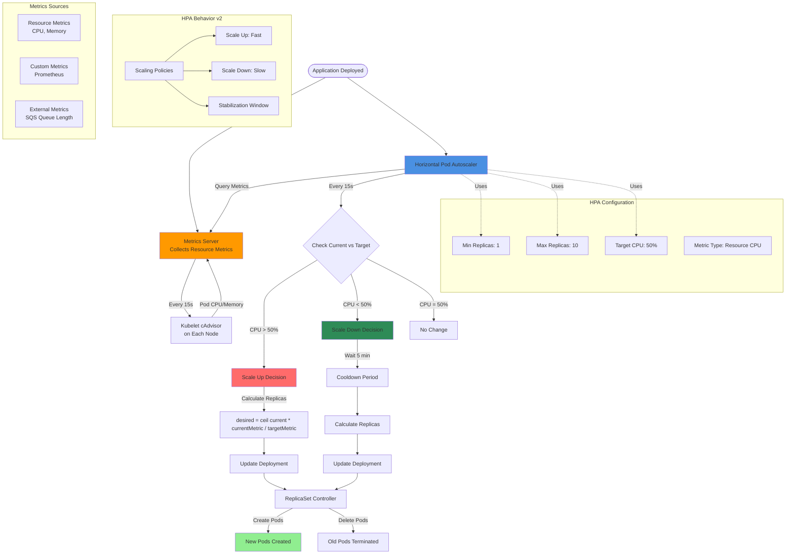

# EKS - Horizontal Pod Autoscaling (HPA)

## HPA Architecture Diagram



### Diagram Explanation

- **Metrics Server**: Required component that **collects resource metrics** from kubelet on each node, stores short-term metrics in memory
- **HPA Controller**: Queries Metrics Server **every 15 seconds**, compares current metrics against target, makes scaling decisions
- **Target Utilization**: HPA maintains **average CPU usage** across all pods at target percentage (e.g., 50% of requested CPU)
- **Scale Up Formula**: `desired replicas = ceil(current replicas × current metric ÷ target metric)` ensures quick response to increased load
- **Scale Down Delay**: **5-minute cooldown** before scaling down prevents flapping from temporary load drops
- **Min/Max Replicas**: Defines **boundaries** for autoscaling - prevents scaling to zero or excessive pod count
- **Resource Requests Required**: Pods **must specify CPU/memory requests** for HPA to calculate utilization percentage
- **Multiple Metrics**: HPA can scale based on **multiple metrics** simultaneously, uses highest calculated replica count
- **Custom Metrics**: Integrate with **Prometheus Adapter** to scale on application-specific metrics (requests/sec, queue depth)
- **Stabilization Window**: Prevents **rapid oscillation** by considering metric history over time window before scaling decisions

## Step-01: Introduction
- What is Horizontal Pod Autoscaling?
- How HPA Works?
- How HPA configured?

## Step-02: Install Metrics Server
```
# Verify if Metrics Server already Installed
kubectl -n kube-system get deployment/metrics-server

# Install Metrics Server
kubectl apply -f https://github.com/kubernetes-sigs/metrics-server/releases/download/v0.3.6/components.yaml

# Verify
kubectl get deployment metrics-server -n kube-system
```

## Step-03: Review Deploy our Application
```
# Deploy
kubectl apply -f kube-manifests/

# List Pods, Deploy & Service
kubectl get pod,svc,deploy

# Access Application (Only if our Cluster is Public Subnet)
kubectl get nodes -o wide
http://<Worker-Node-Public-IP>:31231
```

## Step-04: Create a Horizontal Pod Autoscaler resource for the "hpa-demo-deployment" 
- This command creates an autoscaler that targets 50 percent CPU utilization for the deployment, with a minimum of one pod and a maximum of ten pods. 
- When the average CPU load is below 50 percent, the autoscaler tries to reduce the number of pods in the deployment, to a minimum of one. 
- When the load is greater than 50 percent, the autoscaler tries to increase the number of pods in the deployment, up to a maximum of ten
```
# Template
kubectl autoscale deployment <deployment-name> --cpu-percent=50 --min=1 --max=10

# Replace
kubectl autoscale deployment hpa-demo-deployment --cpu-percent=50 --min=1 --max=10

# Describe HPA
kubectl describe hpa/hpa-demo-deployment 

# List HPA
kubectl get horizontalpodautoscaler.autoscaling/hpa-demo-deployment 
```

## Step-05: Create the load & Verify how HPA is working
```
# Generate Load
kubectl run --generator=run-pod/v1 apache-bench -i --tty --rm --image=httpd -- ab -n 500000 -c 1000 http://hpa-demo-service-nginx.default.svc.cluster.local/ 

# List all HPA
kubectl get hpa

# List specific HPA
kubectl get hpa hpa-demo-deployment 

# Describe HPA
kubectl describe hpa/hpa-demo-deployment 

# List Pods
kubectl get pods
```

## Step-06: Cooldown / Scaledown
- Default cooldown period is 5 minutes. 
- Once CPU utilization of pods is less than 50%, it will starting terminating pods and will reach to minimum 1 pod as configured.


## Step-07: Clean-Up
```
# Delete HPA
kubectl delete hpa hpa-demo-deployment

# Delete Deployment & Service
kubectl delete -f kube-manifests/ 
```

## Step-08: Imperative vs Declarative for HPA
- From Kubernetes v1.18 onwards, we have a declarative way of defining HPA policies using `behavior` object in yaml.
- **Support for configurable scaling behavior**
  - Starting from v1.18 the v2beta2 API allows scaling behavior to be configured through the HPA behavior field. 
  - Behaviors are specified separately for scaling up and down in scaleUp or scaleDown section under the behavior field
```yml
behavior:
  scaleDown:
    stabilizationWindowSeconds: 300
    policies:
    - type: Percent
      value: 100
      periodSeconds: 15
  scaleUp:
    stabilizationWindowSeconds: 0
    policies:
    - type: Percent
      value: 100
      periodSeconds: 15
    - type: Pods
      value: 4
      periodSeconds: 15
    selectPolicy: Max
```
- **Reference:** Select V1.18 from top right corner on Kubernetes website for V1.18 documentation
  -  https://kubernetes.io/docs/tasks/run-application/horizontal-pod-autoscale/


## Referencess
### Metrics Server Releases
- https://github.com/kubernetes-sigs/metrics-server/releases

### Horizontal Pod Autoscaling - Scale based on many type of metrics
- https://v1-16.docs.kubernetes.io/docs/tasks/run-application/horizontal-pod-autoscale-walkthrough/