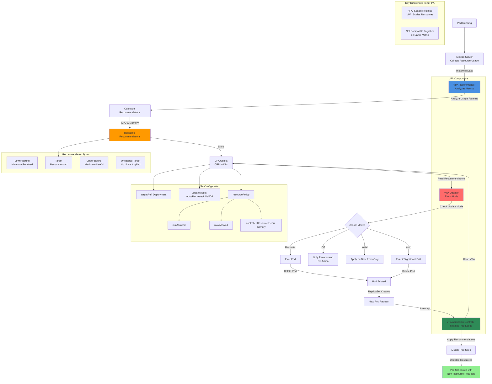

# EKS - Vertical Pod Autoscaling (VPA)

## VPA Architecture Diagram



### Diagram Explanation

- **VPA Recommender**: Monitors **historical resource usage**, calculates optimal CPU/memory requests using **statistical models** 
- **VPA Admission Controller**: **Webhook** that intercepts pod creation, mutates resource requests based on VPA recommendations before scheduling
- **VPA Updater**: Proactively **evicts pods** when current resources deviate significantly from recommendations (in Auto/Recreate mode)
- **Update Modes**: **Off** (recommend only), **Initial** (new pods only), **Recreate** (evict all), **Auto** (evict when significant drift)
- **Resource Policy**: Defines **min/max boundaries** for recommendations, prevents VPA from setting extreme values
- **Recommendation Types**: **Lower Bound** (minimum needed), **Target** (recommended), **Upper Bound** (maximum useful), **Uncapped** (no limits)
- **Metrics Server Required**: VPA depends on **Metrics Server** to collect pod resource usage data over time
- **HPA Incompatibility**: Cannot use VPA and HPA together on **same metric** (CPU), can combine if HPA uses custom metrics
- **Resource Requests vs Limits**: VPA sets **requests** automatically, limits can be set proportionally or independently
- **Eviction Safety**: Respects **PodDisruptionBudgets** before evicting pods, ensures minimum replicas available

## Step-01: Introduction
- The Kubernetes Vertical Pod Autoscaler automatically adjusts the CPU and memory reservations for your pods to help "right size" your applications. 
- This adjustment can improve cluster resource utilization and free up CPU and memory for other pods. 

## Step-02: Pre-requisite - Metric server
- Metric server should be installed & ready, we have done that as part of HPA

## Step-03: Deploy the Vertical Pod Autoscaler (VPA)
```
# Clone Repo
git clone https://github.com/kubernetes/autoscaler.git

# Navigate to VPA
cd autoscaler/vertical-pod-autoscaler/

# Uninstall VPA (if we are using old one)
./hack/vpa-down.sh

# Install new version of VPA
./hack/vpa-up.sh

# Verify VPA Pods
kubectl get pods -n kube-system
```

## Step-04: Review & Deploy our Application Manifests (Deployment & Service)
- Make a note of resources we have defined `spec.containers.resources.requests`.
- `limits` we define in VPA definition
```yml
        resources:
          requests:
            cpu: "5m"       
            memory: "5Mi"   
```

- **Deploy**
```
# Deploy Application
kubectl apply -f kube-manifests/01-VPA-DemoApplication.yml

# List Pods, Deploy & Service
kubectl get pod,svc,deploy

# Describe Pod
kubectl describe pod <pod-name>

# Access Application (If our NodeGroup is in Public Subnet, if not ignore)
kubectl get nodes -o wide
http://<Worker-Node-Public-IP>:31232
```

## Step-05: Create & Deploy VPA manifest

### Create VPA Manifest
- Create a VPA manifest for our above Application which we deployed just now. 
```yml
apiVersion: "autoscaling.k8s.io/v1beta2"
kind: VerticalPodAutoscaler
metadata:
  name: kubengix-vpa
spec:
  targetRef:
    apiVersion: "apps/v1"
    kind: Deployment
    name: vpa-demo-deployment
  resourcePolicy:
    containerPolicies:
      - containerName: '*'
        minAllowed:
          cpu: 5m
          memory: 5Mi
        maxAllowed:
          cpu: 1
          memory: 500Mi
        controlledResources: ["cpu", "memory"]
```

### Deploy VPA Manifest
```
# Deploy
kubectl apply -f kube-manifests/02-VPA-Manifest.yml

# List VPA
kubectl get vpa

# Describe VPA
kubectl describe vpa kubengix-vpa
```


## Step-06: Generate Load
- Open 3 more new terminals and execute below 3 load generation commands
```
# Terminal 1 - List and watch pods
kubectl get pods -w

# Terminal 2 - Generate Load
kubectl run --generator=run-pod/v1 apache-bench -i --tty --rm --image=httpd -- ab -n 500000 -c 1000 http://vpa-demo-service-nginx.default.svc.cluster.local/

# Terminal 3 - Generate Load
kubectl run --generator=run-pod/v1 apache-bench2 -i --tty --rm --image=httpd -- ab -n 500000 -c 1000 http://vpa-demo-service-nginx.default.svc.cluster.local/

# Terminal 4 - Generate Load
kubectl run --generator=run-pod/v1 apache-bench3 -i --tty --rm --image=httpd -- ab -n 500000 -c 1000 http://vpa-demo-service-nginx.default.svc.cluster.local/
```

## Step-07: Describe pods which were re-launched by VPA Updater
```
# List Pods
kubectl get pods

# Describe pods
kubectl describe pod <recently-relaunched-pod>
```

## Step-08: Important Nodes about VPA:
1. VPA Updater can re-launch new pod with updated CPU and Memory when you atleast have 2 pods in a deployment. 
2. If we have only one pod, unless we manually delete that pod, it will not launch new pod with VPA recommended CPU and memory considerign the application availability scenario.

## Step-09: Clean-Up
```
kubectl delete -f kube-manifests/
```