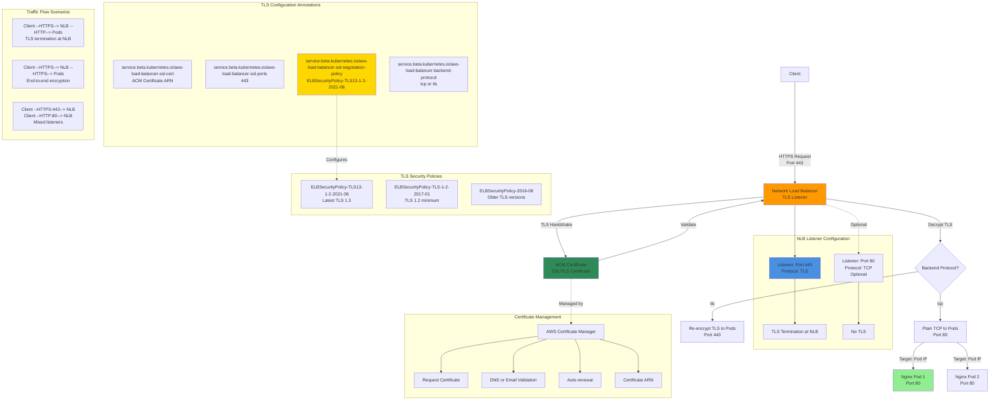

## NLB TLS Termination Diagram



### Diagram Explanation

- **TLS Termination at NLB**: NLB **decrypts** incoming HTTPS traffic using ACM certificate, sends plain TCP to pods
- **ACM Certificate**: Certificate from **AWS Certificate Manager** referenced by ARN in annotation, automatically renewed
- **SSL Ports Annotation**: Specifies which listener ports use **TLS** (e.g., 443), allows mixed TLS and non-TLS listeners
- **Backend Protocol**: Set to **tcp** for TLS termination or **tls** for end-to-end encryption (pass-through)
- **TLS Security Policy**: Defines **allowed TLS versions** and cipher suites, latest policy supports TLS 1.3
- **Mixed Listeners**: Can have both **port 443 (TLS)** and **port 80 (plain TCP)** on same NLB
- **Target Type IP**: NLB forwards decrypted traffic **directly to pod IPs** on configured target port
- **Certificate Validation**: ACM validates **domain ownership** via DNS or email before issuing certificate
- **Cipher Suites**: Security policy controls **encryption algorithms** used during TLS handshake
- **Performance**: NLB TLS offloading reduces **CPU load on pods**, centralizes certificate management

## Step-01: Introduction
- Understand about the 4 TLS Annotations for Network Load Balancers
- aws-load-balancer-ssl-cert
- aws-load-balancer-ssl-ports
- aws-load-balancer-ssl-negotiation-policy
- aws-load-balancer-ssl-negotiation-policy

## Step-02: Review TLS Annotations
- **File Name:** `kube-manifests\02-LBC-NLB-LoadBalancer-Service.yml`
- **Security Policies:** https://docs.aws.amazon.com/elasticloadbalancing/latest/network/create-tls-listener.html#describe-ssl-policies
```yaml
    # TLS
    service.beta.kubernetes.io/aws-load-balancer-ssl-cert: arn:aws:acm:us-east-1:180789647333:certificate/d86de939-8ffd-410f-adce-0ce1f5be6e0d
    service.beta.kubernetes.io/aws-load-balancer-ssl-ports: 443, # Specify this annotation if you need both TLS and non-TLS listeners on the same load balancer
    service.beta.kubernetes.io/aws-load-balancer-ssl-negotiation-policy: ELBSecurityPolicy-TLS13-1-2-2021-06
    service.beta.kubernetes.io/aws-load-balancer-backend-protocol: tcp 
```


## Step-03: Deploy all kube-manifests
```t
# Deploy kube-manifests
kubectl apply -f kube-manifests/

# Verify Pods
kubectl get pods

# Verify Services
kubectl get svc
Observation: 
1. Verify the network lb DNS name

# Verify AWS Load Balancer Controller pod logs
kubectl -n kube-system get pods
kubectl -n kube-system logs -f <aws-load-balancer-controller-POD-NAME>

# Verify using AWS Mgmt Console
Go to Services -> EC2 -> Load Balancing -> Load Balancers
1. Verify Description Tab - DNS Name matching output of "kubectl get svc" External IP
2. Verify Listeners Tab
Observation:  Should see two listeners Port 80 and 443

Go to Services -> EC2 -> Load Balancing -> Target Groups
1. Verify Registered targets
2. Verify Health Check path
Observation: Should see two target groups. 1 Target group for 1 listener

# Access Application
# Test HTTP URL
http://<NLB-DNS-NAME>
http://lbc-network-lb-tls-demo-a956479ba85953f8.elb.us-east-1.amazonaws.com

# Test HTTPS URL
https://<NLB-DNS-NAME>
https://lbc-network-lb-tls-demo-a956479ba85953f8.elb.us-east-1.amazonaws.com
```

## Step-04: Clean-Up
```t
# Delete or Undeploy kube-manifests
kubectl delete -f kube-manifests/

# Verify if NLB deleted 
In AWS Mgmt Console, 
Go to Services -> EC2 -> Load Balancing -> Load Balancers
```

## References
- [Network Load Balancer](https://docs.aws.amazon.com/eks/latest/userguide/network-load-balancing.html)
- [NLB Service](https://kubernetes-sigs.github.io/aws-load-balancer-controller/v2.4/guide/service/nlb/)
- [NLB Service Annotations](https://kubernetes-sigs.github.io/aws-load-balancer-controller/v2.4/guide/service/annotations/)

