## NLB with Elastic IP Diagram

```mermaid
graph TB
    USER[Client] -->|DNS Resolves to EIP| EIP1[Elastic IP 1<br/>Static IP: 3.80.1.100<br/>AZ us-east-1a]
    USER -->|DNS Resolves to EIP| EIP2[Elastic IP 2<br/>Static IP: 3.80.1.101<br/>AZ us-east-1b]
    
    EIP1 -->|Attached to| NLB_AZ1[NLB Node<br/>Availability Zone 1a]
    EIP2 -->|Attached to| NLB_AZ2[NLB Node<br/>Availability Zone 1b]
    
    NLB_AZ1 -->|Target: Pod IP| POD1[Pod 1 in AZ1]
    NLB_AZ1 -->|Cross-Zone| POD3[Pod 3 in AZ2]
    
    NLB_AZ2 -->|Target: Pod IP| POD2[Pod 2 in AZ2]
    NLB_AZ2 -->|Cross-Zone| POD4[Pod 4 in AZ1]
    
    subgraph "EKS Cluster"
        subgraph "Availability Zone 1a"
            POD1[Nginx Pod 1]
            POD4[Nginx Pod 4]
        end
        
        subgraph "Availability Zone 1b"
            POD2[Nginx Pod 2]
            POD3[Nginx Pod 3]
        end
        
        SVC[LoadBalancer Service<br/>Type: LoadBalancer]
        SVC -.->|Selects| POD1
        SVC -.->|Selects| POD2
        SVC -.->|Selects| POD3
        SVC -.->|Selects| POD4
    end
    
    subgraph "Service Annotations"
        ANNO1[service.beta.kubernetes.io/aws-load-balancer-type: external]
        ANNO2[service.beta.kubernetes.io/aws-load-balancer-nlb-target-type: ip]
        ANNO3[service.beta.kubernetes.io/aws-load-balancer-scheme: internet-facing]
        ANNO4[service.beta.kubernetes.io/aws-load-balancer-eip-allocations<br/>eipalloc-xxx, eipalloc-yyy]
    end
    
    SVC --> ANNO1
    SVC --> ANNO2
    SVC --> ANNO3
    SVC --> ANNO4
    
    subgraph "Elastic IP Setup"
        STEP1[1. Create Elastic IPs in EC2]
        STEP2[2. Get EIP Allocation IDs]
        STEP3[3. Add to Service annotation]
        STEP4[4. Must match number of subnets]
        
        STEP1 --> STEP2 --> STEP3 --> STEP4
    end
    
    subgraph "Elastic IP Benefits"
        B1[Static predictable IPs]
        B2[IP whitelisting support]
        B3[Firewall rule compatibility]
        B4[DNS failover ready]
        B5[Preserve IP on recreation]
        B6[Regulatory compliance]
    end
    
    subgraph "Requirements"
        R1[NLB must be internet-facing]
        R2[Number of EIPs = Number of AZs]
        R3[EIPs in same region as cluster]
        R4[Valid allocation IDs]
    end
    
    subgraph "Elastic IP Properties"
        PROP1[Persistent across NLB recreation]
        PROP2[Can be moved between NLBs]
        PROP3[Billed when not associated]
        PROP4[One EIP per AZ]
        PROP5[IPv4 only]
    end
    
    subgraph "Use Cases"
        UC1[Third-party integrations<br/>requiring IP whitelist]
        UC2[Corporate firewall rules]
        UC3[Partner VPN connections]
        UC4[Compliance requirements]
        UC5[Migrating from on-prem<br/>with fixed IPs]
    end
    
    subgraph "Without Elastic IP"
        NO_EIP[Default Behavior]
        NO_EIP --> DYNAMIC[AWS assigns dynamic IPs]
        DYNAMIC --> CHANGE[IPs change on NLB recreation]
        CHANGE --> PROBLEM[Whitelist rules break]
    end
    
    subgraph "Cost Considerations"
        COST1[EIP: $0.005/hour when not attached]
        COST2[EIP: Free when attached to running resource]
        COST3[NLB: Standard NLB charges apply]
        COST4[Data transfer charges]
    end
    
    subgraph "High Availability"
        HA1[EIP per AZ ensures availability]
        HA2[If one AZ fails, other EIP remains]
        HA3[Cross-zone load balancing enabled]
        HA4[Traffic distributed across all AZs]
    end
    
    style EIP1 fill:#FF9900
    style EIP2 fill:#FF9900
    style NLB_AZ1 fill:#4A90E2
    style NLB_AZ2 fill:#4A90E2
    style SVC fill:#2E8B57
    style ANNO4 fill:#FFD700
```



### Diagram Explanation

- **Elastic IP**: **Static public IPv4 address** that persists across NLB recreation, ideal for IP whitelisting scenarios
- **EIP Allocation IDs**: Must obtain **allocation IDs** (eipalloc-xxx) from EC2 console and add to Service annotation
- **One EIP per AZ**: Number of EIPs must **match number of subnets/AZs**, typically 2-3 for high availability
- **Internet-Facing Requirement**: Elastic IPs only work with **internet-facing NLBs**, not internal load balancers
- **Static IP Persistence**: Even if Service/NLB is **deleted and recreated**, same EIPs can be reused
- **IP Whitelisting**: Enables **third-party integrations** and **corporate firewalls** to whitelist specific IP addresses
- **Cross-Zone Load Balancing**: Traffic distributed **evenly across all AZs** regardless of which EIP receives request
- **Cost Impact**: EIPs are **free when attached** to running NLB, but charged $0.005/hour when unattached
- **Compliance Use Case**: Meets **regulatory requirements** for static IP addresses in certain industries
- **Migration Friendly**: Facilitates **migration from on-premises** where fixed IP addresses were used

## Step-01: Introduction
- Create Elastic IPs
- Update NLB Service k8s manifest with Elastic IP Annotation with EIP Allocation IDs

## Step-02: Create two Elastic IPs and get EIP Allocation IDs
- This configuration is optional and use can use it to assign static IP addresses to your NLB
- You must specify the same number of eip allocations as load balancer subnets annotation
- NLB must be internet-facing
```t
# Elastic IP Allocation IDs
eipalloc-07daf60991cfd21f0 
eipalloc-0a8e8f70a6c735d16
```

## Step-03: Review Elastic IP Annotations
- **File Name:** `kube-manifests\02-LBC-NLB-LoadBalancer-Service.yml`
```yaml
    # Elastic IPs
    service.beta.kubernetes.io/aws-load-balancer-eip-allocations: eipalloc-07daf60991cfd21f0, eipalloc-0a8e8f70a6c735d16
```

## Step-04: Deploy all kube-manifests
```t
# Deploy kube-manifests
kubectl apply -f kube-manifests/

# Verify Pods
kubectl get pods

# Verify Services
kubectl get svc
Observation: 
1. Verify the network lb DNS name

# Verify AWS Load Balancer Controller pod logs
kubectl -n kube-system get pods
kubectl -n kube-system logs -f <aws-load-balancer-controller-POD-NAME>

# Verify using AWS Mgmt Console
Go to Services -> EC2 -> Load Balancing -> Load Balancers
1. Verify Description Tab - DNS Name matching output of "kubectl get svc" External IP
2. Verify Listeners Tab
Observation:  Should see two listeners Port 80 and 443

Go to Services -> EC2 -> Load Balancing -> Target Groups
1. Verify Registered targets
2. Verify Health Check path
Observation: Should see two target groups. 1 Target group for 1 listener

# Perform nslookup Test
nslookup nlbeip201.stacksimplify.com
Observation:
1. Verify the IP Address matches our Elastic IPs we created in Step-02

# Access Application
# Test HTTP URL
http://nlbeip201.stacksimplify.com

# Test HTTPS URL
https://nlbeip201.stacksimplify.com
```

## Step-05: Clean-Up
```t
# Delete or Undeploy kube-manifests
kubectl delete -f kube-manifests/

# Delete Elastic IPs created
In AWS Mgmt Console, 
Go to Services -> EC2 -> Network & Security -> Elastic IPs
Delete two EIPs created

# Verify if NLB deleted 
In AWS Mgmt Console, 
Go to Services -> EC2 -> Load Balancing -> Load Balancers
```

## References
- [Network Load Balancer](https://docs.aws.amazon.com/eks/latest/userguide/network-load-balancing.html)
- [NLB Service](https://kubernetes-sigs.github.io/aws-load-balancer-controller/v2.4/guide/service/nlb/)
- [NLB Service Annotations](https://kubernetes-sigs.github.io/aws-load-balancer-controller/v2.4/guide/service/annotations/)

