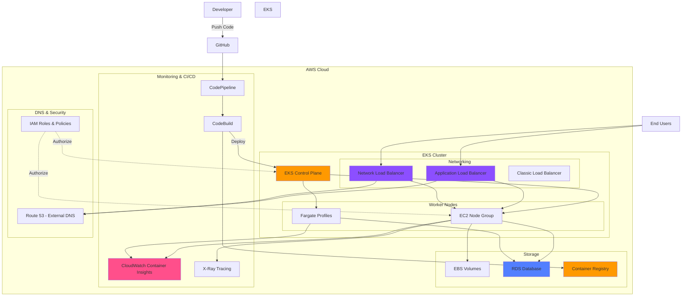

# AWS EKS Kubernetes - Masterclass | DevOps, Microservices

> **Course by:** Kalyan Reddy Daida  
> **Repository based on:** [AWS EKS Kubernetes - Masterclass | DevOps, Microservices](https://www.udemy.com/course/aws-eks-kubernetes-masterclass-devops-microservices/) on Udemy

## Course Overview

This comprehensive course covers AWS EKS (Elastic Kubernetes Service) from fundamentals to advanced production-ready deployments. Learn Docker, Kubernetes, AWS EKS, DevOps practices, Microservices architecture, Load Balancing, Storage, Autoscaling, Monitoring, and more through hands-on practical examples.

## Architecture Diagram



### Diagram Explanation

- **EKS Control Plane**: Managed by AWS, handles **API server**, **scheduler**, and **cluster orchestration** for Kubernetes workloads
- **Worker Nodes**: Two deployment options - **EC2-based node groups** for traditional workloads and **Fargate profiles** for serverless containers
- **Load Balancing Layer**: Three types of load balancers - **ALB** for HTTP/HTTPS routing, **NLB** for TCP/UDP traffic, and **CLB** for legacy applications
- **Persistent Storage**: **EBS CSI Driver** provides block storage for pods, while **RDS** offers managed database services for stateful applications
- **Container Registry**: **ECR** stores and manages Docker images with integrated **vulnerability scanning** and **lifecycle policies**
- **CI/CD Pipeline**: **CodePipeline** orchestrates the build process, **CodeBuild** compiles and pushes images, enabling **automated deployments**
- **Observability Stack**: **CloudWatch Container Insights** provides metrics and logs, **X-Ray** enables distributed tracing for microservices
- **DNS Automation**: **External DNS** automatically creates **Route 53** records when Ingress or Service resources are deployed
- **Security Model**: **IAM roles** and **service accounts** provide **fine-grained access control** using **IRSA** (IAM Roles for Service Accounts)
- **Development Workflow**: Code flows from **GitHub** through **CI/CD pipeline** to **EKS cluster**, enabling **continuous delivery** and **rapid iteration**

### What You'll Learn
- Create and manage AWS EKS clusters using eksctl
- Docker and Kubernetes fundamentals
- AWS EKS Storage with EBS and RDS
- Load Balancing with Classic, Network, and Application Load Balancers
- AWS Load Balancer Controller and Ingress
- External DNS integration with Route53
- Microservices deployment and management
- Distributed tracing with AWS X-Ray
- Canary deployments
- Horizontal and Vertical Pod Autoscaling
- Cluster Autoscaling
- Monitoring with CloudWatch Container Insights
- DevOps CI/CD with AWS CodePipeline, CodeBuild, and GitHub
- Fargate for serverless containers
- ECR (Elastic Container Registry) integration

---

## Table of Contents

1. [EKS - Create Cluster using eksctl](#section-01-eks-create-cluster-using-eksctl)
2. [Docker Fundamentals](#section-02-docker-fundamentals)
3. [Kubernetes Fundamentals](#section-03-kubernetes-fundamentals)
4. [EKS Storage with EBS ElasticBlockStore](#section-04-eks-storage-with-ebs-elasticblockstore)
5. [Kubernetes Important Concepts for Application Deployments](#section-05-kubernetes-important-concepts-for-application-deployments)
6. [EKS Storage with RDS Database](#section-06-eks-storage-with-rds-database)
7. [ELB Classic and Network LoadBalancers](#section-07-elb-classic-and-network-loadbalancers)
8. [ELB Application LoadBalancers](#section-08-elb-application-loadbalancers)
9. [EKS Workloads on Fargate](#section-09-eks-workloads-on-fargate)
10. [ECR - Elastic Container Registry and EKS](#section-10-ecr-elastic-container-registry-and-eks)
11. [DevOps with AWS Developer Tools and GitHub](#section-11-devops-with-aws-developer-tools-and-github)
12. [Microservices Deployment on EKS](#section-12-microservices-deployment-on-eks)
13. [Microservices Distributed Tracing using AWS XRay](#section-13-microservices-distributed-tracing-using-aws-xray)
14. [Microservices Canary Deployments](#section-14-microservices-canary-deployments)
15. [EKS HPA - Horizontal Pod Autoscaler](#section-15-eks-hpa-horizontal-pod-autoscaler)
16. [EKS VPA - Vertical Pod Autoscaler](#section-16-eks-vpa-vertical-pod-autoscaler)
17. [EKS Cluster Autoscaler](#section-17-eks-cluster-autoscaler)
18. [EKS Monitoring using CloudWatch Container Insights](#section-18-eks-monitoring-using-cloudwatch-container-insights)
19. [ELB Network LoadBalancers with LBC](#section-19-elb-network-loadbalancers-with-lbc)

---

## Daily Learning Plan

This course is designed to be completed in approximately **8 weeks** with consistent daily practice. Each section builds upon the previous ones, so it's recommended to follow the sequence.

### Week 1: Foundation (Days 1-5)
- **Day 1-2**: Section 1 - EKS Create Cluster using eksctl
  - Install AWS CLI, kubectl, eksctl
  - Create your first EKS cluster
  - Understand EKS pricing
  - Practice cluster creation and deletion
- **Day 3**: Section 2 - Docker Fundamentals
  - Review Docker basics (external resource)
  - Build and run containers
- **Day 4-5**: Section 3 - Kubernetes Fundamentals
  - Review Kubernetes concepts (external resource)
  - Practice with pods, deployments, services

### Week 2: Storage & Core Concepts (Days 6-10)
- **Day 6-7**: Section 4 - EKS Storage with EBS
  - Install EBS CSI Driver
  - Work with Storage Classes and PVCs
  - Deploy MySQL with persistent storage
  - Deploy User Management Microservice
- **Day 8-9**: Section 5 - Kubernetes Important Concepts
  - Secrets management
  - Init Containers
  - Liveness and Readiness Probes
  - Resource Requests and Limits
  - Namespaces
- **Day 10**: Section 6 - EKS Storage with RDS
  - Create RDS database
  - Connect applications to RDS
  - Use ExternalName services

### Week 3: Load Balancing (Days 11-15)
- **Day 11**: Section 7 - Classic and Network Load Balancers
  - Create private node groups
  - Deploy CLB and NLB services
- **Day 12-15**: Section 8 - Application Load Balancers (ALB)
  - Install AWS Load Balancer Controller
  - ALB Ingress basics
  - Context-path based routing
  - SSL/TLS configuration
  - SSL redirects
  - External DNS setup
  - Name-based virtual host routing
  - Ingress groups
  - Internal load balancers

### Week 4: Fargate & Container Registry (Days 16-18)
- **Day 16**: Section 9 - EKS Workloads on Fargate
  - Fargate Profile basics
  - Advanced Fargate profiles with YAML
  - Deploy serverless workloads
- **Day 17-18**: Section 10 - ECR Integration
  - Create ECR repositories
  - Build and push Docker images
  - Deploy from ECR to EKS
  - Image scanning and security

### Week 5: DevOps & Microservices Basics (Days 19-21)
- **Day 19-20**: Section 11 - DevOps with AWS Developer Tools
  - Set up GitHub integration
  - Create CodeBuild projects
  - Build CI/CD pipelines with CodePipeline
  - Implement approval stages
  - Automate deployments to EKS
- **Day 21**: Section 12 - Microservices Deployment
  - Deploy multi-service architecture
  - Service-to-service communication
  - Configure SES for notifications
  - Practice rollout strategies

### Week 6: Advanced Microservices (Days 22-26)
- **Day 22-24**: Section 13 - Distributed Tracing with X-Ray
  - Install X-Ray daemon
  - Configure IAM roles for X-Ray
  - Implement tracing in microservices
  - Analyze traces and service maps
- **Day 25-26**: Section 14 - Canary Deployments
  - Understand canary deployment strategies
  - Implement traffic splitting
  - Monitor canary releases with X-Ray
  - Practice blue-green deployments

### Week 7: Autoscaling (Days 27-30)
- **Day 27**: Section 15 - Horizontal Pod Autoscaler (HPA)
  - Install Metrics Server
  - Configure HPA
  - Load testing and validation
  - Understand scaling policies
- **Day 28**: Section 16 - Vertical Pod Autoscaler (VPA)
  - Deploy VPA
  - Configure resource policies
  - Test VPA recommendations
  - Understand VPA limitations
- **Day 29-30**: Section 17 - Cluster Autoscaler
  - Configure IAM permissions
  - Deploy Cluster Autoscaler
  - Test scale-up and scale-down
  - Monitor autoscaling behavior

### Week 8: Monitoring & Advanced LB (Days 31-32)
- **Day 31**: Section 18 - CloudWatch Container Insights
  - Install CloudWatch agents
  - Configure log collection
  - Create custom dashboards
  - Set up alerts
  - Query logs with Insights
- **Day 32**: Section 19 - Advanced Network Load Balancing
  - NLB with Load Balancer Controller
  - TLS termination on NLB
  - External DNS with NLB
  - Elastic IP allocation
  - Internal NLB
  - Fargate with NLB

---

## Section 01: EKS Create Cluster using eksctl

### Topics Covered
- Install CLIs (AWS CLI, kubectl, eksctl)
- Create EKS Cluster
- Create EKS Node Groups
- Understand EKS Cluster Pricing
  - EKS Control Plane
  - EKS Worker Nodes
  - EKS Fargate Profile
- Delete EKS Clusters

**Folder:** `01-EKS-Create-Cluster-using-eksctl/`

---

## Section 02: Docker Fundamentals

Docker is a fundamental prerequisite for working with Kubernetes and EKS. This section covers Docker basics through an external repository.

**External Resource:** https://github.com/stacksimplify/docker-fundamentals

**Folder:** `02-Docker-Fundamentals/`

---

## Section 03: Kubernetes Fundamentals

Kubernetes fundamentals are essential before diving into AWS EKS. This section covers core Kubernetes concepts through an external repository.

**External Resource:** https://github.com/stacksimplify/kubernetes-fundamentals

**Folder:** `03-Kubernetes-Fundamentals/`

---

## Section 04: EKS Storage with EBS ElasticBlockStore

### Overview
Learn how to use AWS EBS CSI Driver for persistent storage in EKS. Deploy MySQL Database with persistent volumes and a User Management Microservice that uses the database.

### Topics Covered
1. Install EBS CSI Driver
2. Create MySQL Database Deployment & ClusterIP Service
3. Create User Management Microservice Deployment & NodePort Service

### Kubernetes Concepts

| Kubernetes Object  | YAML File |
| ------------- | ------------- |
| Storage Class  | 01-storage-class.yml |
| Persistent Volume Claim | 02-persistent-volume-claim.yml   |
| Config Map  | 03-UserManagement-ConfigMap.yml  |
| Deployment, Environment Variables, Volumes, VolumeMounts  | 04-mysql-deployment.yml  |
| ClusterIP Service  | 05-mysql-clusterip-service.yml  |
| Deployment, Environment Variables  | 06-UserManagementMicroservice-Deployment.yml  |
| NodePort Service  | 07-UserManagement-Service.yml  |

### References
- **Dynamic Volume Provisioning:** https://kubernetes.io/docs/concepts/storage/dynamic-provisioning/
- https://github.com/kubernetes-sigs/aws-ebs-csi-driver
- https://docs.aws.amazon.com/eks/latest/userguide/ebs-csi.html

**Folder:** `04-EKS-Storage-with-EBS-ElasticBlockStore/`

---

## Section 05: Kubernetes Important Concepts for Application Deployments

### Topics Covered

| S.No  | Kubernetes Concept Name |
| ------------- | ------------- |
| 1.  | Secrets  |
| 2.  | Init Containers  |
| 3.  | Liveness & Readiness Probes  |
| 4.  | Requests & Limits  |
| 5.  | Namespaces  |

Each concept includes:
- Detailed explanation
- Practical YAML manifests
- Hands-on deployment examples
- Best practices

**Folder:** `05-Kubernetes-Important-Concepts-for-Application-Deployments/`

---

## Section 06: EKS Storage with RDS Database

### Overview
Learn how to use AWS RDS (Relational Database Service) as a managed database solution for your EKS workloads. This solves the problems of managing databases in Kubernetes with EBS volumes.

### What You'll Learn
- Problems with MySQL Pod & EBS CSI
- How to solve them using AWS RDS Database
- Creating and configuring RDS instances
- Connecting EKS applications to RDS
- Using Kubernetes ExternalName services

### Key Steps
1. Create DB Security Group
2. Create DB Subnet Group in RDS
3. Create RDS MySQL Database
4. Create Kubernetes ExternalName service
5. Connect applications to RDS
6. Update deployment manifests
7. Test and verify connectivity

### RDS Configuration Details
- **Engine:** MySQL 5.7.22
- **Template:** Free Tier
- **Connectivity:** VPC integration with EKS
- **Security:** Security groups for port 3306
- **Accessibility:** Public (for learning/troubleshooting)

**Folder:** `06-EKS-Storage-with-RDS-Database/`

---

## Section 07: ELB Classic and Network LoadBalancers

### AWS Load Balancer Types
1. Classic Load Balancer (CLB)
2. Network Load Balancer (NLB)
3. Application Load Balancer (ALB) - covered in next section

### Topics Covered
- Create EKS Private NodeGroup
- Deploy applications with Classic Load Balancer
- Deploy applications with Network Load Balancer
- Understand differences between CLB and NLB
- Configure health checks
- Understand service annotations

**Folder:** `07-ELB-Classic-and-Network-LoadBalancers/`

---

## Section 08: ELB Application LoadBalancers

### Overview
This is one of the most comprehensive sections covering AWS Application Load Balancer integration with EKS through the AWS Load Balancer Controller.

### Topics Covered

| S.No  | Topic Name |
| ------------- | ------------- |
| 1.  | AWS Load Balancer Controller Installation  |
| 2.  | ALB Ingress Basics  |
| 3.  | ALB Ingress Context Path based Routing  |
| 4.  | ALB Ingress SSL  |
| 5.  | ALB Ingress SSL Redirect (HTTP to HTTPS) |
| 6.  | ALB Ingress External DNS |
| 7.  | ALB Ingress External DNS for k8s Ingress |
| 8.  | ALB Ingress External DNS for k8s Service |
| 9.  | ALB Ingress Name based Virtual Host Routing |
| 10. | ALB Ingress SSL Discovery - Host |
| 11. | ALB Ingress SSL Discovery - TLS |
| 12. | ALB Ingress Groups |
| 13. | ALB Ingress Target Type - IP Mode |
| 14. | ALB Ingress Internal Load Balancer |

### Key Concepts
- AWS Load Balancer Controller (latest version)
- Ingress annotations and configurations
- SSL/TLS certificate management with ACM
- External DNS for automatic Route53 record creation
- Path-based and host-based routing
- Ingress groups for shared ALBs
- Target type configurations (instance vs IP mode)
- Internal vs external load balancers

### References
- [AWS Load Balancer Controller Documentation](https://kubernetes-sigs.github.io/aws-load-balancer-controller/v2.4/)
- [ALB Ingress Annotations Reference](https://kubernetes-sigs.github.io/aws-load-balancer-controller/v2.4/guide/ingress/annotations/)
- [eksctl getting started](https://eksctl.io/introduction/#getting-started)
- [External DNS](https://github.com/kubernetes-sigs/external-dns)

**Folder:** `08-NEW-ELB-Application-LoadBalancers/`

---

## Section 09: EKS Workloads on Fargate

### Overview
AWS Fargate provides serverless compute for containers, eliminating the need to manage EC2 instances for your EKS workloads.

### Topics Covered
1. Fargate Profiles - Basic
2. Fargate Profiles - Advanced using YAML

### What You'll Learn
- Creating Fargate profiles
- Deploying pods on Fargate
- Namespace-based Fargate selection
- Label-based pod selection
- Fargate pod execution role
- Fargate limitations and best practices

### References
- https://eksctl.io/usage/fargate-support/
- https://docs.aws.amazon.com/eks/latest/userguide/fargate.html

**Folder:** `09-EKS-Workloads-on-Fargate/`

---

## Section 10: ECR Elastic Container Registry and EKS

### Overview
Learn how to integrate AWS ECR (Elastic Container Registry) with EKS for private container image storage and management.

### What You'll Learn
- Build Docker images locally
- Create ECR repositories
- Push images to ECR
- Pull images from ECR in EKS
- Configure image scanning
- Manage image lifecycle

### ECR Terminology
- **Registry:** An ECR registry is provided to each AWS account
- **Repository:** Contains your Docker images
- **Repository policy:** Control access to repositories and images
- **Authorization token:** Required for Docker client authentication
- **Image:** Container images you push and pull

### Key Steps
1. Create ECR Repository
2. Build Docker Image locally
3. Authenticate Docker to ECR
4. Push Docker Image to ECR
5. Update Kubernetes manifests with ECR image URI
6. Deploy to EKS
7. Verify deployment

### Prerequisites
- AWS CLI V2
- Docker CLI
- IAM user with authorization token

**Folder:** `10-ECR-Elastic-Container-Registry-and-EKS/`

---

## Section 11: DevOps with AWS Developer Tools and GitHub

### Overview
Implement a complete CI/CD pipeline for EKS using AWS CodePipeline, CodeBuild, and GitHub integration.

### DevOps Pipeline Architecture
```
GitHub → CodePipeline → CodeBuild (Build) → Manual Approval → CodeBuild (Deploy) → EKS
```

### What You'll Learn
- CI/CD concepts (Continuous Integration & Continuous Deployment)
- GitHub repository integration
- AWS CodeBuild for building containers
- AWS CodePipeline for orchestration
- Multi-stage pipelines (Build, Approval, Deploy)
- STS Assume Role for secure EKS access
- SNS notifications for approvals
- ECR integration for image storage

### Pipeline Stages

#### Stage 1: Source
- GitHub integration via GitHub App
- Automatic triggers on code push

#### Stage 2: Build
- Build Docker images
- Push to ECR
- Use `buildspec-build.yml`

#### Stage 3: Approval (Optional)
- Manual approval via SNS email
- Approval required before deployment

#### Stage 4: Deploy
- Authenticate to EKS using STS Assume Role
- Deploy Kubernetes manifests
- Use `buildspec-deploy.yml`

### Key Concepts
- **buildspec.yml files:** Define build and deploy commands
- **IAM Roles:** Proper permissions for CodeBuild and CodePipeline
- **STS Assume Role:** Secure EKS cluster access
- **aws-auth ConfigMap:** Grant CodeBuild role access to EKS
- **Environment Variables:** IMAGE_URI, IMAGE_TAG, EKS cluster details

### Security Best Practices
- Use STS Assume Role instead of hardcoded credentials
- Minimum required IAM permissions
- ECR image scanning
- Private GitHub repositories

### GitHub Repository
Demo repository: [aws-eks-devops](https://github.com/stacksimplify/aws-eks-devops)

**Folder:** `11-NEW-DevOps-with-AWS-Developer-Tools-and-GitHub/`

---

## Section 12: Microservices Deployment on EKS

### Overview
Deploy a complete microservices architecture with service-to-service communication on AWS EKS.

### Architecture
- **User Management Service:** RESTful API for user management
- **Notification Service:** Email notification service using AWS SES

### Use Case
User Management **Create User API** calls Notification Service **Send Notification API** to send email when a user is created.

### Docker Images Used

| Application Name | Docker Image Name |
| ------------------------------- | --------------------------------------------- |
| User Management Microservice | stacksimplify/kube-usermanagement-microservice:1.0.0 |
| Notifications Microservice V1 | stacksimplify/kube-notifications-microservice:1.0.0 |
| Notifications Microservice V2 | stacksimplify/kube-notifications-microservice:2.0.0 |

### Prerequisites
1. **AWS RDS Database** (from Section 6)
2. **ALB Ingress Controller** (from Section 8)
3. **External DNS** (from Section 8)
4. **AWS SES (Simple Email Service)**
   - SMTP credentials
   - Verified email addresses

### Key Components
- MySQL ExternalName Service (RDS connection)
- User Management Deployment and Service
- Notification Service Deployment and ClusterIP Service
- SMTP ExternalName Service (SES connection)
- ALB Ingress with SSL
- External DNS for Route53

### Deployment Strategies Covered
- Rolling updates
- `kubectl set image`
- `kubectl edit deployment`
- Manifest updates with `kubectl apply`
- Rollback with `kubectl rollout undo`

**Folder:** `12-Microservices-Deployment-on-EKS/`

---

## Section 13: Microservices Distributed Tracing using AWS XRay

### Overview
Implement distributed tracing for microservices using AWS X-Ray to visualize service dependencies and troubleshoot performance issues.

### What You'll Learn
- AWS X-Ray concepts
- Kubernetes DaemonSets
- Distributed tracing implementation
- Service maps and trace analysis
- Segments and subsegments

### Use Case
User Management **getNotificationAppInfo** calls Notification Service **notification-xray** which sends traces to AWS X-Ray.

### Docker Images with X-Ray Support

| Application Name | Docker Image Name |
| ------------------------------- | --------------------------------------------- |
| User Management Microservice | stacksimplify/kube-usermanagement-microservice:3.0.0-AWS-XRay-MySQLDB |
| Notifications Microservice | stacksimplify/kube-notifications-microservice:3.0.0-AWS-XRay |

### Key Steps
1. Create IAM permissions for X-Ray daemon
2. Create X-Ray service account with IAM role
3. Deploy X-Ray DaemonSet
4. Update application deployments with X-Ray environment variables:
   - `AWS_XRAY_TRACING_NAME`
   - `AWS_XRAY_DAEMON_ADDRESS`
   - `AWS_XRAY_CONTEXT_MISSING`
5. Deploy microservices
6. Generate traffic
7. Analyze traces in X-Ray console

### X-Ray Features
- **Service Map:** Visual representation of service architecture
- **Traces:** End-to-end request tracking
- **Segments:** Individual service spans
- **Annotations:** Custom metadata
- **Metadata:** Additional trace information

### References
- https://github.com/aws-samples/aws-xray-kubernetes/
- https://aws.amazon.com/blogs/compute/application-tracing-on-kubernetes-with-aws-x-ray/
- https://docs.aws.amazon.com/xray/latest/devguide/xray-sdk-java-configuration.html

**Folder:** `13-Microservices-Distributed-Tracing-using-AWS-XRay-on-EKS/`

---

## Section 14: Microservices Canary Deployments

### Overview
Implement canary deployment strategy to gradually roll out new versions of microservices with traffic splitting.

### Use Case
User Management calls both V1 and V2 versions of Notification Service with controlled traffic distribution.

### Traffic Distribution Strategy

| NS V1 Replicas | NS V2 Replicas | Traffic Distribution |
| -------------- | -------------- | -------------------- |
| 4 | 0 | 100% traffic to NS V1 Version |
| 3 | 1 | 25% traffic to NS V2 Version |
| 2 | 2 | 50% traffic to NS V2 Version |
| 1 | 3 | 75% traffic to NS V2 Version |
| 0 | 4 | 100% traffic to NS V2 Version |

### Docker Images

| Application Name | Docker Image Name |
| ------------------------------- | --------------------------------------------- |
| User Management Microservice | stacksimplify/kube-usermanagement-microservice:3.0.0-AWS-XRay-MySQLDB |
| Notifications Microservice V1 | stacksimplify/kube-notifications-microservice:3.0.0-AWS-XRay |
| Notifications Microservice V2 | stacksimplify/kube-notifications-microservice:4.0.0-AWS-XRay |

### How It Works
Both V1 and V2 deployments share the same label selector in the ClusterIP Service:
```yaml
selector:
  app: notification-restapp
```

Traffic is distributed based on the number of replicas of each version.

### Prerequisites
- AWS RDS Database
- ALB Ingress Controller
- External DNS
- X-Ray Daemon (for tracing both versions)

### Monitoring
Use AWS X-Ray to visualize traffic distribution and compare performance between versions.

### Downsides of This Approach
- No fine-grained traffic control
- Replica-based distribution only
- No automatic rollback
- Limited monitoring integration

### Better Alternatives
- **Istio:** Open-source service mesh
- **AWS App Mesh:** AWS managed service mesh
- **Flagger:** Progressive delivery operator

**Folder:** `14-Microservices-Canary-Deployments/`

---

## Section 15: EKS HPA Horizontal Pod Autoscaler

### Overview
Automatically scale the number of pods based on CPU utilization or custom metrics.

### How HPA Works
- Monitors resource metrics (CPU, memory)
- Compares current usage with target values
- Scales pods up or down to match target
- Works with Deployments, ReplicaSets, StatefulSets

### Key Steps
1. Install Metrics Server
2. Deploy application
3. Create HPA resource
4. Generate load
5. Observe scaling behavior

### HPA Configuration
```bash
kubectl autoscale deployment <deployment-name> \
  --cpu-percent=50 \
  --min=1 \
  --max=10
```

This creates an autoscaler that:
- Targets 50% CPU utilization
- Maintains minimum 1 pod
- Scales up to maximum 10 pods

### Important Concepts
- **Scale-up:** When load increases above target
- **Scale-down:** When load decreases below target
- **Cooldown period:** Default 5 minutes before scaling down
- **Stabilization window:** Prevents flapping

### Metrics Server
Required for HPA to collect resource metrics from pods.

### Declarative HPA (v1.18+)
From Kubernetes v1.18+, use `behavior` object in YAML for advanced scaling policies:
```yaml
behavior:
  scaleDown:
    stabilizationWindowSeconds: 300
    policies:
    - type: Percent
      value: 100
      periodSeconds: 15
  scaleUp:
    stabilizationWindowSeconds: 0
    policies:
    - type: Percent
      value: 100
      periodSeconds: 15
```

### References
- https://kubernetes.io/docs/tasks/run-application/horizontal-pod-autoscale/

**Folder:** `15-EKS-HPA-Horizontal-Pod-Autoscaler/`

---

## Section 16: EKS VPA Vertical Pod Autoscaler

### Overview
The Kubernetes Vertical Pod Autoscaler automatically adjusts CPU and memory reservations for pods to help "right-size" applications.

### Benefits
- Improves cluster resource utilization
- Frees up CPU and memory for other pods
- Automatically adjusts resource requests
- Helps prevent over-provisioning

### Prerequisites
- Metrics Server (installed in HPA section)

### Key Steps
1. Clone and install VPA from GitHub
2. Deploy application with initial resource requests
3. Create VPA manifest targeting the deployment
4. Generate load
5. Observe VPA recommendations and pod updates

### VPA Manifest Example
```yaml
apiVersion: "autoscaling.k8s.io/v1beta2"
kind: VerticalPodAutoscaler
metadata:
  name: kubengix-vpa
spec:
  targetRef:
    apiVersion: "apps/v1"
    kind: Deployment
    name: vpa-demo-deployment
  resourcePolicy:
    containerPolicies:
      - containerName: '*'
        minAllowed:
          cpu: 5m
          memory: 5Mi
        maxAllowed:
          cpu: 1
          memory: 500Mi
        controlledResources: ["cpu", "memory"]
```

### Important Notes
1. VPA Updater can re-launch pods with updated resources when you have at least 2 pods
2. With only 1 pod, manual deletion is required to apply recommendations
3. VPA and HPA should not target the same metric on the same deployment

### VPA Components
- **Recommender:** Monitors resource usage and provides recommendations
- **Updater:** Evicts pods that need resource updates
- **Admission Controller:** Sets resource requests on new pods

**Folder:** `16-EKS-VPA-Vertical-Pod-Autoscaler/`

---

## Section 17: EKS Cluster Autoscaler

### Overview
The Kubernetes Cluster Autoscaler automatically adjusts the number of nodes in your cluster when:
- Pods fail to launch due to lack of resources
- Nodes are underutilized and pods can be rescheduled elsewhere

### Prerequisites
- Node groups created with `--asg-access` flag
- This enables IAM policy for cluster-autoscaler

### How It Works
1. Monitors pods that cannot be scheduled
2. Checks if adding nodes would help
3. Scales up the Auto Scaling Group
4. Monitors node utilization
5. Scales down underutilized nodes (after cooldown period)

### Key Steps
1. Verify node group has ASG access
2. Deploy Cluster Autoscaler
3. Add safe-to-evict annotation
4. Edit deployment to add cluster name
5. Add additional parameters:
   - `--balance-similar-node-groups`
   - `--skip-nodes-with-system-pods=false`
6. Set correct image version matching EKS version
7. Test scale-up by increasing pod replicas
8. Test scale-down by reducing pod replicas

### Important Configuration
```yaml
- --node-group-auto-discovery=asg:tag=k8s.io/cluster-autoscaler/enabled,k8s.io/cluster-autoscaler/eksdemo1
- --balance-similar-node-groups
- --skip-nodes-with-system-pods=false
```

### Scaling Behavior
- **Scale-up:** 2-3 minutes
- **Scale-down:** 5-20 minutes (cooldown period)
- **Min nodes:** Configured in node group
- **Max nodes:** Configured in node group

### Monitoring
```bash
kubectl -n kube-system logs -f deployment.apps/cluster-autoscaler
```

### References
- https://github.com/kubernetes/autoscaler/releases

**Folder:** `17-EKS-Autoscaling-Cluster-Autoscaler/`

---

## Section 18: EKS Monitoring using CloudWatch Container Insights

### Overview
Amazon CloudWatch Container Insights provides comprehensive monitoring for EKS clusters with metrics, logs, and dashboards.

### What You'll Learn
- CloudWatch Container Insights setup
- CloudWatch Agent configuration
- Fluentd for log collection
- Custom dashboards
- CloudWatch Alarms
- Log Insights queries

### Components
- **CloudWatch Agent:** Sends metrics to CloudWatch
- **Fluentd:** Sends logs to CloudWatch
- **DaemonSets:** Both run as DaemonSets on all nodes

### Key Steps
1. Associate CloudWatch policy to worker node IAM role
2. Install Container Insights (CloudWatch Agent + Fluentd)
3. Deploy sample application
4. Generate load
5. View metrics in CloudWatch dashboard
6. Query logs with CloudWatch Insights
7. Create custom dashboards
8. Set up alarms

### CloudWatch Resources Created
- Namespace: `amazon-cloudwatch`
- DaemonSet: `cloudwatch-agent`
- DaemonSet: `fluentd-cloudwatch`
- Log Groups:
  - `/aws/containerinsights/<cluster-name>/application`
  - `/aws/containerinsights/<cluster-name>/dataplane`
  - `/aws/containerinsights/<cluster-name>/host`
  - `/aws/containerinsights/<cluster-name>/performance`

### Sample Log Insights Queries

#### Average Node CPU Utilization
```
STATS avg(node_cpu_utilization) as avg_node_cpu_utilization by NodeName
| SORT avg_node_cpu_utilization DESC
```

#### Container Restarts
```
STATS avg(number_of_container_restarts) as avg_number_of_container_restarts by PodName
| SORT avg_number_of_container_restarts DESC
```

#### Cluster Node Failures
```
stats avg(cluster_failed_node_count) as CountOfNodeFailures
| filter Type="Cluster"
| sort @timestamp desc
```

#### CPU Usage By Container
```
stats pct(container_cpu_usage_total, 50) as CPUPercMedian by kubernetes.container_name
| filter Type="Container"
```

#### Pods Requested vs Running
```
fields @timestamp, @message
| sort @timestamp desc
| filter Type="Pod"
| stats min(pod_number_of_containers) as requested,
        min(pod_number_of_running_containers) as running,
        ceil(avg(pod_number_of_containers-pod_number_of_running_containers)) as pods_missing
        by kubernetes.pod_name
| sort pods_missing desc
```

#### Application Log Errors
```
stats count() as countoferrors by kubernetes.container_name
| filter stream="stderr"
| sort countoferrors desc
```

### CloudWatch Alarms
Create alarms for:
- High CPU usage
- High memory usage
- Pod failures
- Node failures
- Container restarts

### SNS Integration
- Create SNS topics for alerts
- Subscribe email addresses
- Receive notifications when alarms trigger

### References
- https://docs.aws.amazon.com/AmazonCloudWatch/latest/monitoring/deploy-container-insights-EKS.html
- https://docs.aws.amazon.com/AmazonCloudWatch/latest/monitoring/Container-Insights-reference-performance-entries-EKS.html

**Folder:** `18-EKS-Monitoring-using-CloudWatch-Container-Insights/`

---

## Section 19: ELB Network LoadBalancers with LBC

### Overview
Learn advanced Network Load Balancer configurations using the AWS Load Balancer Controller (LBC).

### Topics Covered
1. **NLB Basics** - Basic NLB configuration with LBC
2. **NLB TLS** - TLS termination on NLB
3. **NLB External DNS** - Automatic Route53 registration
4. **NLB Elastic IP** - Static IP addresses
5. **NLB Internal** - Internal load balancers for private traffic
6. **NLB Fargate** - NLB with Fargate workloads

### Key Differences
- **Legacy Cloud Provider Controller:** Creates CLB and NLB (old method)
- **AWS Load Balancer Controller:** Creates ALB and NLB (new method)

### NLB Annotations

#### Basic Configuration
```yaml
service.beta.kubernetes.io/aws-load-balancer-name: my-nlb
service.beta.kubernetes.io/aws-load-balancer-type: external
service.beta.kubernetes.io/aws-load-balancer-nlb-target-type: instance
```

#### Health Checks
```yaml
service.beta.kubernetes.io/aws-load-balancer-healthcheck-protocol: http
service.beta.kubernetes.io/aws-load-balancer-healthcheck-port: traffic-port
service.beta.kubernetes.io/aws-load-balancer-healthcheck-path: /index.html
service.beta.kubernetes.io/aws-load-balancer-healthcheck-healthy-threshold: "3"
service.beta.kubernetes.io/aws-load-balancer-healthcheck-unhealthy-threshold: "3"
service.beta.kubernetes.io/aws-load-balancer-healthcheck-interval: "10"
```

#### TLS Configuration
```yaml
service.beta.kubernetes.io/aws-load-balancer-ssl-cert: arn:aws:acm:region:account:certificate/xxxxx
service.beta.kubernetes.io/aws-load-balancer-ssl-ports: "443"
service.beta.kubernetes.io/aws-load-balancer-ssl-negotiation-policy: ELBSecurityPolicy-TLS13-1-2-2021-06
service.beta.kubernetes.io/aws-load-balancer-backend-protocol: tcp
```

#### External DNS
```yaml
external-dns.alpha.kubernetes.io/hostname: myapp.example.com
```

#### Elastic IP
```yaml
service.beta.kubernetes.io/aws-load-balancer-eip-allocations: eipalloc-xxxxxxxxx,eipalloc-yyyyyyyyy
```

#### Internal NLB
```yaml
service.beta.kubernetes.io/aws-load-balancer-scheme: internal
```

### Access Control
```yaml
service.beta.kubernetes.io/load-balancer-source-ranges: 0.0.0.0/0
```

### Resource Tags
```yaml
service.beta.kubernetes.io/aws-load-balancer-additional-resource-tags: Environment=dev,Team=test
```

### Target Types
- **Instance mode:** Traffic routed to node, then to pod (default)
- **IP mode:** Traffic routed directly to pod IPs

### Security Policies
For TLS termination, choose from AWS security policies:
- `ELBSecurityPolicy-TLS13-1-2-2021-06` (recommended)
- `ELBSecurityPolicy-2016-08`
- And others

### References
- [Network Load Balancer](https://docs.aws.amazon.com/eks/latest/userguide/network-load-balancing.html)
- [NLB Service](https://kubernetes-sigs.github.io/aws-load-balancer-controller/v2.4/guide/service/nlb/)
- [NLB Service Annotations](https://kubernetes-sigs.github.io/aws-load-balancer-controller/v2.4/guide/service/annotations/)

**Folder:** `19-ELB-Network-LoadBalancers-with-LBC/`

---

## Additional Resources

### AWS Documentation
- [AWS EKS User Guide](https://docs.aws.amazon.com/eks/latest/userguide/)
- [AWS Load Balancer Controller](https://kubernetes-sigs.github.io/aws-load-balancer-controller/)
- [AWS IAM Roles for Service Accounts](https://docs.aws.amazon.com/eks/latest/userguide/iam-roles-for-service-accounts.html)

### Kubernetes Documentation
- [Kubernetes Official Documentation](https://kubernetes.io/docs/)
- [kubectl Command Reference](https://kubernetes.io/docs/reference/kubectl/)

### Tools
- [eksctl](https://eksctl.io/)
- [kubectl](https://kubernetes.io/docs/reference/kubectl/)
- [AWS CLI](https://aws.amazon.com/cli/)

### Community
- [EKS Workshop](https://www.eksworkshop.com/)
- [Kubernetes Slack](https://kubernetes.slack.com/)

---

## Contributing

This repository is based on the course by Kalyan Reddy Daida. Feel free to raise issues or submit pull requests for improvements.

## License

Please refer to the course materials for licensing information.

---

**Happy Learning! 🚀**

*Remember: The best way to learn is by doing. Make sure to follow along with hands-on labs for each section.*

